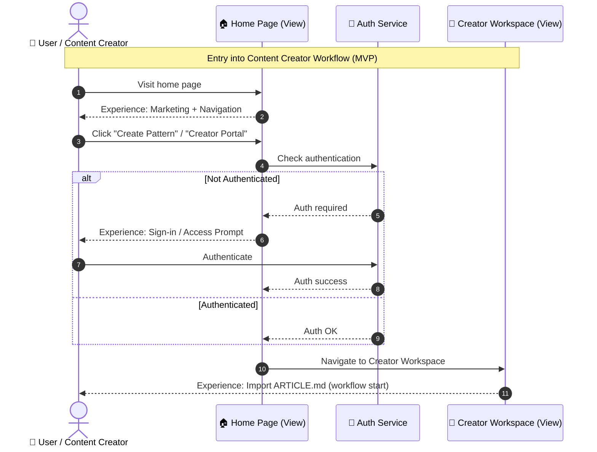

## Home Page → Creator Workflow Entry Diagram (MVP)

This diagram shows **how a user gets from the home page into the content-creator workflow**, without adding assumptions or extra features.

### Design intent

* Home page is **neutral**
* Entry is **explicit**
* Workflow only begins after intentional navigation



---

## How this connects to the earlier diagrams

This diagram **precedes** the MVP workflow you already approved:

1. **Home Page → Creator Workspace** ← *this diagram*
2. **Import ARTICLE.md**
3. **Convert → Validate → Publish**

So the full journey is now:

```
Home
  ↓
Creator Workspace
  ↓
Import ARTICLE.md
  ↓
Convert to Draft
  ↓
Validate
  ↓
Publish (if passed)
```

No hidden jumps. No assumed dashboards. No magical context.

---

## Important UX clarifications (now explicit)

### 1. Home Page does NOT do creator work

* No parsing
* No analytics
* No assumptions about intent

It only provides **navigation + positioning**.

---

### 2. Creator Workspace is the workflow boundary

The moment the user lands here:

* They are intentionally in “creator mode”
* The first valid action is **Import ARTICLE.md**
* Everything downstream is deterministic

---

### 3. MVP-friendly CTA language (examples)

We can refine later, but MVP-safe options are:

* **“Create a Pattern”**
* **“Creator Portal”**
* **“Publish a Pattern”**

Each leads to the same workflow entry.

---

## What we should refine next (diagram-level)

Now that entry is explicit, the next high-leverage refinements are:

1. **Home Page CTA Decision Diagram**
   (multiple CTAs vs single CTA)

2. **Access Model Diagram**
   (Who can publish? Anyone authenticated? Role-gated?)

3. **Post-Publish Navigation Diagram**
   (What happens after “Published Success”? Stay in workspace? Return home?)
