Perfect — I’ll lock those two decisions into the diagrams:

* ✅ **No Draft Editing** (for MVP)
* ✅ **Publish is only allowed after Validation Passed** (hard gate)

And then I’ll proceed with the next refinement: **the Draft Pattern shape diagram** (data shape, not code) + updated sequence/state diagrams.

---

## 1) Updated MVP Sequence Diagram — No Editing, Publish Gated by Validation

```mermaid
sequenceDiagram
  autonumber

  actor Creator as 🧠 Content Creator
  participant View as 🧩 Creator Workspace (View)

  participant Upload as 📥 Upload Service
  participant Parse as 🧾 Markdown Parse Service
  participant Convert as 🔁 Pattern Conversion Service
  participant Validate as ✅ Validation Service
  participant Catalog as 📚 Pattern Catalog Service
  participant Index as 🔎 Search/Index Service

  Note over Creator,Index: MVP starts AFTER markdown exists (created off-platform)

  %% Experience A: Import
  Creator->>View: Action: Import ARTICLE.md
  View->>Upload: Store markdown file
  Upload-->>View: Upload accepted (uploadRef)
  View-->>Creator: Experience: Import Confirmed (uploadRef + next action)

  %% Experience B: Convert
  Creator->>View: Action: Convert to Pattern
  View->>Parse: Extract sections + diagrams + checklist
  Parse-->>View: ParsedDoc (structure + warnings)
  View->>Convert: Map ParsedDoc → Draft Pattern
  Convert-->>View: Draft Pattern (structured fields)
  View-->>Creator: Experience: Draft Ready (preview + validate)

  %% Experience C: Validate
  Creator->>View: Action: Run Validation
  View->>Validate: Validate Draft Pattern
  Validate-->>View: Validation Report (pass/fail + issues)
  View-->>Creator: Experience: Validation Results (pass badge OR issues list)

  alt Validation Failed
    Note over Creator,View: MVP: Fixes happen off-platform → re-import updated ARTICLE.md
    Creator->>View: Action: Import updated ARTICLE.md
  else Validation Passed
    %% Experience D: Publish (hard-gated)
    Creator->>View: Action: Publish to Catalog
    View->>Catalog: Publish Draft Pattern
    Catalog-->>View: Published (patternUrl)
    View->>Index: Index for search + filters
    Index-->>View: Indexed
    View-->>Creator: Experience: ✅ Published Success (live link)
  end
```



---

## 2) Updated View Experience State Machine — No Editing Loop, Hard Gate


---

## 3) Next Refinement: Draft Pattern Shape Diagram

This diagram is the “contract” for what the platform expects **after conversion** and **before validation**.

```mermaid
flowchart TB
  Draft[📄 Draft Pattern]

  Draft --> Identity
  Draft --> Content
  Draft --> Diagrams
  Draft --> Checklist
  Draft --> Metadata
  Draft --> Provenance

  subgraph Identity[🆔 Identity]
    Title[Title\n(required)]
    Slug[Slug\n(required)]
    Summary[Short Summary\n(optional)]
  end

  subgraph Content[🧠 Content Blocks]
    Hook[Hook Markdown\n(required)]
    Problem[Problem Detail Markdown\n(required)]
    Decision[Decision Point Markdown\n(optional)]
    Metrics[Metrics & SLAs Markdown\n(optional)]
  end

  subgraph Diagrams[📈 Diagrams]
    AsIs[As-Is Mermaid\n(required)]
    Orchestrated[Orchestrated Mermaid\n(required)]
  end

  subgraph Checklist[✅ Implementation Checklist]
    Items[Checklist Items\n(required: 1+)]
  end

  subgraph Metadata[🏷️ Catalog Metadata]
    Industries[Industries\n(optional)]
    BrokenSignals[Broken Signals\n(optional)]
    Components[Components\n(optional)]
    Tags[Tags\n(optional)]
  end

  subgraph Provenance[🧾 Provenance]
    UploadRef[Upload Ref\n(required)]
    SourceHash[Content Hash\n(optional)]
    CreatedAt[Created Timestamp\n(required)]
  end
```

### What this shape diagram lets us refine next

* Which fields are **required** for MVP publish (right now: Title, Slug, Hook, Problem, both diagrams, checklist)
* Which sections your markdown template must reliably produce
* What Validation must check (schema + diagram budgets + quality rubric), aligned to your governance rules 

---

## Next refinement options (pick one and I’ll generate diagrams)

1. **Markdown → Draft Mapping Diagram**
   Show which markdown headings map to which Draft Pattern fields (super useful for template design).

2. **Validation Gate Diagram**
   Break down validation into: Schema checks, Diagram budget checks, HQO rubric checks, and “publish eligibility”.

3. **Publish/Versioning Diagram**
   MVP decision: does re-import overwrite a draft, create a new draft, or create a new version?

Just tell me: **“Do #1”** (or #2 / #3), and I’ll produce the next diagram set.


---

Absolutely — here are **#1 (Markdown → Draft Mapping)** and **#2 (Validation Gate)** as diagrams you can review and refine.


---

## #1 — Markdown → Draft Pattern Mapping Diagram

This diagram makes the **import contract** explicit: what headings/blocks you must have in `ARTICLE.md` for the platform to convert reliably.

````mermaid
flowchart LR
  MD[📝 ARTICLE.md<br/>Markdown Source] --> PARSE[🧾 Parse Markdown<br/>Headings + Blocks]
  PARSE --> MAP[🔁 Map to Draft Pattern Fields]
  MAP --> DRAFT[📄 Draft Pattern]

  subgraph MD_STRUCTURE[Expected Markdown Structure]
    H1[# Title (H1)]
    Hook[## Hook]
    Problem[## Problem / Problem Detail]
    AsIs[```mermaid<br/>As-Is Diagram<br/>```]
    Orchestrated[```mermaid<br/>Orchestrated Diagram<br/>```]
    Decision[## Decision Point (optional)]
    Metrics[## Metrics & SLAs (optional)]
    Checklist[## Implementation Checklist<br/>- item 1<br/>- item 2<br/>...]
    Meta[Frontmatter / Tags / Notes (optional)]
  end

  MD --> MD_STRUCTURE

  subgraph FIELD_MAP[Draft Pattern Field Mapping]
    F_Title[title<br/>(required)]
    F_Slug[slug<br/>(derived from title OR frontmatter)]
    F_Hook[hookMarkdown<br/>(required)]
    F_Problem[problemDetailMarkdown<br/>(required)]
    F_AsIs[asIsDiagramMermaid<br/>(required)]
    F_Orch[orchestratedDiagramMermaid<br/>(required)]
    F_Decision[decisionPointMarkdown<br/>(optional)]
    F_Metrics[metricsMarkdown<br/>(optional)]
    F_Checklist[implementationChecklist<br/>(required: 1+)]
    F_Meta[catalogMetadata<br/>(optional: industries, brokenSignals, tags)]
  end

  MAP --> FIELD_MAP
  FIELD_MAP --> DRAFT

  %% Explicit arrows from markdown parts to fields
  H1 --> F_Title
  H1 --> F_Slug
  Hook --> F_Hook
  Problem --> F_Problem
  AsIs --> F_AsIs
  Orchestrated --> F_Orch
  Decision --> F_Decision
  Metrics --> F_Metrics
  Checklist --> F_Checklist
  Meta --> F_Meta
````

### Two key “non-assumption” notes

* If you don’t want to assume “As-Is vs Orchestrated” labeling in markdown yet, we can instead define:

  * “First mermaid block = as-is”
  * “Second mermaid block = orchestrated”
* Slug derivation can be MVP-simple:

  * `slug = kebab-case(title)` unless frontmatter overrides

---

## #2 — Validation Gate Diagram (Publish Eligibility)

This diagram makes it obvious: **validation is not one thing** — it’s a set of gates. Publish is only unlocked if all hard gates pass.


### How to use this diagram in UX

* Validation Results experience should display:

  * **Gate status** (Passed/Failed)
  * **Issue list** grouped by gate
  * Clear instruction: “Fix off-platform → re-import”

---

## Next refinement (quick)

If you want, I can now produce a **Validation Results UX diagram** that shows exactly what the View returns on failure vs pass (still one View participant, no code, pure UX experience states).

