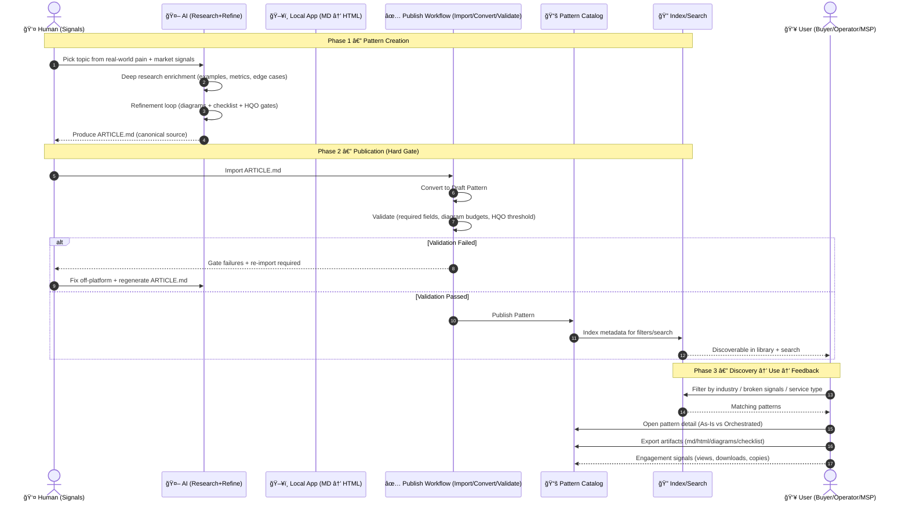
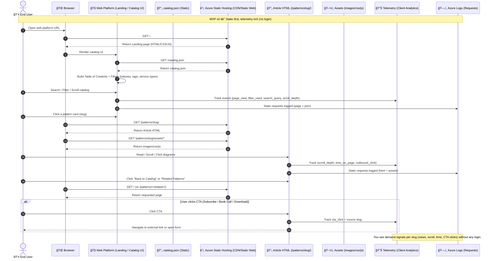

---
# Sidney Jones
---

Hey bro, I just talked to my wife, Wrenetha, about the supply chain (orchestration wisdom) I'm building here. The MVP looks like this:
- (human) raw materials - get insight from real-world experiences or market data to determine a good topic
- (AI) enrichment process (deep research) - use Chat GPT's deep research to collect rich data around the topic
- (AI) refinement process - create sequence diagrams that orchestrate the problem and the solution, and review/refine until we achieve the highest level of quality to produce the customer experience we're aiming for.
- (AI) create an article in markdown with diagrams
- (Local-App) convert markdown to HTML
- (Local-App) push HTML to Azure
- (Web-Platform) discover articles from Azure
- (Web-Platform) create index or table of contents of articles for display - user needs to be able to navigate through different articles based on context (industry, geographic, service types, categories, more.., etc.)
- (Web-Platform) allow user to navigate to articles with clean orchestration


---
# ChatGPT
---

Love it — what you just described is already **3 different customer journeys** stitched into one supply chain:

1. **Content Creator Journey** (make the pattern)
2. **Publication Journey** (ship it + index it)
3. **Buyer/Operator/MSP Journey** (discover → evaluate → implement → measure)

You already have these “journeys as sequences†captured in your repo — you can basically **use them as your MVP backbone** and keep your product honest with gates + events.      

---

## The upgraded MVP (same idea, cleaner orchestration)

### A) Pattern Creation Supply Chain (Creator-side)

* **Human signals** → pick topic (real-world pain + market signal)
* **AI deep research** → enrich with examples, metrics, edge cases
* **AI refinement loop** → diagram budgets + HQO score gates
* **Generate ARTICLE.md** (markdown as the source-of-truth artifact)

This maps directly to your end-to-end creator workflow + governance (HQO threshold, diagram budgets, validation-before-publish). 

### B) Publication Supply Chain (Hard-gated, no in-platform editing)

Instead of “Local-App convert → push to Azure → Platform discovers from Azureâ€, consider making **the platform ingest + validate + publish** the canonical artifact (ARTICLE.md) and *then* produce HTML as a deploy artifact.

That’s exactly what your “MVP Pattern Publication Workflow†is saying: **Import → Convert → Validate → Publish → Index**, with re-import loops if validation fails. 

### C) Discovery & Use (Buyer / Operator / MSP)

Your platform value shows up when people can:

* filter fast (industry, broken signals, service types, etc.)
* open a pattern and instantly “recognize themselvesâ€
* export implementation-ready artifacts
* track outcomes

That’s literally your buyer journey + operator journey + MSP journey.   

---

## One “Master MVP†sequence diagram (your supply chain as a single orchestration)



If you want the “Azure static hosting†step in the diagram, treat it as an **implementation detail of Catalog/Publish** (publish produces HTML artifacts → deploy). The *user-facing orchestration* stays clean.

---

## The 3 most important MVP additions (so the platform actually compounds)

### 1) Canonical artifact + deterministic conversion

Pick one canonical truth:

* **ARTICLE.md is canonical**
* Platform converts to: Pattern JSON + HTML + index fields

That gives you repeatable publication and makes “re-import loops†a feature, not a bug. 

### 2) Metadata taxonomy (so discovery actually works)

Minimum fields to support your “navigate by context†goal:

* industries[]
* geography[] (optional but powerful)
* serviceTypes[] (consulting, platform, automation, ops, etc.)
* brokenSignals[] (ownership, visibility, time/SLA, etc.)
* tags[]
* HQO score + clarity score

Your buyer journey explicitly requires filtering by industry and broken signals + showing HQO/clarity. 

### 3) Closed-loop learning (so it becomes “wisdomâ€)

Instrument the loop with events:

* pattern.viewed, article.exported, checklist.downloaded, implementation.started, results.reported

Your operator journey already models the “pattern → implementation → measurable impact†loop, which is *how the library becomes defensible*. 

---

## Where Wrenetha is *exactly right*

Calling it “supply chain†is the unlock:

* **Raw materials** = lived experience + market signals
* **Manufacturing** = research + refinement + validation gates
* **Distribution** = catalog + index + discovery UX
* **Customer success** = implementation + measurement feedback

That’s a compounding system — each published pattern makes the next one faster, and each implementation creates proof that improves trust + conversion.

If you want, next we can turn your MVP list into:

* a **requirements checklist** per phase (Creator, Publish, Discovery, Implementation)
* plus a **minimal schema** for the metadata that powers your table-of-contents + filters.

---
# Sidney Jones
---
You make a good point here. However, I already have the local app built and only need to add a tiny feature to push the HTML to Azure. This allows for a frictionless MVP release so that I can get some learning immediately in lieu of digressing into more implementation with ingestion (requiring login flow, etc.). I want to a stupid simple web app for now to generate traffic and give me the telemetry I need to focus on the next best move!


---
# ChatGPT
---
Yep — your instinct is right: **ship the “dumb†pipeline first** and let *traffic + telemetry* tell you what to harden next. You can keep the future ingestion/publish workflow in your back pocket without paying the login/tax up front.

Here’s a *stupid-simple* version that stays aligned with your long-term vision but uses your existing local app + Azure as the “distribution layer.â€

## MVP v0: Static-first, telemetry-rich (no login)

### Flow

1. **Local app**: MD → HTML (already done)
2. **Tiny feature**: push HTML + assets to Azure Storage Static Website (or Azure Static Web Apps)
3. **Web app**: basically just a shell that links to the static site (or the static site *is* the web app)
4. **Telemetry**: client-side analytics + server logs

This is the fastest way to get:

* search traffic (indexable pages)
* behavior signals (what people click, scroll, bounce on)
* pattern demand signals (which topics pull attention)

---

## Architecture that stays “MVP-simple†but future-proofs you

### Keep these contracts now (even if everything is static)

**A) URL contract (slug-based)**

* `/patterns/<slug>/`
* `/patterns/<slug>/index.html`
* `/patterns/<slug>/assets/*`

**B) Metadata contract (1 JSON file per article)**
Alongside every HTML page, emit:

* `/patterns/<slug>/pattern.json`

It can be tiny now:

```json
{
  "slug": "compute-infrastructure-flywheel",
  "title": "Compute Infrastructure Flywheel",
  "industries": ["AI Infrastructure"],
  "serviceTypes": ["DevOps", "FinOps"],
  "tags": ["orchestration", "gpu", "capex"],
  "publishedUtc": "2026-01-12T00:00:00Z"
}
```

That single file becomes your bridge later to “ingest/validate/index†without needing login today.

---

## Telemetry: what to track in v0 (so you can decide the next best move)

### Minimum events (high signal, low effort)

* `page_view` (with slug + referrer)
* `time_on_page` (simple timer)
* `scroll_depth` (25/50/75/90)
* `outbound_click` (links to repos, downloads, etc.)
* `cta_click` (“Book a callâ€, “Subscribeâ€, “Downloadâ€, etc.)

### “Demand scoring†(your next-move compass)

You can compute a simple interest score per article:

* views * (avg_scroll_depth) * (cta_click_rate)

That tells you what to write next and what to productize.

---

## Index / Table of contents without any backend

You can generate a **single `catalog.json`** during your local publish step:

* `/catalog.json` = list of all `pattern.json` entries

Then your “stupid simple web app†can be a single page that:

* fetches `catalog.json`
* renders filters (industry/service/tags)
* links to the static HTML pages

No DB. No auth. No ingestion pipeline. Just static + JSON.

---

## Azure choices (fastest first)

### Fastest: Azure Storage Static Website

* push files to `$web`
* cheap, simple, reliable
* telemetry: Azure Storage logs + client analytics

### Slightly nicer: Azure Static Web Apps

* easy CI/CD
* built-in staging
* still “static-firstâ€
* can add APIs later if/when needed

Either way, your local app “push HTML to Azure†feature is the only missing piece.

---

## How this connects to your “hard-gated publication†later (without building it now)

When you’re ready, the platform ingestion workflow can simply start by consuming the same things you already ship:

* `ARTICLE.md` (source)
* `pattern.json` (metadata)
* generated `index.html` (rendered artifact)

So you’re not “digressing†— you’re **shipping the distribution channel now** and deferring the governance engine until you’ve earned it with traffic.

---

If you want, paste (1) what your local app is written in and (2) how you’re hosting today (Storage Static Website vs Static Web Apps), and I’ll give you the smallest “push-to-Azure†implementation (including content-type headers + cache rules + uploading an entire folder tree).

---
# Sidney
---
Okay, give me a diagram of how the sequence of this "MVP v0: Static-first, telemetry-rich (no login).md" will look from the end users of the web platform. I want to understand what their experience will really look like.

---
# ChatGPT
---
## User Experience
Note: Can't put "<>" characters (<slug>) in diagrams but the article route pattern is actually: 📄 Article HTML (/patterns/<slug>/)




If you want it to feel even more “product-like†with zero backend, add two extra static pieces to the flow:

* `/patterns/<slug>/pattern.json` (metadata per article for related-content + breadcrumbs)
* `/sitemap.xml` (so Google indexes you fast and your catalog becomes discoverable via search)

I can also generate a **second diagram** that shows the same journey, but split into “Visitor → Returning Visitor → Subscriber†so you can see what your funnel looks like.

