# Warranty Defect Escalation: From Backlog to Orchestration

## Hook

Most warranty escalations don’t fail because repairs are hard.
They fail because **no one owns the clock**, capacity constraints are invisible, and escalation is treated as an exception instead of a designed path.

This article shows how a common warranty defect backlog emerges—and how orchestration fixes it.

---

## The Problem in One Minute

A customer reports a legitimate warranty defect.
Support opens a ticket.
The case enters a vendor backlog with no ETA.

Weeks turn into months.
Customers escalate emotionally because the system never escalates structurally.

The issue isn’t effort.
It’s **orchestration**.

---

## The As-Is System (What’s Really Happening)

```mermaid
sequenceDiagram
  autonumber
  actor Customer as 👤 Customer
  participant Support as 🎧 Support
  participant Warranty as 📋 Warranty
  participant Vendor as 🛠️ Vendor
  participant Schedule as 📆 Schedule

  Customer->>Support: Report defect
  Support->>Warranty: Open case
  Warranty->>Vendor: Assign repair
  Vendor->>Schedule: Request availability
  Schedule-->>Vendor: Backlog (no ETA)
  Vendor-->>Warranty: No schedule
  Warranty-->>Support: Status pending
  Support-->>Customer: Waiting on vendor
```

**System behavior:**

* No explicit owner after assignment
* No SLA clock
* No capacity signal
* No automatic escalation
* Customer waits in uncertainty

---

## The Orchestrated System (What Changes)

**What’s different:**

* Ownership is explicit
* Time is visible
* Capacity is treated as a signal
* Escalation is automatic
* Customer is proactively informed

---

## The Decision Point That Matters

The system’s most important decision is **capacity availability**.

In the as-is system, capacity failure stalls the flow.

In the orchestrated system:

* capacity unavailability **triggers action**
* escalation is **routing**, not blame
* customers are informed before frustration builds

This single decision point prevents months of churn.

---

## Metrics & SLAs That Make This Work

Effective orchestration requires measurable signals:

* **Time to ETA**: ≤ 48 hours from case creation
* **SLA breach detection**: continuous, not reactive
* **Escalation trigger**: before SLA violation, not after
* **Customer updates**: proactive, scheduled, predictable

If these signals don’t exist, orchestration can’t exist.

---

## Implementation Checklist

* [ ] Assign a single case owner at creation
* [ ] Start an SLA clock immediately
* [ ] Require vendor capacity confirmation
* [ ] Detect SLA breach risk automatically
* [ ] Route escalations without manual intervention
* [ ] Notify customers before delays become complaints
* [ ] Log every state change and decision

---

## Orchestration Quality Scorecard

| Dimension               | Score (0–5) | Notes                               |
| ----------------------- | ----------- | ----------------------------------- |
| Actor clarity           | 5           | All roles have clear responsibility |
| Ownership & routing     | 5           | Orchestrator owns case lifecycle    |
| SLA & time awareness    | 4           | SLA visible and enforced            |
| Decision points (`alt`) | 5           | Capacity drives routing             |
| Customer visibility     | 4           | Proactive updates included          |
| Capacity handling       | 4           | Backlog treated as signal           |
| Observability           | 3           | Key events captured                 |
| Minimal complexity      | 4           | Fits on one screen                  |
| **Total**               | **34**      | **/40 — PASS**                      |

---

## Closing Insight

Warranty escalations don’t require heroics.
They require **designed paths for when things go wrong**.

When time, ownership, and escalation are orchestrated intentionally, customers stop chasing answers—and systems start behaving responsibly.

That’s not better service.
That’s better design.
