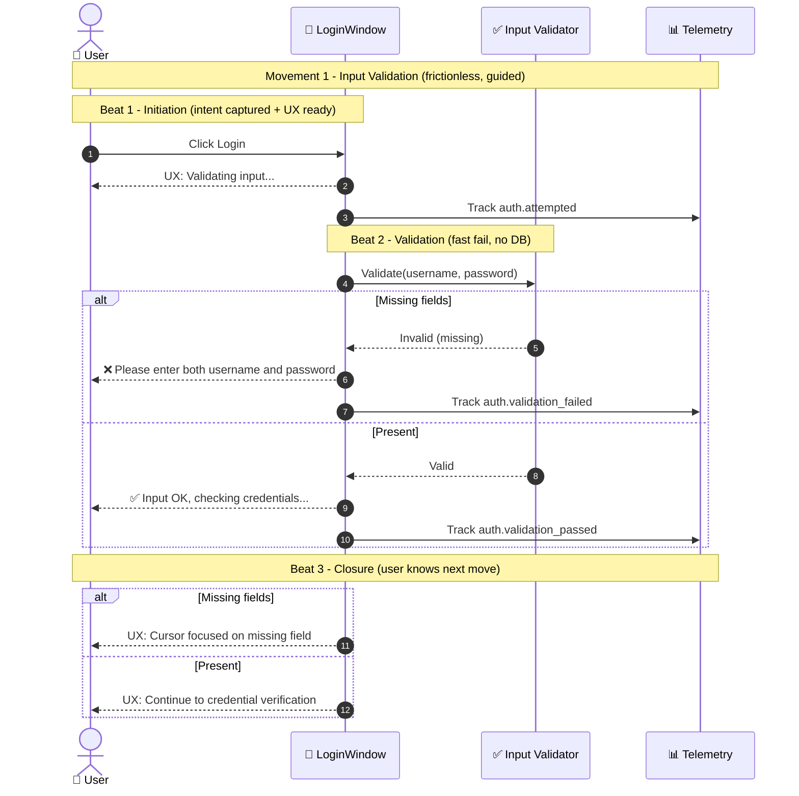
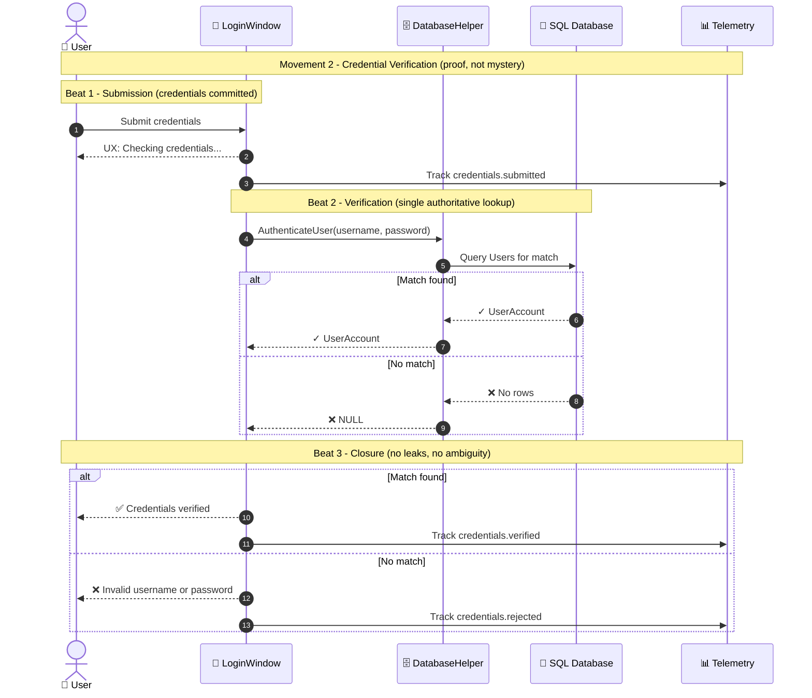
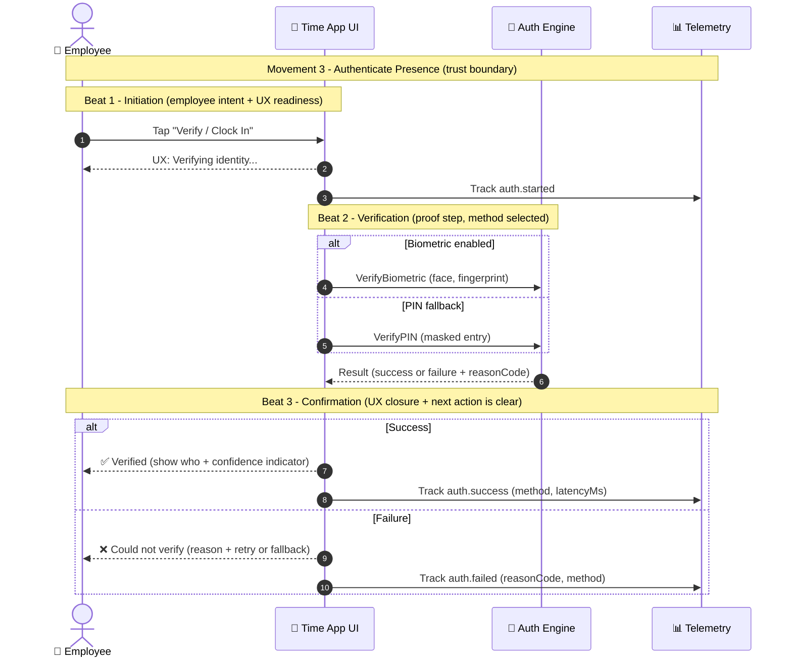
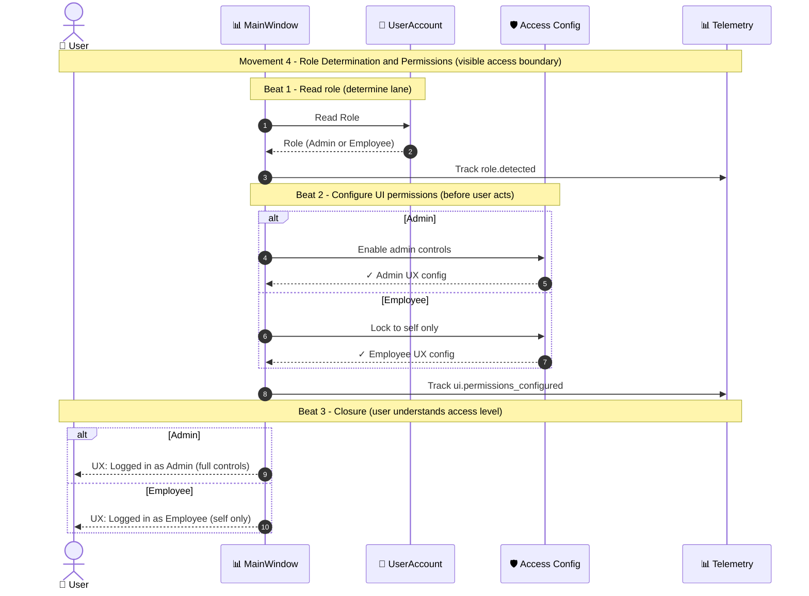
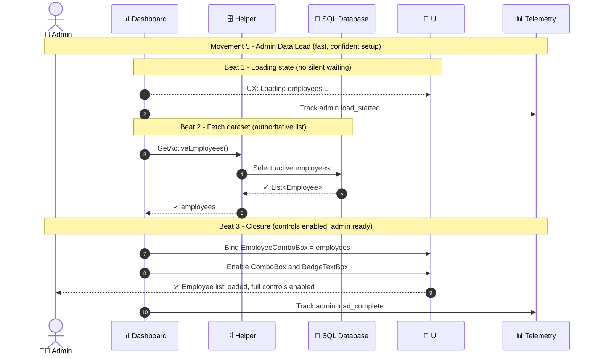
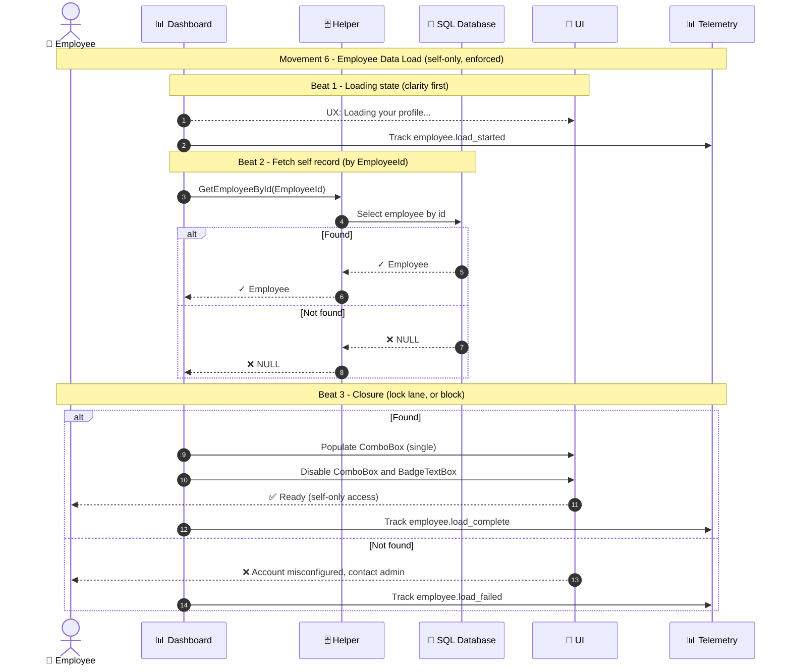
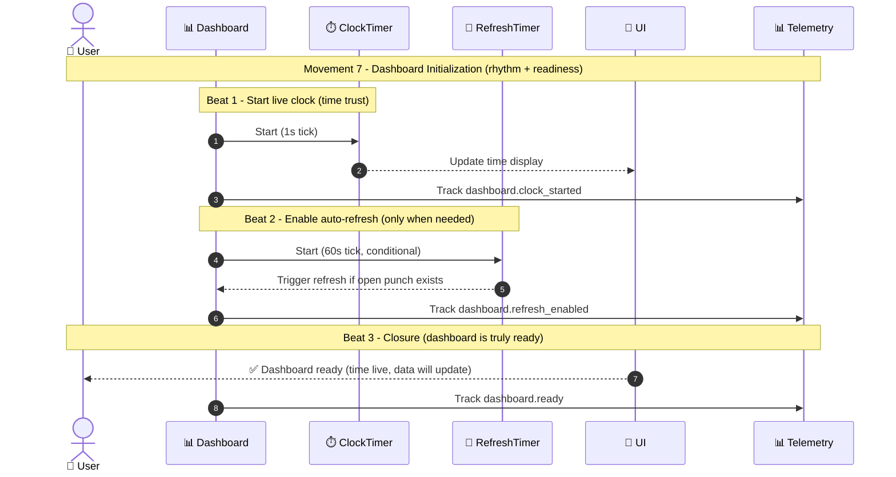
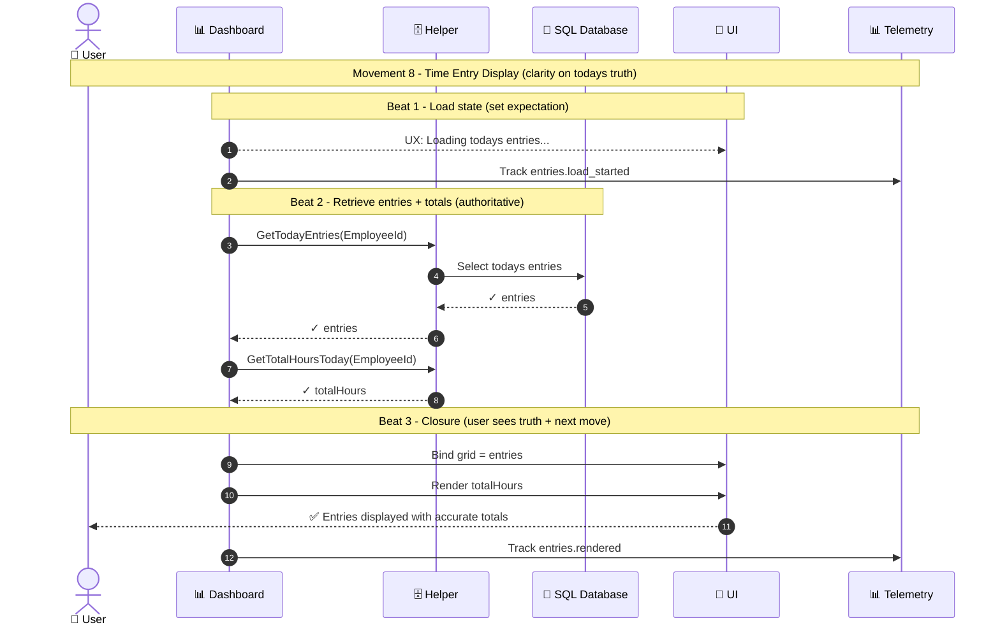

# Employee Authentication Experience Suite

**Eight movements. One attendance truth.**

The **Employee Authentication Experience Suite** defines the UX-first orchestration for employee login, authorization, and readiness within the Time & Attendance platform.
It is not a login flow. It is a **composed experience**, intentionally designed as a sequence of **movements**, each made up of **multiple beats** that guide the employee from intent to certainty.

This suite ensures that:

* Authentication is **trusted**, not mysterious
* Progress is **visible**, not implied
* Policy enforcement is **felt as clarity**, not friction
* Every movement ends with a **closed UX loop**

---

## Why an “Experience Suite”?

The term **Experience Suite** is deliberate.

* **Experience** signals that UX is the primary design axis, not backend validation.
* **Suite** signals modular composition: each movement can evolve independently, while preserving a shared rhythm and mental model.

This framing enables:

* Scalable feature growth without cognitive overload
* Clean service boundaries for engineering
* Predictable user confidence at every step

---

## Musical Composition Model

The suite follows a strict composition rule:

* **Movement** = a major UX question is resolved
* **Beat** = a human-perceivable outcome within that movement

Every beat must:

* Reduce uncertainty
* Increase confidence
* Or signal progress

Every movement must end in **UX closure**, where the employee knows:

* What just happened
* What state they are in
* What action is available next

---

## The Eight Movements (At a Glance)

| # | Movement                         | Core Question Resolved                   |
| - | -------------------------------- | ---------------------------------------- |
| 1 | Input Validation                 | “Did I start this correctly?”            |
| 2 | Credential Verification          | “Am I who I say I am?”                   |
| 3 | Authenticate Presence            | “Is my presence trusted?”                |
| 4 | Role Determination & Permissions | “What am I allowed to do?”               |
| 5 | Admin Data Load                  | “Is the system ready for admin actions?” |
| 6 | Employee Data Load               | “Is my view locked to me?”               |
| 7 | Dashboard Initialization         | “Is the system live and stable?”         |
| 8 | Time Entry Display               | “What is today’s attendance truth?”      |

---

## Movement 1 — Input Validation

**Frictionless entry with fast feedback**

**Purpose**
Capture employee intent and eliminate obvious errors immediately, without invoking backend systems.

**Beats**

1. **Initiation** — User signals intent; UI confirms readiness
2. **Validation** — Inputs checked locally for completeness
3. **Closure** — User knows whether they can proceed or must correct

**UX Outcome**
The employee never wonders if the system “noticed” them.

---

## Movement 2 — Credential Verification

**Proof without ambiguity**

**Purpose**
Verify credentials against a single authoritative source while keeping failure states opaque and safe.

**Beats**

1. **Submission** — Credentials committed with visible progress
2. **Verification** — One authoritative lookup (no retries, no guessing)
3. **Closure** — Clear success or failure, with no information leakage

**UX Outcome**
The employee knows whether access is granted — and why.

---

## Movement 3 — Authenticate Presence

**Establish the trust boundary**

**Purpose**
Confirm not just identity, but *presence legitimacy* using biometric or fallback methods.

**Beats**

1. **Initiation** — Verification begins with clear UX feedback
2. **Verification** — Biometric or PIN validation occurs
3. **Confirmation** — Success or failure is clearly communicated

**UX Outcome**
The employee feels *verified*, not merely logged in.

---

## Movement 4 — Role Determination & Permissions

**Visible access boundaries**

**Purpose**
Determine role and configure permissions *before* the user can act.

**Beats**

1. **Role Detection** — System determines user lane
2. **Permission Configuration** — UI is shaped to role
3. **Closure** — User understands scope of access

**UX Outcome**
No surprise buttons. No hidden restrictions.

---

## Movement 5 — Admin Data Load

**Confident system readiness**

**Purpose**
Prepare admin-level data and controls with visible loading and deterministic completion.

**Beats**

1. **Loading State** — Expectations are set
2. **Dataset Retrieval** — Authoritative data is fetched
3. **Closure** — Admin controls are enabled and ready

**UX Outcome**
Admins trust the system before acting.

---

## Movement 6 — Employee Data Load

**Self-only enforcement**

**Purpose**
Load employee-specific data and lock the UI to prevent cross-access.

**Beats**

1. **Loading State** — User knows their data is being fetched
2. **Record Retrieval** — Self record is resolved or rejected
3. **Closure** — UI is locked or a clear error is shown

**UX Outcome**
Employees feel protected — and constrained correctly.

---

## Movement 7 — Dashboard Initialization

**Rhythm and readiness**

**Purpose**
Initialize live time signals and conditional refresh logic.

**Beats**

1. **Clock Start** — Time trust is established
2. **Auto-Refresh Enablement** — System stays current when needed
3. **Closure** — Dashboard is visibly “alive”

**UX Outcome**
The system feels active, not static.

---

## Movement 8 — Time Entry Display

**Today’s attendance truth**

**Purpose**
Present authoritative time entries and totals for the current day.

**Beats**

1. **Load State** — User expectations are set
2. **Data Retrieval** — Entries and totals are calculated
3. **Closure** — User sees the truth and knows next actions

**UX Outcome**
No guessing. No disputes. Just clarity.

---

## Closing Thought

This suite does not optimize for speed alone.
It optimizes for **confidence per second**.

When authentication feels like a song:

* Users trust outcomes
* Engineers build cleaner systems
* Policy enforcement disappears into clarity

This is not a login flow.
It is a **composed experience**.
