## The FPA Experience Suite

**Five movements. One financial truth.**

The **FPA Experience Suite** is the UX and orchestration backbone of the Financial Performance Assessment platform. It is not a single screen, calculation, or report — it is a **designed experience**, composed intentionally as a sequence of movements that guide a user from curiosity to clarity.

Each movement represents a **distinct UX scene**, with a clear purpose, visible progress, and deterministic outcomes. Together, the five movements form a cohesive journey that transforms raw financial data into actionable insight — without overwhelming the user or obscuring trust.

---

### Why “Experience Suite”?

We chose the term **Experience Suite** deliberately.

* **Experience** emphasizes that this system is UX-first, not backend-driven.
  Every step is observable, explainable, and designed around how humans think and decide.
* **Suite** conveys that these movements are **modular but composed** — each movement can evolve independently, yet they work best when played together.

This framing allows the platform to scale naturally:

* New movements can be added without breaking the mental model.
* Existing movements can deepen in sophistication without increasing cognitive load.
* Different user types (casual investors, professionals, advisors) can engage at different depths.

---

### The Five Movements (At a Glance)

Each movement is expressed as its own UX-based sequence diagram, with **beats** that clearly articulate what the user sees, what the system does, and how progress is communicated.

#### 1. **Enter Symbol + Choose Depth**
   The moment of intent. Friction is minimized, ambiguity is removed, and the user chooses how deep they want to go.

```mermaid
sequenceDiagram
  autonumber
  actor U as 👤 Investor / User
  participant B as 🌐 Browser
  participant UI as 🧭 FPA Web App (FPAScore UI)
  participant SSJS as 📜 stockSearch.js (Autocomplete)
  participant YF as 🌍 Yahoo Finance
  participant T as 📊 Telemetry / Audit

  Note over U,T: Movement 1 — Enter Symbol + Choose Depth (fast, guided UX)

  Note over U,YF: Beat 1 — Autocomplete reduces friction + prevents symbol typos
  U->>B: Navigate to /FPAScore
  B->>UI: GET /FPAScore
  UI-->>B: Render calculator (empty state)
  B-->>U: Show symbol input + Analyze (Quick/Full)
  U->>B: Type "AAP"
  B->>SSJS: input event (AAP)
  SSJS->>YF: GET autocomplete (AAP)
  YF-->>SSJS: Suggestions
  SSJS-->>B: Render dropdown (AAPL - Apple Inc)
  U->>B: Select "AAPL"

  Note over U,T: Beat 2 — Choose analysis depth + submit request (tracked)
  U->>B: Click Analyze → Quick or Full
  B->>UI: POST /FPAScore (symbol=AAPL, analysisType=quick|full)
  UI->>T: Track analysis.requested (symbol, analysisType)
```

#### 2. **Data Freshness + Loading UX**
   Trust is established. The system proves it knows what it’s doing by showing freshness checks, cache decisions, and visible progress.

```mermaid
sequenceDiagram
  autonumber
  actor U as 👤 Investor / User
  participant B as 🌐 Browser
  participant PM as 📄 FPAScoreModel (PageModel)
  participant DI as 📥 Data Intake Orchestrator
  participant DB as 🗄️ WealthBuilder DB
  participant YF as 🌍 Yahoo Finance
  participant T as 📊 Telemetry / Audit

  Note over U,T: Movement 2 — Data Freshness + Loading UX (progress + smart cache)

  Note over B,DB: Beat 3 — Check cache + staleness gate (fresh vs stale)
  PM-->>B: UX: Show stepper "Checking data freshness…"
  PM->>DB: Load latest financial snapshot timestamps (symbol=AAPL)
  DB-->>PM: Cached data (or missing)

  alt Cache missing OR stale
    Note over B,T: Beat 4 — Refresh financial data (visible progress + validation)
    PM-->>B: UX: Stepper "Refreshing financial data…"
    PM->>DI: Start intake (symbol=AAPL)
    DI->>YF: Fetch profile + statements + quote + stats
    YF-->>DI: Data payloads
    DI->>DB: Upsert company/financials/quote/stats
    DB-->>DI: Persist OK
    DI->>T: Track data.persisted + data.validation.passed
    DI-->>PM: Intake complete
  else Cache fresh
    Note over B,YF: Beat 5 — Fast path (cached financials + refresh quote only)
    PM-->>B: UX: Stepper "Using cached financials…"
    PM->>DI: Refresh quote only (symbol=AAPL)
    DI->>YF: Fetch latest quote
    YF-->>DI: Quote
    DI->>DB: Upsert quote
    DB-->>DI: Persist OK
    DI-->>PM: Quote refreshed
  end
```

#### 3. **Score Calculation**
   Determinism takes center stage. Financial components are assembled, calculated, persisted, and audited — fast and transparently.

```mermaid
sequenceDiagram
  autonumber
  actor U as 👤 Investor / User
  participant B as 🌐 Browser
  participant PM as 📄 FPAScoreModel (PageModel)
  participant Calc as 🧮 FPA Score Calculator
  participant DB as 🗄️ WealthBuilder DB
  participant T as 📊 Telemetry / Audit

  Note over U,T: Movement 3 — Score Calculation (deterministic, auditable, fast)

  Note over B,T: Beat 4 — Assemble dataset + compute components + persist + instrument
  PM-->>B: UX: Stepper "Calculating score…"
  PM->>Calc: CalculateScoreAsync(symbol=AAPL)
  Calc->>DB: Load company + statements + quote + stats
  DB-->>Calc: Financial dataset
  Calc->>Calc: Compute components (L, Le, P, G, V, E)
  Calc->>Calc: Aggregate weighted score → letter grade (A–F)
  Calc->>DB: Persist score + components + timestamp
  DB-->>Calc: Saved
  Calc->>T: Track score.calculated + score.persisted
  Calc-->>PM: ScoreResult (score, grade, components)
```

#### 4. **Optional AI Narrative**
   Insight is layered on top of facts. AI is introduced only when requested, providing explanation, risk context, and valuation perspective without obscuring the math.

```mermaid
sequenceDiagram
  autonumber
  actor U as 👤 Investor / User
  participant B as 🌐 Browser
  participant PM as 📄 FPAScoreModel (PageModel)
  participant AE as 🧠 AI Analysis Engine
  participant DB as 🗄️ WealthBuilder DB
  participant OAI as 🤖 OpenAI
  participant T as 📊 Telemetry / Audit

  Note over U,T: Movement 4 — Optional AI Narrative (Full mode only, “UX closure”)

  alt analysisType = full
    Note over B,T: Beat 5 — Generate AI insights (UX progress + context + tokens)
    PM-->>B: UX: Stepper "Generating AI insights…"
    PM->>AE: GenerateNarrative(scoreResult, symbol=AAPL)
    AE->>DB: Load peer/trend context (sector/industry + history)
    DB-->>AE: Context bundle
    AE->>OAI: Prompt (score + components + context)
    OAI-->>AE: Narrative + risks + valuation notes
    AE->>T: Track narrative.generated (+ token usage/cost)
    AE-->>PM: AIAnalysis payload
  else analysisType = quick
    Note over PM,T: Beat 6 — Skip AI (Quick mode) + track
    PM->>T: Track narrative.skipped (Quick mode)
  end
```

#### 5. **Render Results + Export**
   Clarity is delivered. The user receives a clean, interpretable score and can immediately share, download, or act on the output.

## Movement 5 — Render Results + Export (shareable outputs)

```mermaid
sequenceDiagram
  autonumber
  actor U as 👤 Investor / User
  participant B as 🌐 Browser
  participant UI as 🧭 FPA Web App (FPAScore UI)
  participant PM as 📄 FPAScoreModel (PageModel)
  participant RG as 📄 Report Generator
  participant DB as 🗄️ WealthBuilder DB
  participant T as 📊 Telemetry / Audit

  Note over U,T: Movement 5 — Render Results + Export (shareable outputs)

  Note over B,U: Beat 6 — Render results (score card + breakdown + optional AI panel)
  PM-->>B: Return Page() with results
  B->>UI: Render score header + breakdown + key metrics
  UI-->>U: ✅ Results displayed (grade, score, components, insights)

  opt User downloads report
    Note over U,T: Beat 7 — Export report (generate + load provenance + audit)
    U->>B: Click Download (format)
    B->>RG: Generate(format, symbol=AAPL)
    RG->>DB: Load persisted score + components + provenance
    DB-->>RG: Data
    RG->>T: Track report.exported (format)
    RG-->>B: File stream
    B-->>U: ✅ Download complete
  end
```

---

### A Musical Model for UX Clarity

The FPA Experience Suite borrows from a **musical composition metaphor**:

* **Movements** define major phases of the experience.
* **Beats** capture precise interactions within each phase.
* UX signals (loading steppers, confirmations, transitions) act as the rhythm that keeps the user oriented.

This structure enforces a critical discipline:

> *Every beat must visibly justify its existence to the user.*

No hidden work. No silent failures. No “magic.”

---

### Designed for Trust, Not Just Speed

Many financial tools optimize only for speed or density.
The FPA Experience Suite optimizes for **confidence**.

* Users always know *what is happening*.
* They understand *why it is happening*.
* They can choose *how much depth* they want.
* Outputs are auditable, repeatable, and explainable.

This makes the platform suitable not just for individual investors, but for professionals who need to defend decisions, share insights, and revisit assessments over time.

---

### The Result

The FPA Experience Suite turns financial analysis into a **guided, intelligible experience** — one that respects both the data and the decision-maker.

Five movements.
One coherent journey.
One financial truth, revealed with clarity.
