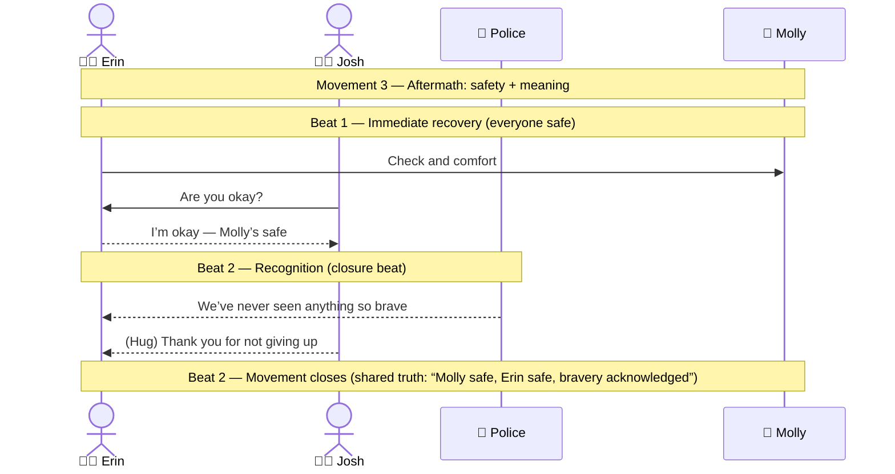

Absolutely — here are the story diagrams rewritten to match our **Movement + Beat** standards (movement notes span *all* participants; beat notes span only the impacted participants, **except** closure beats which span *all impacted participants*). 

---

## Diagram 1 — Movement 1: Danger + Search Under Time Pressure

```mermaid
sequenceDiagram
  actor Erin as 👩‍🌾 Erin
  actor Josh as 👨‍🌾 Josh
  participant Police as 🚓 Police
  participant River as 🌊 Smith River
  participant Molly as 🐴 Molly

  Note over Erin,Molly: Movement 1 — Flood threat + Molly missing

  Note over River,Police: Beat 1 — Flood risk escalates (evacuation window)
  River-->>Police: Dam risk rising + flooding worsening
  Police-->>Josh: Warning: evacuate within hours
  Police-->>Erin: Warning: evacuate within hours

  Note over Erin,Molly: Beat 2 — Search decision (split up to cover ground)
  Josh->>Erin: Split up and search (cover more ground)
  Erin-->>Josh: Agreed (two-way radio)
  Josh->>Molly: Search fields and barn area
  Erin->>Molly: Search fields near flooding

  Note over Erin,Molly: Beat 3 — Molly located (status shared)
  Erin-->>Josh: Found Molly in flooded southwest field
  Josh-->>Police: Molly located; heading to flooded field
  Police-->>Josh: We’re coming with you
```

---

## Diagram 2 — Movement 2: Rescue (Erin Refuses to Leave Molly)

```mermaid
sequenceDiagram
  actor Erin as 👩‍🌾 Erin
  actor Josh as 👨‍🌾 Josh
  participant Police as 🚓 Police
  participant Flood as 🌊 Floodwater
  participant Molly as 🐴 Molly
  participant Tree as 🌳 Tree (anchor)

  Note over Erin,Tree: Movement 2 — Molly trapped; Erin executes rescue

  Note over Flood,Molly: Beat 1 — Problem becomes visible (Molly trapped)
  Flood-->>Molly: Deep, fast-moving water surrounds you
  Molly-->>Erin: Refuses to move toward dry ground

  Note over Police,Erin: Beat 2 — Safety instruction vs commitment
  Police-->>Erin: Get out now and save yourself
  Erin-->>Police: No — I’m not leaving without her

  Note over Erin,Tree: Beat 3 — Erin creates a rescue anchor (rope plan)
  Erin->>Tree: Throw rope and secure anchor point
  Erin->>Erin: Pull self closer; prepare to mount Molly

  Note over Erin,Molly: Beat 4 — Calm + control (make Molly movable)
  Erin->>Molly: Climb onto Molly and steady her
  Erin->>Molly: Pat and calm until she trusts movement

  Note over Erin,Tree: Beat 5 — Pull to safety (closure beat)
  Erin->>Tree: Use rope leverage to guide movement
  Erin->>Molly: Move step-by-step toward safety
  Flood-->>Molly: Water pressure reduced as you reach shallower area
  Erin-->>Josh: Molly is safe

  Note over Erin,Tree: Beat 5 — Movement closes (everyone sees the outcome)
  Josh-->>Erin: You did it (Molly safe)
  Police-->>Erin: Rescue confirmed (stand down / evacuate)
```

> **Beat 5 is the closure beat**, so its beat note spans all participants impacted by the resolution (Erin, Josh, Police, Flood context, Molly, Tree anchor). 

---

## Diagram 3 — Movement 3: Aftermath + Recognition (Bravery Observed)



---

If you want to take it one step cleaner, we can also produce a **single “Full Story” diagram** that chains Movement 1 → 2 → 3, but keeps each movement boxed by its own movement note and beat notes.
