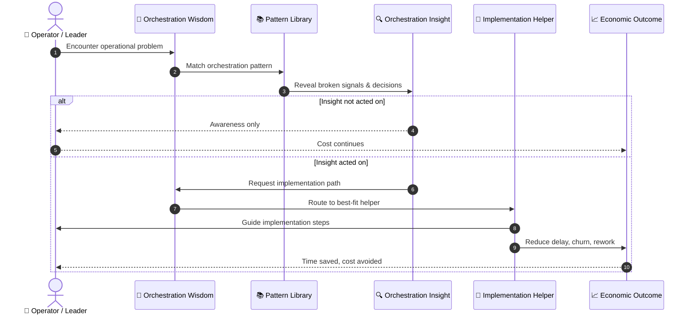
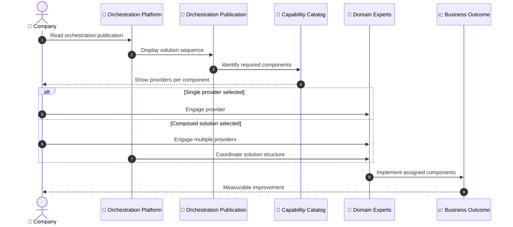

Great question — this is where **orchestration-wisdom stops being a publication and becomes a platform**.

A good match-maker here is **not** a marketplace in the traditional sense.
It’s a **pattern-to-capability alignment engine**.

Below is a clear, grounded way to think about it.

---

## 1. What the Match-Maker Actually Matches (Core Insight)

You are not matching *people to people* first.

You are matching **patterns to needs**, and **needs to capability**.

Think of the match-maker as operating on **three planes**:

### Plane 1 — The Problem (Pattern Reality)

* What orchestration pattern is failing?
* What signals are broken? (time, ownership, capacity, visibility)
* What decision points are missing?

This already exists in your articles and schema.

---

### Plane 2 — The Capability (Who Can Fix This)

Capabilities can be:

* internal teams
* consultants
* vendors
* software platforms
* even internal transformation initiatives

Each capability is described **in orchestration terms**, not marketing terms.

---

### Plane 3 — The Context (Fit & Readiness)

Not every organization is ready for the same solution.

Context matters:

* scale
* industry constraints
* risk tolerance
* maturity
* budget
* urgency

The match-maker aligns *all three planes*.

---

## 2. The Mental Model: “Pattern → Lever → Capability”

Every orchestration pattern implies **levers**, not tools.

### Example

**Pattern Identified**

> Warranty defect escalation backlog

**Primary broken signals**

* SLA visibility
* capacity routing
* escalation automation

**Required levers**

* case orchestration
* SLA monitoring
* escalation routing
* customer notification

**Now the match-maker asks**

> Who can reliably pull these levers *in this context*?

That’s the match.

---

## 3. What a Matchable “Capability Profile” Looks Like

Instead of listings, you create **Capability Profiles**.

Each profile answers:

```yaml
capability:
  name: "Warranty Case Orchestration"
  type: ["internal-team", "vendor", "consultant", "platform"]
  orchestration_strengths:
    - ownership modeling
    - SLA enforcement
    - escalation routing
    - capacity-aware scheduling
  industries:
    - automotive
    - construction
  scale_fit:
    min_cases_per_month: 500
    max_cases_per_month: 50000
  integration_complexity: medium
  maturity_required: medium
  typical_time_to_value: "60–90 days"
  failure_modes_not_handled:
    - parts supply chain optimization
```

No hype.
Just **what it does well and where it breaks**.

That honesty is the moat.

---

## 4. How the Match-Maker Experience Feels to the User

### Step 1 — “Recognize Yourself”

User reads a pattern article.

At the end, a calm prompt:

> *“If this pattern feels familiar, here are the capabilities that typically resolve it.”*

No CTA urgency. No email gate.

---

### Step 2 — “Confirm the Pattern”

A short, reflective interaction (not a quiz):

* Do you have an SLA clock today?
* Do escalations happen automatically?
* Do customers know the next step?

This maps directly to your schema signals.

---

### Step 3 — “View Capability Matches”

The platform shows:

> **Best-fit orchestration capabilities for this pattern**

Grouped by:

* internal enablement
* external partners
* platforms/tools

Each match includes:

* why it fits
* what it will *not* solve
* readiness prerequisites

This builds trust immediately.

---

## 5. Why This Is Not a Traditional Marketplace

Traditional marketplaces:

* optimize for transactions
* hide limitations
* rank by popularity or spend

Your match-maker:

* optimizes for **system alignment**
* surfaces limitations explicitly
* ranks by **orchestration fit**

This is closer to **clinical diagnosis** than shopping.

---

## 6. How AI Becomes the Match-Maker Brain

Your AI already has the raw material:

* structured orchestration patterns (OWS)
* signals
* decision points
* constraints

The AI’s role is to:

1. infer **which levers matter most**
2. eliminate mismatched capabilities early
3. explain *why* something fits or doesn’t

Explainability is key:

> “This capability matches because it handles SLA breaches automatically, which is the dominant failure signal in your pattern.”

---

## 7. Monetization Without Corrupting Trust

This is critical.

### The Rule

> Payment must never influence match quality.

### Safe models:

#### 1. Capability Verification Fee

Providers pay to be:

* reviewed
* profiled
* validated against orchestration criteria

Not for placement. For **credibility**.

---

#### 2. Referral With Disclosure

If a connection happens:

> *“This capability supports orchestration-wisdom and helps fund the platform.”*

Transparency maintains trust.

---

#### 3. Internal Enablement First

Often the best match is:

> *“You already have what you need. Here’s how to orchestrate it.”*

That paradoxically increases platform authority.

---

## 8. The Long-Term Flywheel

Over time:

1. Patterns accumulate
2. Capabilities refine themselves to match patterns
3. Language converges
4. Organizations self-diagnose better
5. Fewer bad matches occur
6. Platform becomes a **reference authority**

Eventually:

* vendors adapt to your language
* teams design systems *to avoid being featured as failures*

That’s real influence.

---

## 9. One Sentence Definition (For You)

> **The orchestration-wisdom match-maker aligns broken system patterns with the exact capabilities required to fix them—based on signals, constraints, and readiness, not hype.**

---

## 10. If You Want Next

I can:

* design the **capability schema**
* sketch the **match-maker flow UI**
* define a **trust & validation framework**
* show how this integrates cleanly with your articles
* or map a **v1 → v3 platform roadmap**

Just say where you want to go.


---


Great question — this is where **orchestration-wisdom stops being a publication and becomes a platform**.

A good match-maker here is **not** a marketplace in the traditional sense.
It’s a **pattern-to-capability alignment engine**.

Below is a clear, grounded way to think about it.

---

## 1. What the Match-Maker Actually Matches (Core Insight)

You are not matching *people to people* first.

You are matching **patterns to needs**, and **needs to capability**.

Think of the match-maker as operating on **three planes**:

### Plane 1 — The Problem (Pattern Reality)

* What orchestration pattern is failing?
* What signals are broken? (time, ownership, capacity, visibility)
* What decision points are missing?

This already exists in your articles and schema.

---

### Plane 2 — The Capability (Who Can Fix This)

Capabilities can be:

* internal teams
* consultants
* vendors
* software platforms
* even internal transformation initiatives

Each capability is described **in orchestration terms**, not marketing terms.

---

### Plane 3 — The Context (Fit & Readiness)

Not every organization is ready for the same solution.

Context matters:

* scale
* industry constraints
* risk tolerance
* maturity
* budget
* urgency

The match-maker aligns *all three planes*.

---

## 2. The Mental Model: “Pattern → Lever → Capability”

Every orchestration pattern implies **levers**, not tools.

### Example

**Pattern Identified**

> Warranty defect escalation backlog

**Primary broken signals**

* SLA visibility
* capacity routing
* escalation automation

**Required levers**

* case orchestration
* SLA monitoring
* escalation routing
* customer notification

**Now the match-maker asks**

> Who can reliably pull these levers *in this context*?

That’s the match.

---

## 3. What a Matchable “Capability Profile” Looks Like

Instead of listings, you create **Capability Profiles**.

Each profile answers:

```yaml
capability:
  name: "Warranty Case Orchestration"
  type: ["internal-team", "vendor", "consultant", "platform"]
  orchestration_strengths:
    - ownership modeling
    - SLA enforcement
    - escalation routing
    - capacity-aware scheduling
  industries:
    - automotive
    - construction
  scale_fit:
    min_cases_per_month: 500
    max_cases_per_month: 50000
  integration_complexity: medium
  maturity_required: medium
  typical_time_to_value: "60–90 days"
  failure_modes_not_handled:
    - parts supply chain optimization
```

No hype.
Just **what it does well and where it breaks**.

That honesty is the moat.

---

## 4. How the Match-Maker Experience Feels to the User

### Step 1 — “Recognize Yourself”

User reads a pattern article.

At the end, a calm prompt:

> *“If this pattern feels familiar, here are the capabilities that typically resolve it.”*

No CTA urgency. No email gate.

---

### Step 2 — “Confirm the Pattern”

A short, reflective interaction (not a quiz):

* Do you have an SLA clock today?
* Do escalations happen automatically?
* Do customers know the next step?

This maps directly to your schema signals.

---

### Step 3 — “View Capability Matches”

The platform shows:

> **Best-fit orchestration capabilities for this pattern**

Grouped by:

* internal enablement
* external partners
* platforms/tools

Each match includes:

* why it fits
* what it will *not* solve
* readiness prerequisites

This builds trust immediately.

---

## 5. Why This Is Not a Traditional Marketplace

Traditional marketplaces:

* optimize for transactions
* hide limitations
* rank by popularity or spend

Your match-maker:

* optimizes for **system alignment**
* surfaces limitations explicitly
* ranks by **orchestration fit**

This is closer to **clinical diagnosis** than shopping.

---

## 6. How AI Becomes the Match-Maker Brain

Your AI already has the raw material:

* structured orchestration patterns (OWS)
* signals
* decision points
* constraints

The AI’s role is to:

1. infer **which levers matter most**
2. eliminate mismatched capabilities early
3. explain *why* something fits or doesn’t

Explainability is key:

> “This capability matches because it handles SLA breaches automatically, which is the dominant failure signal in your pattern.”

---

## 7. Monetization Without Corrupting Trust

This is critical.

### The Rule

> Payment must never influence match quality.

### Safe models:

#### 1. Capability Verification Fee

Providers pay to be:

* reviewed
* profiled
* validated against orchestration criteria

Not for placement. For **credibility**.

---

#### 2. Referral With Disclosure

If a connection happens:

> *“This capability supports orchestration-wisdom and helps fund the platform.”*

Transparency maintains trust.

---

#### 3. Internal Enablement First

Often the best match is:

> *“You already have what you need. Here’s how to orchestrate it.”*

That paradoxically increases platform authority.

---

## 8. The Long-Term Flywheel

Over time:

1. Patterns accumulate
2. Capabilities refine themselves to match patterns
3. Language converges
4. Organizations self-diagnose better
5. Fewer bad matches occur
6. Platform becomes a **reference authority**

Eventually:

* vendors adapt to your language
* teams design systems *to avoid being featured as failures*

That’s real influence.

---

## 9. One Sentence Definition (For You)

> **The orchestration-wisdom match-maker aligns broken system patterns with the exact capabilities required to fix them—based on signals, constraints, and readiness, not hype.**

---

## 10. If You Want Next

I can:

* design the **capability schema**
* sketch the **match-maker flow UI**
* define a **trust & validation framework**
* show how this integrates cleanly with your articles
* or map a **v1 → v3 platform roadmap**

Just say where you want to go.


---


Excellent catch — that gap you pointed out is *exactly* where most “insight platforms” quietly hand-wave.

You’re right: **value does not materialize by insight alone**.
There must be an **implementation helper**, and *who* that is depends on context.

Below is a **corrected and explicit orchestration model** that makes the helper visible and intentional.

---

## The Missing Actor: “Implementation Helper”

The helper is **not always the same entity**.
In a well-designed platform, the helper is selected, not assumed.

There are **four legitimate helper archetypes**:

1. **The User’s Internal Team** (most common, most valuable)
2. **A Verified External Capability** (consultant / vendor / platform)
3. **A Hybrid Pair** (internal owner + external accelerator)
4. **The Platform Itself** (guides, templates, orchestration specs)

Your platform’s job is to **route to the right helper**, not default to selling one.

---

## Revised Economic Value Flow (Corrected)

### Key correction:

Insight does **not** jump directly to outcome.
It flows through **guided implementation**.

---

## Mermaid Sequence Diagram

### *“From Insight to Value via Implementation Help”*



---

## Who the “Implementation Helper” Actually Is (Explicitly)

### 1. Internal Team (Default, Highest Trust)

**When this is the helper:**

* Problem is orchestration, not tooling
* Team already exists
* Authority is internal

**Platform role:**

* provide diagrams
* provide checklists
* provide orchestration specs
* provide “what good looks like”

This is *pure value delivery with zero monetization* — and it builds immense trust.

---

### 2. Verified External Capability (When Needed)

**When this is the helper:**

* Internal capability gap exists
* Time-to-value matters
* Change needs acceleration

**Platform role:**

* match pattern → required levers → verified capability
* explain *why* this helper fits
* disclose limitations

The platform does **not** sell the helper — it **vouches for fit**.

---

### 3. Hybrid (Most Common in Larger Orgs)

**Helper = Internal Owner + External Guide**

* Internal team owns execution
* External capability accelerates or de-risks

**Platform role:**

* clarify boundaries
* prevent dependency
* keep orchestration ownership internal

This prevents the “consultant black box” problem.

---

### 4. Platform-Native Help (Later Maturity)

Over time, the platform itself becomes a helper via:

* orchestration templates
* SLA calculators
* escalation rules
* reference architectures
* AI-assisted walkthroughs

Still: **no execution ownership transfer**.

---

## Why Making the Helper Explicit Matters

Without an explicit helper:

* insight feels inspirational but inert
* users blame themselves
* trust erodes

With an explicit helper:

* insight becomes actionable
* value becomes traceable
* monetization stays ethical

This is the difference between:

> “Here’s a great idea”
> and
> “Here’s how this actually gets done.”

---

## One-Line Correction to Your Original Flow

Replace this:

```text
Insight -> Action -> Outcome
```

With this:

```text
Insight -> Helper -> Action -> Outcome
```

That single insertion turns your platform from:

* **content**
  into
* **economic infrastructure**

---

## If You Want, Next We Can

* formalize a **Helper Selection Decision Tree**
* define a **Capability Verification Framework**
* design the **UI moment where the helper is introduced**
* map how monetization fits *without corrupting trust*

You spotted the most important missing link — and now it’s properly orchestrated.


---


Yes — **this is an *exceptionally* strong foundation for a consulting firm**, and importantly, it’s the kind most consulting firms *wish* they had but don’t.

What you’ve designed is not “content marketing for consulting.”
It’s **consulting infrastructure**.

Let me explain why — and what kind of consulting firm this naturally becomes.

---

## Why This Is a Consulting Firm (Not Just a Platform)

Traditional consulting firms sell:

* people
* time
* slide decks
* “experience”

Your model sells:

* **clarity**
* **diagnosis**
* **orchestration design**
* **repeatable system insight**

That’s a higher-order offering.

You are effectively productizing:

> *“What senior consultants do in the first 30–60 days.”*

But you’re doing it:

* faster
* cheaper
* more transparently
* with less ego
* and with reusable artifacts

---

## What Kind of Consulting Firm This Is

This is not:

* strategy consulting
* management consulting
* IT consulting

It’s **Orchestration Consulting**.

A firm that:

* identifies broken decision paths
* redesigns flows
* clarifies ownership
* installs time-awareness
* and routes work intelligently

Across industries.

---

## The Consulting Value Chain (Rewritten)

### Traditional Consulting

1. Discovery interviews
2. Workshops
3. PowerPoint synthesis
4. Recommendations
5. Handoff
6. “Good luck”

### Your Model

1. Pattern recognition (self-serve)
2. Visual diagnosis (diagram)
3. Decision-point identification
4. Orchestration redesign
5. Implementation helper routing
6. Measured outcome

Much tighter loop. Much more honest.

---

## How a Consulting Engagement Looks Using This Tool

### Phase 1 — Pattern Alignment (Low Cost / Often Free)

* Client reads 2–3 relevant patterns
* Says: *“This is exactly us.”*
* Trust is established before sales

### Phase 2 — Orchestration Diagnosis (Short, High-Value)

Deliverables:

* 2–4 bounded orchestration diagrams
* explicit decision points
* SLA and ownership gaps
* capacity signals

No 80-slide decks.

---

### Phase 3 — Orchestration Design

* To-be orchestration flows
* escalation logic
* governance model
* metrics

All grounded in the same schema the client already understands.

---

### Phase 4 — Guided Implementation

You don’t “do everything.”

You:

* guide
* verify
* unblock
* adjust

The client owns execution.
You own orchestration quality.

---

## Why This Is a Consulting Firm Executives Trust

Executives don’t want:

* jargon
* frameworks for frameworks’ sake
* dependency

They want:

* **to see the system**
* **to know where leverage is**
* **to avoid wasting money**

Your diagrams answer those questions faster than slides ever could.

---

## Where the Firm Makes Money (Cleanly)

### 1. Orchestration Diagnostics (Fixed-Fee)

Short, sharp, valuable.

Clients pay to:

* understand their system
* identify decision points
* avoid months of guessing

---

### 2. Orchestration Design Sprints

Time-boxed.
Outcome-based.
Artifact-driven.

Not “we’ll figure it out together.”

---

### 3. Implementation Oversight (Not Staff Aug)

You’re not bodies.
You’re **guardrails**.

You ensure:

* SLAs exist
* escalations work
* ownership doesn’t drift

---

### 4. Capability Matching (Optional, Ethical)

If external help is needed:

* you match
* you disclose
* you don’t distort

Your credibility stays intact.

---

## Why This Firm Scales (Unlike Traditional Consulting)

Traditional consulting scales by:

* hiring more people
* training them slowly
* diluting quality

Your firm scales by:

* publishing patterns
* refining schema
* improving AI agents
* codifying wisdom

Every article makes the firm stronger.

---

## What This Firm Is Quietly Competing With

* Big 4 diagnostics
* Internal transformation teams
* Endless PMO initiatives
* Tool-first “solutions”

And it does so **without pretending to replace them**.

---

## One Sentence Positioning

Here’s a positioning statement you could actually use:

> **We help organizations see where their systems are breaking—and design orchestration that fixes it.**

Simple. True. Hard to argue with.

---

## Final Insight (This Matters)

Most consulting firms sell answers.

This firm sells **sight**.

And once someone sees their system clearly,
they never want to go back.

If you want next, I can:

* design the consulting offerings
* price them sanely
* outline the firm’s operating model
* or help you write the consulting firm homepage

Just say the word.


---


You’re describing a platform that sits *above* consultants, MSPs, and domain experts the same way Shopify sits above merchants, or Upwork sits above freelancers—but with one crucial difference:

**you’re matching on “problem truth + orchestration fit,” not keywords + resumes.**

That’s exactly the right move in an AI-shaped economy, because AI is commoditizing *production*, while increasing demand for:

* **diagnosis**
* **trust**
* **fit**
* **implementation reliability**
* **outcome accountability**

If you don’t want to “be the domain expert,” your platform’s highest-value job becomes:

> **Reduce the search-and-misfit cost of getting the right expertise onto the right problem at the right time.**

Here’s what that can look like when you go deep.

---

## 1) The New Services Economy: What AI Is Actually Doing

AI is pushing services into three layers:

### Layer A — Commodity Production (getting cheaper fast)

* drafts, code, diagrams, reports, analysis
* “good enough” deliverables
* generic playbooks

### Layer B — Context + Judgment (getting more valuable)

* “what matters here?”
* tradeoffs, sequencing, constraints
* choosing the right lever

### Layer C — Trust + Execution (always scarce)

* do they actually deliver?
* will they be accountable?
* do they integrate with reality?

**Your platform should live in Layer B + C**.

Not “write more content.”
Not “do more work.”
**Route the right capability into the right context.**

---

## 2) What You’re Building: A “Problem–Capability Exchange”

Not a consultant directory.

A **match-making exchange** that standardizes:

* problem definitions (truth)
* orchestration requirements (fit)
* provider capability profiles (proof)
* outcome signals (accountability)

### The unit of matching is not a person.

It’s a **capability**.

> “SLA-based case orchestration for warranty escalation backlogs”
> not
> “20 years of experience, great communicator…”

---

## 3) The Matchmaking Logic: Pattern → Lever → Capability → Proof

### Step 1: Identify the pattern

From your article / user intake:

* broken signals: ownership, time, capacity, visibility
* missing decision points
* symptom vs cause

### Step 2: Extract the levers

What must change, structurally?

* SLA clocks
* escalation routing
* capacity-aware scheduling
* customer comms loop
* observability events

### Step 3: Match to capability profiles

Providers declare:

* strengths (what levers they pull well)
* constraints (what they don’t do)
* scale fit, time-to-value, maturity required

### Step 4: Rank by proof, not claims

Proof sources:

* playbooks (public)
* anonymized case studies
* referenceable outcomes
* “capability tests” (more below)
* repeat performance on platform

This is how you avoid becoming “another marketplace full of noise.”

---

## 4) The “Capability Test” (Your Big Moat)

To keep quality high, providers shouldn’t just *say* they can help.

They should **demonstrate** it.

Example: a provider wants to be listed for “Warranty Escalation Orchestration.”

You give them a standardized “pattern challenge”:

* Here’s an as-is flow
* Produce a to-be orchestration within the diagram budget
* Include SLA triggers + escalation routes + observability
* Score must pass HQO rubric

They submit:

* `ARTICLE.md` style output (or a capability artifact)
* and you score it

Now your match-maker is anchored in **demonstrated orchestration literacy**.

That’s incredibly defensible.

---

## 5) The User Journey You Want

### For a company with a real problem:

1. They read a pattern article and say “this is us.”
2. They answer 8–12 signal questions (fast intake).
3. They get:

   * recommended next steps (self-serve)
   * *and* a shortlist of best-fit helpers if needed
4. They choose:

   * internal enablement path (free/cheap)
   * or “connect me to a helper”

### For a domain expert / MSP / consultant:

1. They onboard with capability profiles
2. They take capability tests
3. They earn verification badges *by pattern type*
4. They get matched to deals where they actually fit

This makes the platform feel like a **professional operating system**, not a gig board.

---

## 6) Incentives That Keep It Healthy (No Pay-to-Win)

Your biggest risk is corruption:

* providers paying for placement
* low-quality spam
* “lead selling”

Avoid it with this rule:

> **Money can buy verification and processing, but never ranking.**

### Healthy monetization options:

* Verification fee (to be tested and reviewed)
* Subscription for access to leads **they qualify for**
* Success fee (with explicit disclosure)
* Paid tooling: playbooks, templates, orchestration kits

But ranking should be driven by:

* fit score
* proof score
* outcome history
* responsiveness/quality metrics

---

## 7) What the “Economy of the Platform” Looks Like

This becomes an ecosystem:

* **Patterns** create demand
* **Capabilities** supply solutions
* **Proof + outcomes** improve matching
* Better matching increases trust
* Trust increases usage
* Usage increases provider incentive to raise quality
* Quality increases outcomes
* Outcomes increase trust

That’s a flywheel.

---

## 8) Your Position in This Economy

You are not the domain expert.

You are the **orchestration referee + routing layer**.

You provide:

* the language
* the structure
* the constraints
* the quality gate
* the marketplace integrity

You’re building the “TCP/IP” of operational problem-solving:

* standard packets (patterns)
* standard routing (levers)
* reliable delivery (verified capability)

---

## 9) What This Enables Long-Term

Once the exchange exists, you can expand into:

* **team formation** (not just single experts)
* **multi-capability orchestration** (MSP + domain expert + integrator)
* **implementation assurance** (checkpoints, audits, drift detection)
* **outcome benchmarking** (industry baselines by pattern type)

And you can do it without becoming the services firm.

---

## A concrete next step

If you want to move this from concept to buildable design, the next artifacts to define are:

1. **Capability Profile Schema** (how experts describe what they do)
2. **Match Score Model** (fit scoring based on signals/levers)
3. **Verification Workflow** (capability tests + HQO rubric)
4. **Two-sided UX flows** (company intake + provider onboarding)

If you say “generate #1 and #2”, I’ll produce both schemas (JSON) plus a simple scoring algorithm you can implement immediately.


---


Yes — what you’ve just described is **the natural evolution of the platform**.
At this point, it stops being “matchmaking” and becomes **composable problem-solving infrastructure**.

Let’s make this precise, then show it visually.

---

## 1. Reframing the Platform: From Matching → Composition

You are no longer just connecting:

* **a problem → a person**

You are enabling:

* **a problem → an orchestrated solution → a composed set of capabilities**

This is a *huge* upgrade.

### Key shift

> Companies don’t buy experts.
> They buy **outcomes**, which are delivered by **multiple coordinated capabilities**.

Your platform makes that coordination explicit *before* money changes hands.

---

## 2. Two Core Objects (Everything Flows From These)

### A. Capability Profiles (Supply Side)

A domain expert doesn’t list themselves as:

> “Consultant | MSP | Specialist”

They list **capabilities**, each one being:

* scoped
* testable
* attachable to a step in a sequence flow

Example capability:

```yaml
capability:
  name: "SLA-Based Case Orchestration Design"
  handles_steps:
    - "start_sla_clock"
    - "define_escalation_triggers"
    - "ownership_assignment"
  industries: ["automotive", "construction"]
  delivery_mode: ["design", "enablement"]
  typical_duration: "2–4 weeks"
```

Each expert can have **many capabilities**.

---

### B. Orchestration Publications (Demand Side)

Each article / pattern already contains:

* sequence flows
* decision points
* components (ownership, SLA, escalation, capacity, etc.)

These are **attachment points**.

Each step or component can say:

> “This step can be implemented by these types of capabilities.”

---

## 3. Automatic Linking: Profiles ↔ Publications

Now the magic:

### When a Domain Expert Creates a Profile

The platform automatically:

* parses their capabilities
* matches them to orchestration components
* links them to **relevant publications**

So the expert doesn’t market themselves.
They appear *inside the exact problems they solve*.

> “Experts don’t advertise. They are discovered at the moment of need.”

---

### When a Company Reads a Publication

They don’t see “hire a consultant.”

They see:

* **This solution is composed of 5 components**
* **Each component can be implemented independently**
* **Here are verified providers for each component**

This removes ambiguity and sales friction.

---

## 4. The New Buying Experience (This Is the Breakthrough)

Companies don’t “hire a firm.”

They **order a solution**, composed of parts.

### Example: Warranty Escalation Solution

From the sequence flow, the platform extracts components:

1. Case ownership model
2. SLA definition + breach detection
3. Capacity-aware scheduling
4. Escalation routing
5. Customer communication loop

The company can then:

* select one provider for all
* OR select *different providers per component*

Just like cloud services.

---

## 5. Sequence Flow: Economic Exchange via Composition

Here is the **correct orchestration flow** of how value is created and delivered.

### Mermaid Sequence Diagram

**“From Publication to Composed Solution Delivery”**



---

## 6. Why This Works in the AI Economy

AI has changed the services market in 3 ways:

### 1. Knowledge Is Cheap

Everyone can “say the right thing.”

Your platform filters for:

* **structural understanding**
* **orchestration literacy**
* **demonstrated capability**

---

### 2. Buyers Want Control

Companies don’t want:

* opaque engagements
* bundled work they don’t need

They want:

* modularity
* transparency
* choice

Your platform gives them that.

---

### 3. Specialists Want Precision

Experts don’t want:

* bad-fit clients
* generic RFPs
* endless selling

They want:

* problems they are good at
* clear scope
* clean interfaces

Your platform gives them that too.

---

## 7. Economic Alignment (No One Is Exploited)

### For Domain Experts

* They are discovered, not marketed
* They only engage where they fit
* They can specialize deeply

### For Companies

* They buy only what they need
* They see the solution before buying
* They avoid mis-hire risk

### For the Platform

* You earn by:

  * verification
  * orchestration coordination
  * transaction facilitation
* Not by distorting matches

---

## 8. This Is the Right Abstraction

What you’re building is effectively:

> **A package manager for real-world problem solving**

* Publications = specs
* Sequence flows = dependency graphs
* Capabilities = packages
* Providers = maintainers
* Companies = consumers

That analogy is *very* strong — and very buildable.

---

## 9. What to Define Next (Concrete)

To make this real, the next artifacts to design are:

1. **Capability-to-Sequence Mapping Schema**

   * how a capability attaches to steps/components
2. **Composable Ordering Model**

   * how companies select and combine providers
3. **Coordination Contract**

   * how multiple providers stay aligned to the same orchestration

If you want, next I can:

* generate the **capability schema**
* design the **UI flow for composing a solution**
* or write the **coordination rules** that prevent chaos when multiple providers are involved

You’re now designing a *new market structure*, not just a tool.

