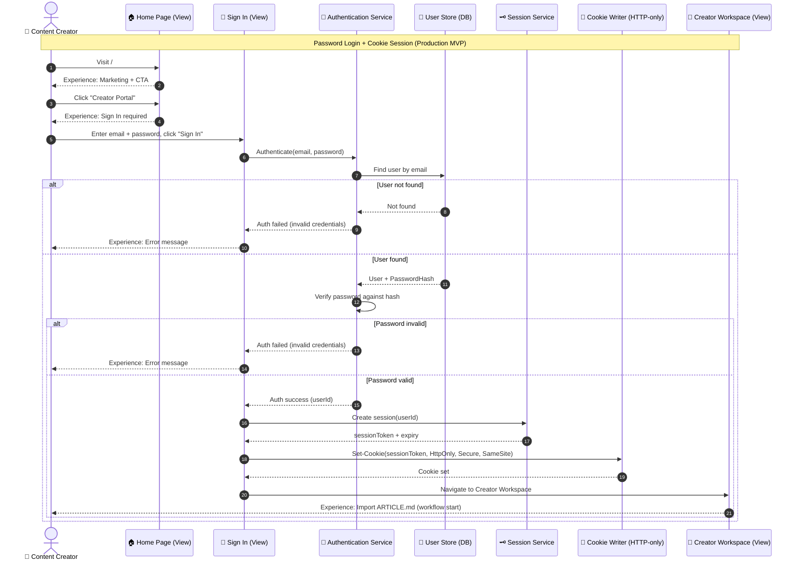
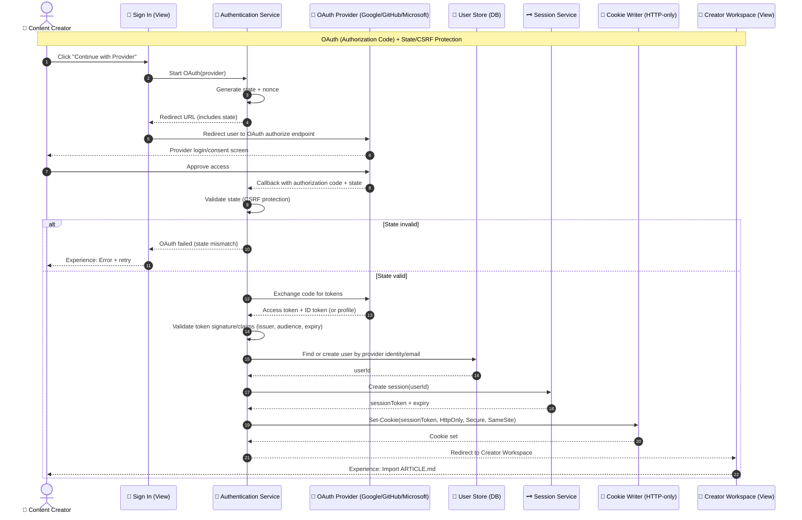

Yep — what you have is a **solid “content-creator-entry” prototype**, and the blocker is exactly what you called out: **real authentication + real session persistence**.

Let’s keep this in **diagram form** so we can review and refine the design before writing any production code.

Below are the **3 diagrams** that “complete” the login flow design end-to-end:

1. **Password Login + Cookie Session (recommended MVP production path)**
2. **OAuth Login (Google/GitHub/Microsoft) with CSRF state protection**
3. **Session Persistence + Cross-Server Scaling (Redis/distributed cache)**

---

## 1) Home → Sign In → Session Cookie → Workspace (Password Login)

This diagram replaces “accept any password” with a real flow: lookup user → verify hash → create server-side session → set **HTTP-only cookie** → load workspace.



**Design choices embedded (reviewable):**

* Publishable sessions are **server-side** (not JWT in local storage)
* Browser holds only an **HTTP-only cookie**
* Workspace access is gated by **Session valid?**

---

## 2) OAuth Login Flow (Redirect + Callback + State Validation)

This replaces “simulated OAuth” with the real sequence: start OAuth → redirect → callback → validate `state` → exchange code → create session → cookie → workspace.



**Refinement knobs we can decide together:**

* Do you allow auto-create user on first OAuth login? (usually yes)
* Do you require email verification for password logins but not OAuth? (common)
* SameSite strategy: `Lax` usually works well; `None` needed if cross-site embeddings

---

## 3) Session Persistence + Cross-Server Scaling (No More In-Memory)

This diagram focuses on what breaks today (in-memory) and what fixes it (distributed storage + cookie).

```mermaid
flowchart LR
  Browser[🌐 Browser]
  App1[🖥️ App Server A]
  App2[🖥️ App Server B]
  Redis[(🧠 Distributed Session Store<br/>Redis / Azure Cache)]
  DB[(🧾 User DB)]
  LB[⚖️ Load Balancer]

  Browser -->|HTTP request + Cookie(sessionToken)| LB
  LB --> App1
  LB --> App2

  App1 -->|Validate token → lookup session| Redis
  App2 -->|Validate token → lookup session| Redis

  App1 --> DB
  App2 --> DB

  Redis -->|Session payload + expiry| App1
  Redis -->|Session payload + expiry| App2
```

**What this makes explicit:**

* Any server can validate any request because session is shared
* Restart doesn’t log everyone out
* Cookie is the stable client-side handle, not memory

---

# Where Your Prototype Fits

Based on your summary, you already have:

* Views: Home / Sign In / Workspace ✅
* Orchestration: flow steps ✅
* Logging/analytics ✅
* Session logic (conceptual) ✅, but storage needs upgrade

What’s left is to make these diagrams “real” by implementing:

* Password verification (hash compare)
* OAuth state/callback/code exchange
* Cookie-based auth
* Distributed session store

