```mermaid
sequenceDiagram
  participant Buyer as 👔 Buyer
  participant Browser as 🌐 Browser
  participant Homepage as 🏠 Home.razor
  
  Note over Buyer,Homepage: Beat 1: Homepage Load
  
  Buyer->>Browser: Click search result
  Browser->>Homepage: GET /
  Homepage->>Homepage: Render hero section
  Homepage->>Homepage: Load featured patterns
  Homepage-->>Browser: HTML + CSS
  Browser-->>Buyer: ✅ "Operational problems are orchestration problems"
```

```mermaid
sequenceDiagram
  participant Buyer as 👔 Buyer
  
  Note over Buyer: Beat 2: Read Value Proposition
  
  Buyer->>Buyer: Read: "Operational problems are orchestration problems"
  Buyer->>Buyer: Read: "No-scroll diagrams + implementation-ready playbooks"
  Buyer->>Buyer: Scan featured pattern cards
  Buyer->>Buyer: Recognition: "Support Ticket Escalation" = our pain point
  Buyer-->>Buyer: ✅ Decision: Worth exploring
```

```mermaid
sequenceDiagram
  participant Buyer as 👔 Buyer
  participant Homepage as 🏠 Home.razor
  participant Library as 📚 Patterns.razor
  
  Note over Buyer,Library: Beat 3: Navigate to Pattern Library
  
  Buyer->>Homepage: Click "Browse Patterns" button
  Homepage->>Library: Navigate /patterns
  Library->>Library: Load PatternService.GetAllPatternsAsync()
  Library->>Library: Initialize filter options
  Library-->>Buyer: ✅ Pattern library with sidebar filters
```

```mermaid
sequenceDiagram
  participant Buyer as 👔 Buyer
  participant Sidebar as 📋 Filter Sidebar
  participant PatternService as 🔧 Pattern Service
  
  Note over Buyer,PatternService: Beat 1: Filter by Industry
  
  Buyer->>Sidebar: Check "Technology"
  Sidebar->>PatternService: FilterPatternsAsync(industries: ["Technology"])
  PatternService->>PatternService: Filter patterns matching industry
  PatternService-->>Sidebar: ✓ 24 patterns
  Sidebar-->>Buyer: ✅ Updated grid with Technology patterns
```

```mermaid
sequenceDiagram
  participant Buyer as 👔 Buyer
  participant Sidebar as 📋 Filter Sidebar
  participant PatternService as 🔧 Pattern Service
  
  Note over Buyer,PatternService: Beat 2: Filter by Broken Signal
  
  Buyer->>Sidebar: Check "Ownership"
  Sidebar->>PatternService: FilterPatternsAsync(industries: ["Technology"], brokenSignals: ["Ownership"])
  PatternService->>PatternService: Refine filter
  PatternService-->>Sidebar: ✓ 12 patterns
  Sidebar-->>Buyer: ✅ Updated grid with Ownership-related patterns
```

```mermaid
sequenceDiagram
  participant Buyer as 👔 Buyer
  participant Dropdown as 📊 Sort Dropdown
  participant PatternService as 🔧 Pattern Service
  
  Note over Buyer,PatternService: Beat 3: Sort by Clarity Score
  
  Buyer->>Dropdown: Select "Clarity Score (Highest)"
  Dropdown->>PatternService: FilterPatternsAsync(sortBy: "clarity")
  PatternService->>PatternService: Order by ClarityScore descending
  PatternService-->>Dropdown: ✓ Sorted patterns
  Dropdown-->>Buyer: ✅ Grid reordered (highest clarity first)
```

```mermaid
sequenceDiagram
  participant Buyer as 👔 Buyer
  
  Note over Buyer: Beat 1: Read Hook and Problem
  
  Buyer->>Buyer: Read hook: "Escalated tickets that somehow become invisible"
  Buyer->>Buyer: Emotional recognition: "This is exactly our pain!"
  Buyer->>Buyer: Read problem detail (rendered markdown)
  Buyer->>Buyer: Validate: Describes ownership gaps we experience
  Buyer-->>Buyer: ✅ Pattern is highly relevant
```

# Company Buyer Pattern Discovery & Evaluation

> **Domain**: orchestration-wisdom | **Status**: active | **Auto-generated from**: [company-buyer-discovery.json](../../C:/source/repos/bpm/internal/orchestration-wisdom/sequences/company-buyer-discovery.json)

## Table of Contents

- [Overview](#overview)
- [User Story](#user-story)
- [Business Value](#business-value)
- [Governance](#governance)
- [Workflow Movements](#workflow-movements)
  - [Movement : Homepage Discovery & Initial Browse](#movement--homepage-discovery--initial-browse)
    - [Beat : Homepage Load](#beat--homepage-load)
    - [Beat : Read Value Proposition](#beat--read-value-proposition)
    - [Beat : Navigate to Pattern Library](#beat--navigate-to-pattern-library)
  - [Movement : Filter & Pattern Discovery](#movement--filter--pattern-discovery)
    - [Beat : Filter by Industry](#beat--filter-by-industry)
    - [Beat : Filter by Broken Signal](#beat--filter-by-broken-signal)
    - [Beat : Sort by Clarity Score](#beat--sort-by-clarity-score)
    - [Beat : Select Pattern Card](#beat--select-pattern-card)
  - [Movement : Deep Pattern Evaluation](#movement--deep-pattern-evaluation)
    - [Beat : Read Hook and Problem](#beat--read-hook-and-problem)
    - [Beat : Analyze As-Is Diagram](#beat--analyze-as-is-diagram)
    - [Beat : Analyze Orchestrated Diagram](#beat--analyze-orchestrated-diagram)
- [Metadata](#metadata)

## Overview

Documents how company buyers (VP Operations, IT Directors) discover the Orchestration Wisdom platform, evaluate patterns for their operational challenges, and make purchase/implementation decisions

**Purpose**: Enable efficient pattern discovery and evaluation leading to informed purchase decisions

**Trigger**: Company buyer lands on orchestration-wisdom.com homepage seeking solutions to operational problems

## User Story

**As a** VP Operations at mid-market company,
**I want to** Find proven orchestration patterns to solve recurring operational bottlenecks,
**So that** Reduce firefighting, improve team velocity, and demonstrate ROI to executive leadership.

### User Story Diagram

```mermaid
sequenceDiagram
  participant Buyer as 👔 VP Operations
  participant Homepage as 🏠 Homepage
  participant Library as 📚 Pattern Library
  participant Detail as 📄 Pattern Detail
  
  Buyer->>Homepage: Google: "support ticket escalation solution"
  Homepage-->>Buyer: ✓ "Operational problems are orchestration problems"
  
  rect rgb(230, 245, 255)
  Note over Buyer,Library: Movement 1: Discovery & Filtering
  Buyer->>Library: Browse Patterns
  Buyer->>Library: Filter: Technology, Ownership
  Library-->>Buyer: ✓ 12 matching patterns
  end
  
  rect rgb(255, 245, 230)
  Note over Buyer,Detail: Movement 2: Pattern Evaluation
  Buyer->>Detail: View "Support Ticket Escalation Backlog"
  Detail-->>Buyer: ✓ As-Is diagram (shows current pain)
  Detail-->>Buyer: ✓ Orchestrated diagram (shows solution)
  Detail-->>Buyer: ✓ HQO Score: 35/40
  end
  
  rect rgb(240, 255, 240)
  Note over Buyer,Detail: Movement 3: Decision & Action
  Buyer->>Detail: Download ARTICLE.md
  Buyer->>Detail: Review implementation checklist
  Buyer-->>Buyer: ✅ Decision: Present to leadership Monday
  end
```



## Business Value


## Governance

### Policies
- Homepage must load in <2 seconds
- Pattern library must support filtering by industry and broken signals
- All patterns must display HQO score and clarity metrics
- Pattern details must include implementation checklist and estimated impact
- Export functionality must generate implementation-ready artifacts

### Metrics
- Homepage bounce rate
- Pattern discovery time (homepage → relevant pattern)
- Pattern evaluation completion rate
- Download/export conversion rate
- Time from first visit to purchase decision

## Workflow Movements

### Movement : Homepage Discovery & Initial Browse

Buyer lands on homepage, understands value proposition, and navigates to pattern library

**Tempo**: 120 | **Status**: active


#### User Story

**As a** Company Buyer,
**I want to** Quickly understand if this platform can solve my operational problems,
**So that** Avoid wasting time on irrelevant solutions.


**Beats**: 3

#### Beat : Homepage Load
- **Handler**: `Home.razor page render`
- **Event**: homepage.visited

**User Story**:

- **Persona**: First-time visitor
- **Goal**: Understand what this platform offers
- **Benefit**: Decide if worth exploring further

**User Story Diagram**:


**Visual Diagram**:



**Notes**:
- Hero section must be compelling and clear
- Featured patterns should show diversity (different industries/signals)

#### Beat : Read Value Proposition
- **Handler**: `User reading content`
- **External System**: User - Visual attention ()
- **Event**: value.proposition.read

**User Story**:

- **Persona**: Skeptical buyer
- **Goal**: Validate this isn't generic consulting fluff
- **Benefit**: Feel confident to invest time exploring

**User Story Diagram**:


**Visual Diagram**:



**Notes**:
- Value prop must be concise (1-2 sentences)
- Featured patterns should show real problems, not abstractions

#### Beat : Navigate to Pattern Library
- **Handler**: `Navigation to /patterns`
- **Event**: patterns.browsed

**User Story**:

- **Persona**: Engaged buyer
- **Goal**: See full catalog of patterns
- **Benefit**: Find patterns specific to my industry/problem

**User Story Diagram**:


**Visual Diagram**:



**Notes**:
- Pattern library should load quickly (<1 second)
- Filters should be visible and intuitive

---

### Movement : Filter & Pattern Discovery

Buyer uses filters to narrow down patterns to most relevant for their context

**Tempo**: 100 | **Status**: active


#### User Story

**As a** Company Buyer,
**I want to** Quickly find patterns matching my industry and problem type,
**So that** Avoid information overload, focus on relevant solutions.


**Beats**: 4

#### Beat : Filter by Industry
- **Handler**: `FilterOptions.Industries selection + ApplyFilters()`
- **Event**: pattern.filtered

**User Story**:

- **Persona**: Technology company buyer
- **Goal**: See patterns relevant to my industry
- **Benefit**: Examples resonate with my operational context

**User Story Diagram**:


**Visual Diagram**:



**Notes**:
- Filter should update instantly (no page reload)
- Pattern count should update to show number of matches

#### Beat : Filter by Broken Signal
- **Handler**: `FilterOptions.BrokenSignals selection + ApplyFilters()`
- **Event**: pattern.filtered

**User Story**:

- **Persona**: Buyer with ownership clarity issues
- **Goal**: Find patterns addressing ownership gaps
- **Benefit**: Solutions directly target my team's pain point

**User Story Diagram**:


**Visual Diagram**:



**Notes**:
- Multiple filters should work together (AND logic)
- Filter badges should show active selections

#### Beat : Sort by Clarity Score
- **Handler**: `FilterOptions.SortBy selection + ApplyFilters()`
- **Event**: pattern.sorted

**User Story**:

- **Persona**: Quality-focused buyer
- **Goal**: See highest-quality patterns first
- **Benefit**: Don't waste time on low-quality content

**User Story Diagram**:


**Visual Diagram**:



**Notes**:
- Clarity score should be visible on pattern cards
- Default sort should be 'Most Referenced'

#### Beat : Select Pattern Card
- **Handler**: `Navigation to /patterns/{slug}`
- **Event**: pattern.detail.viewed

**User Story**:

- **Persona**: Interested buyer
- **Goal**: See full pattern details and diagrams
- **Benefit**: Evaluate if pattern solves my specific problem

**User Story Diagram**:


**Visual Diagram**:


**Notes**:
- Pattern card should be clickable (entire card, not just title)
- Detail page should load diagrams without flicker

---

### Movement : Deep Pattern Evaluation

Buyer reads pattern details, analyzes diagrams, and evaluates fit for their organization

**Tempo**: 80 | **Status**: active


#### User Story

**As a** Company Buyer,
**I want to** Deeply understand the pattern and validate it solves my problem,
**So that** Make informed decision about implementation.


**Beats**: 3

#### Beat : Read Hook and Problem
- **Handler**: `User reading markdown content rendered by MarkdownService`
- **External System**: User - Visual attention ()
- **Event**: pattern.hook.read

**User Story**:

- **Persona**: Busy executive
- **Goal**: Quickly determine if pattern matches my situation
- **Benefit**: Don't waste time on irrelevant patterns

**User Story Diagram**:


**Visual Diagram**:



**Notes**:
- Hook must be emotionally resonant, not generic
- Problem section should describe systemic issue, not blame

#### Beat : Analyze As-Is Diagram
- **Handler**: `Mermaid.js rendering <pre class="mermaid"> blocks`
- **External System**: Mermaid.js - Diagram renderer ()
- **Event**: diagram.analyzed

**User Story**:

- **Persona**: Visual thinker
- **Goal**: See my current broken workflow visualized
- **Benefit**: Confirm pattern understands my problem

**User Story Diagram**:

```mermaid
sequenceDiagram
  participant B as Buyer
  participant D as Diagram
  B->>D: View As-Is
  D-->>B: Rendered diagram
  B->>B: Analyze flow
```

**Visual Diagram**:

```mermaid
sequenceDiagram
  participant Buyer as 👔 Buyer
  participant Browser as 🌐 Browser
  participant Mermaid as 🎨 Mermaid.js
  
  Note over Buyer,Mermaid: Beat 2: Analyze As-Is Diagram
  
  Buyer->>Browser: Scroll to As-Is diagram section
  Browser->>Mermaid: Render <pre class="mermaid">
  Mermaid->>Mermaid: Parse sequence diagram syntax
  Mermaid->>Mermaid: Draw actors: Customer, L1, L2, L3, Queue
  Mermaid->>Mermaid: Draw 12 interaction steps
  Mermaid-->>Browser: ✓ Interactive diagram
  Browser-->>Buyer: ✓ Diagram visible (no scroll needed)
  
  Buyer->>Buyer: Analyze: Ticket → L1 → L2 → stuck in queue
  Buyer->>Buyer: Identify: No clear owner, no SLA tracking
  Buyer-->>Buyer: ✅ "This is our current broken process!"
```

**Notes**:
- Diagram must fit in viewport (no horizontal scroll)
- Actor names should be clear and relatable

#### Beat : Analyze Orchestrated Diagram
- **Handler**: `Mermaid.js rendering orchestrated diagram`
- **External System**: Mermaid.js - Diagram renderer ()
- **Event**: diagram.analyzed

**User Story**:

- **Persona**: Solution-focused buyer
- **Goal**: Understand the orchestration improvement
- **Benefit**: Visualize how my workflow could improve

**User Story Diagram**:

```mermaid
sequenceDiagram
  participant B as Buyer
  participant D as Diagram
  B->>D: View Orchestrated
  D-->>B: Solution diagram
  B->>B: Understand improvement
```

**Visual Diagram**:

```mermaid
sequenceDiagram
  participant Buyer as 👔 Buyer
  participant Browser as 🌐 Browser
  participant Mermaid as 🎨 Mermaid.js
  
  Note over Buyer,Mermaid: Beat 3: Analyze Orchestrated Diagram
  
  Buyer->>Browser: Scroll to Orchestrated diagram section
  Browser->>Mermaid: Render orchestrated diagram
  Mermaid->>Mermaid: Parse diagram (7 actors, 16 steps)
  Mermaid->>Mermaid: Draw new elements: Smart Router, SLA Monitor
  Mermaid-->>Buyer: ✓ Improved workflow diagram
  
  Buyer->>Buyer: Analyze: Router assigns to available L2
  Buyer->>Buyer: Analyze: SLA Monitor tracks aging tickets
  Buyer->>Buyer: Compare: 6 actors → 7 actors (added Router)
  Buyer->>Buyer: Insight: "Clear ownership + capacity awareness = solution"
  Buyer-->>Buyer: ✅ "This would solve our problem!"
```

**Notes**:
- Orchestration elements should be visually distinct
- Improvement should be obvious from diagram alone

---

## Metadata

- **Version**: 
- **Author**: 
- **Created**: 
- **Tags**: 

---

_This documentation was auto-generated from the canonical sequence definition._
_**Canonical Reference**: [company-buyer-discovery.json](../../C:/source/repos/bpm/internal/orchestration-wisdom/sequences/company-buyer-discovery.json)_
