```mermaid
sequenceDiagram
  participant Creator as 📝 Creator
  participant Analytics as 📊 Analytics Dashboard
  
  Note over Creator,Analytics: Beat 1: Review Analytics
  
  Creator->>Analytics: Login to dashboard
  Analytics->>Analytics: Query top searches with no results
  Analytics-->>Creator: ✓ "Escalation backlog" (892 searches, 0 results)
  Creator-->>Creator: ✅ High-value opportunity identified
```

```mermaid
sequenceDiagram
  participant Creator as 📝 Creator
  
  Note over Creator: Beat 3: Document Findings
  
  Creator->>Creator: Write problem summary
  Creator->>Creator: Identify broken signals: Ownership, Visibility, Time/SLA
  Creator->>Creator: Sketch workflow: Customer → L1 → L2 → stuck
  Creator->>Creator: Note typical metrics: 35% SLA breach
  Creator-->>Creator: ✅ Research package ready for AI
```

```mermaid
sequenceDiagram
  participant Creator as 📝 Creator
  participant Template as 📄 OWS Template
  
  Note over Creator,Template: Beat 1: Load Template
  
  Creator->>Template: Open ARTICLE.md template
  Template-->>Creator: ✓ 9 sections structure
  Creator->>Creator: Copy template to AI context
  Creator-->>Creator: ✅ Template ready
```

```mermaid
sequenceDiagram
  participant Creator as 📝 Creator
  participant FileSystem as 💾 File System
  
  Note over Creator,FileSystem: Beat 3: Save Draft
  
  Creator->>FileSystem: Save as support-ticket-escalation.md
  FileSystem-->>Creator: ✓ File saved
  Creator-->>Creator: ✅ Draft ready for review
```

```mermaid
sequenceDiagram
  participant Creator as 📝 Creator
  participant Desktop as 🖥️ MarkdownViewer
  participant Markdig as 📝 Markdig
  participant Mermaid as 🎨 Mermaid.js
  
  Note over Creator,Mermaid: Beat 1: Open in Desktop
  
  Creator->>Desktop: Open ARTICLE.md
  Desktop->>Markdig: ConvertToHtml()
  Markdig->>Markdig: Parse markdown
  Markdig->>Markdig: Apply extensions
  Markdig->>Markdig: Custom Mermaid renderer
  Markdig-->>Desktop: ✓ HTML with <pre class="mermaid">
  Desktop->>Mermaid: Initialize and render
  Mermaid-->>Desktop: ✓ Interactive diagrams
  Desktop-->>Creator: ✅ Live preview ready
```

```mermaid
sequenceDiagram
  participant Creator as 📝 Creator
  participant Editor as 📝 VS Code
  participant FileWatcher as 👁️ Watcher
  participant Desktop as 🖥️ MarkdownViewer
  
  Note over Creator,Desktop: Beat 2: Refine Content
  
  Creator->>Editor: Edit: Strengthen hook
  Creator->>Editor: Edit: Add industry context
  Creator->>Editor: Edit: Clarify Router logic
  Creator->>Editor: Save (Ctrl+S)
  FileWatcher->>FileWatcher: Detect file change
  FileWatcher->>Desktop: Notify: File modified
  Desktop->>Desktop: Reload markdown
  Desktop->>Desktop: Re-render
  Desktop-->>Creator: ✅ Preview updated (auto-refresh)
```

# Content Creator End-to-End Journey

> **Domain**: orchestration-wisdom | **Status**: active | **Auto-generated from**: [content-creator-end-to-end.json](../../C:/source/repos/bpm/internal/orchestration-wisdom/sequences/content-creator-end-to-end.json)

## Table of Contents

- [Overview](#overview)
- [User Story](#user-story)
- [Business Value](#business-value)
- [Governance](#governance)
- [Workflow Movements](#workflow-movements)
  - [Movement : Pattern Discovery & Research](#movement--pattern-discovery--research)
    - [Beat : Review Platform Analytics](#beat--review-platform-analytics)
    - [Beat : Conduct Industry Research](#beat--conduct-industry-research)
    - [Beat : Document Research Findings](#beat--document-research-findings)
  - [Movement : AI-Assisted Pattern Generation](#movement--ai-assisted-pattern-generation)
    - [Beat : Load OWS Template](#beat--load-ows-template)
    - [Beat : Generate Pattern with AI](#beat--generate-pattern-with-ai)
    - [Beat : Save Pattern Draft](#beat--save-pattern-draft)
  - [Movement : Desktop Validation & Refinement](#movement--desktop-validation--refinement)
    - [Beat : Open in MarkdownViewer](#beat--open-in-markdownviewer)
    - [Beat : Refine Content](#beat--refine-content)
    - [Beat : Validate Diagram Budgets](#beat--validate-diagram-budgets)
    - [Beat : Calculate HQO Scorecard](#beat--calculate-hqo-scorecard)
  - [Movement : JSON Export & Schema Validation](#movement--json-export--schema-validation)
    - [Beat : Export to OWS JSON](#beat--export-to-ows-json)
    - [Beat : Validate Against Schema](#beat--validate-against-schema)
  - [Movement : Version Control & Publication](#movement--version-control--publication)
    - [Beat : Commit to Git](#beat--commit-to-git)
    - [Beat : CI/CD Pipeline Deploy](#beat--cicd-pipeline-deploy)
    - [Beat : Track Publication Event](#beat--track-publication-event)
    - [Beat : Verify Pattern Live](#beat--verify-pattern-live)
  - [Movement : Engagement Monitoring & Iteration](#movement--engagement-monitoring--iteration)
    - [Beat : Monitor Initial Engagement](#beat--monitor-initial-engagement)
    - [Beat : Collect User Feedback](#beat--collect-user-feedback)
    - [Beat : Plan Iteration](#beat--plan-iteration)
    - [Beat : Track Long-term Impact](#beat--track-long-term-impact)
    - [Beat : Identify Next Content Gaps](#beat--identify-next-content-gaps)
- [Metadata](#metadata)

## Overview

Complete end-to-end journey for content creators using the Orchestration Wisdom platform, from identifying operational patterns in the wild through AI-assisted authoring, desktop validation, publication, and tracking user engagement metrics

**Purpose**: Enable content creators to discover, document, publish, and measure the impact of orchestration patterns at scale

**Trigger**: Content creator identifies operational anti-pattern in industry research, client feedback, or platform analytics showing content gap

## User Story

**As a** Content Creator / AI Researcher,
**I want to** Continuously discover, document, and publish high-quality orchestration patterns that solve real operational problems,
**So that** Build comprehensive pattern library that drives platform value, user engagement, and operational improvements across organizations.

### User Story Diagram

```mermaid
sequenceDiagram
  participant Creator as 📝 Content Creator
  participant Analytics as 📊 Platform Analytics
  participant AI as 🤖 Claude/GPT-4
  participant Desktop as 🖥️ MarkdownViewer
  participant Platform as 🌐 OW Platform
  participant Users as 👥 Users
  
  Creator->>Analytics: Review content gaps
  Analytics-->>Creator: ✓ "Escalation" highly searched
  
  rect rgb(230, 245, 255)
  Note over Creator,AI: Phase 1: AI-Assisted Authoring
  Creator->>AI: Generate escalation pattern
  AI-->>Creator: ✓ ARTICLE.md with diagrams
  end
  
  rect rgb(255, 245, 230)
  Note over Creator,Desktop: Phase 2: Desktop Validation
  Creator->>Desktop: Preview & validate
  Desktop-->>Creator: ✓ HQO: 35/40
  end
  
  rect rgb(240, 255, 240)
  Note over Creator,Platform: Phase 3: Publication
  Creator->>Platform: Publish pattern
  Platform-->>Users: ✓ Pattern live
  end
  
  rect rgb(255, 245, 255)
  Note over Creator,Users: Phase 4: Engagement & Iteration
  Users->>Platform: View, download, implement
  Platform->>Analytics: Track engagement
  Analytics-->>Creator: ✓ 1,240 views, 89 downloads
  end
```



## Business Value


## Governance

### Policies
- All patterns must score ≥30/40 on HQO rubric before publication
- Mermaid diagrams must adhere to budget constraints (≤7 actors, ≤18 steps)
- Content must be validated in MarkdownViewer before publication
- Published patterns must include complete implementation checklists
- Analytics must be reviewed monthly to identify content gaps

### Metrics
- Pattern generation time (research → publication)
- AI token usage per pattern
- Pattern quality score (HQO average)
- Time to first view after publication
- Pattern engagement rate (views, downloads, implementations)

## Workflow Movements

### Movement : Pattern Discovery & Research

Content creator identifies pattern opportunity through analytics, industry research, and user feedback

**Tempo**: 120 | **Status**: active


#### User Story

**As a** Content Creator,
**I want to** Identify high-value pattern opportunities that solve real operational problems,
**So that** Focus effort on patterns users actually need, not speculative content.


**Beats**: 3

#### Beat : Review Platform Analytics
- **Handler**: `Analytics dashboard review`
- **External System**: Platform - Google Analytics / Custom Dashboard ()
- **Event**: research.initiated

**User Story**:

- **Persona**: Data-driven content creator
- **Goal**: Find patterns users are actively searching for
- **Benefit**: Create content that immediately gets traffic and engagement

**User Story Diagram**:


**Visual Diagram**:



**Notes**:
- Review analytics weekly for trends
- Prioritize topics with 100+ searches per month

#### Beat : Conduct Industry Research
- **Handler**: `Manual research across multiple sources`
- **External System**: Various - Reddit, HN, Forums, Client feedback ()
- **Event**: gap.identified

**User Story**:

- **Persona**: Thorough researcher
- **Goal**: Validate that pattern solves real widespread problem
- **Benefit**: Avoid creating patterns for edge cases or hypothetical scenarios

**User Story Diagram**:


**Visual Diagram**:


**Notes**:
- Look for problems with emotional language (frustration indicators)
- Validate across at least 3 independent sources

#### Beat : Document Research Findings
- **Handler**: `Note-taking in Notion/Confluence`
- **External System**: Creator - Notion / Confluence / OneNote ()
- **Event**: research.documented

**User Story**:

- **Persona**: Organized content creator
- **Goal**: Have clear context before engaging AI
- **Benefit**: Better AI prompts, more accurate pattern generation

**User Story Diagram**:


**Visual Diagram**:



**Notes**:
- Include specific metrics when available
- Note which orchestration signals are broken

---

### Movement : AI-Assisted Pattern Generation

Use AI to generate complete pattern draft following OWS template

**Tempo**: 140 | **Status**: active


#### User Story

**As a** Efficient content creator,
**I want to** Generate high-quality pattern draft in minutes, not hours,
**So that** Focus creative energy on refinement, not blank-page writing.


**Beats**: 3

#### Beat : Load OWS Template
- **Handler**: `Template file loading`
- **Event**: template.loaded

**User Story**:

- **Persona**: Template-driven creator
- **Goal**: Ensure AI follows consistent structure
- **Benefit**: All patterns have same format, quality, completeness

**User Story Diagram**:


**Visual Diagram**:



**Notes**:
- Template includes examples for each section
- Diagram budget constraints included in comments

#### Beat : Generate Pattern with AI
- **Handler**: `AI API call (Claude/GPT-4)`
- **External System**: Anthropic / OpenAI - Claude 3.5 Sonnet / GPT-4 ()
- **Event**: draft.generated

**User Story**:

- **Persona**: AI-assisted creator
- **Goal**: Get complete, high-quality draft in one generation
- **Benefit**: Reduce iteration cycles, faster time to publication

**User Story Diagram**:


**Visual Diagram**:


**Notes**:
- Use detailed prompts with specific metrics
- Include industry context for relevant examples

#### Beat : Save Pattern Draft
- **Handler**: `File system save`
- **Event**: draft.saved

**User Story**:

- **Persona**: Organized creator
- **Goal**: Have draft saved for desktop review
- **Benefit**: Can iterate without losing work

**User Story Diagram**:


**Visual Diagram**:



**Notes**:
- Use descriptive filename matching pattern slug
- Save in dedicated drafts folder

---

### Movement : Desktop Validation & Refinement

Review pattern in MarkdownViewer, validate diagrams and HQO score, refine content

**Tempo**: 90 | **Status**: active


#### User Story

**As a** Quality-focused creator,
**I want to** Ensure pattern meets all quality standards before publication,
**So that** Publish with confidence, maintain platform reputation.


**Beats**: 4

#### Beat : Open in MarkdownViewer
- **Handler**: `MarkdownViewer.MainWindow`
- **Event**: preview.opened

**User Story**:

- **Persona**: Visual reviewer
- **Goal**: See exactly how pattern will look when published
- **Benefit**: WYSIWYG: desktop preview = web rendering

**User Story Diagram**:


**Visual Diagram**:



**Notes**:
- Same Markdig pipeline as web platform
- Instant validation of formatting

#### Beat : Refine Content
- **Handler**: `Text editor + FileWatcher`
- **External System**: Creator - VS Code / Sublime ()
- **Event**: content.refined

**User Story**:

- **Persona**: Iterative creator
- **Goal**: Quickly refine content with instant feedback
- **Benefit**: See changes immediately, iterate faster

**User Story Diagram**:


**Visual Diagram**:



**Notes**:
- Use split-screen: editor left, preview right
- Focus on clarity and concreteness

#### Beat : Validate Diagram Budgets
- **Handler**: `MermaidDiagramValidator (future)`
- **Event**: diagram.validated

**User Story**:

- **Persona**: Standards-focused creator
- **Goal**: Ensure diagrams are simple and no-scroll
- **Benefit**: Maintain platform principle of diagram simplicity

**User Story Diagram**:

```mermaid
sequenceDiagram
  participant C as Creator
  participant V as Validator
  C->>V: Validate diagrams
  V-->>C: Both within budget
```

**Visual Diagram**:

```mermaid
sequenceDiagram
  participant Creator as 📝 Creator
  participant Validator as ✅ Diagram Validator
  
  Note over Creator,Validator: Beat 3: Validate Diagrams
  
  Creator->>Validator: Validate As-Is diagram
  Validator->>Validator: Count actors: 6 ✓ (≤7)
  Validator->>Validator: Count steps: 12 ✓ (≤18)
  Validator->>Validator: Count alt blocks: 1 ✓ (≤2)
  Validator-->>Creator: ✅ As-Is within budget
  
  Creator->>Validator: Validate Orchestrated diagram
  Validator->>Validator: Count actors: 7 ✓ (≤7)
  Validator->>Validator: Count steps: 16 ✓ (≤18)
  Validator->>Validator: Count alt blocks: 2 ✓ (≤2)
  Validator-->>Creator: ✅ Orchestrated within budget
```

**Notes**:
- Budget: ≤7 actors, ≤18 steps, ≤2 alt blocks
- If exceeds budget, simplify or split pattern

#### Beat : Calculate HQO Scorecard
- **Handler**: `HQOScorecardCalculator (future)`
- **Event**: hqo.calculated

**User Story**:

- **Persona**: Quality-driven creator
- **Goal**: Verify pattern meets 30/40 threshold
- **Benefit**: Publish only high-quality patterns

**User Story Diagram**:

```mermaid
sequenceDiagram
  participant C as Creator
  participant H as HQO Calc
  C->>H: Calculate score
  H-->>C: 35/40 (pass)
```

**Visual Diagram**:

```mermaid
sequenceDiagram
  participant Creator as 📝 Creator
  participant Calculator as 📊 HQO Calculator
  
  Note over Creator,Calculator: Beat 4: Calculate HQO
  
  Creator->>Calculator: Calculate scorecard
  Calculator->>Calculator: Score Ownership: 5/5
  Calculator->>Calculator: Score Time/SLA: 4/5
  Calculator->>Calculator: Score Capacity: 4/5
  Calculator->>Calculator: Score Visibility: 4/5
  Calculator->>Calculator: Score Customer Loop: 3/5
  Calculator->>Calculator: Score Escalation: 5/5
  Calculator->>Calculator: Score Handoffs: 4/5
  Calculator->>Calculator: Score Documentation: 3/5
  Calculator->>Calculator: Total: 35/40 ✓ (≥30 threshold)
  Calculator->>Calculator: Check: All dimensions ≥3 ✓
  Calculator-->>Creator: ✅ HQO: 35/40 (Ready to publish)
```

**Notes**:
- 8 dimensions: Ownership, Time/SLA, Capacity, Visibility, Customer Loop, Escalation, Handoffs, Documentation
- Threshold: Total ≥30, no dimension <3

---

### Movement : JSON Export & Schema Validation

Convert markdown to OWS JSON and validate against schema

**Tempo**: 100 | **Status**: active


#### User Story

**As a** Technical creator,
**I want to** Generate valid JSON for platform ingestion,
**So that** Pattern loads correctly with all features working.

```mermaid
sequenceDiagram
  participant Creator
  participant Exporter
  participant Validator
  Creator->>Exporter: Export JSON
  Exporter->>Validator: Validate
  Validator-->>Creator: Valid
```

**Beats**: 2

#### Beat : Export to OWS JSON
- **Handler**: `PatternJsonExporter`
- **Event**: json.exported

**User Story**:

- **Persona**: Structured data creator
- **Goal**: Convert markdown to JSON automatically
- **Benefit**: No manual JSON writing, fewer errors

**User Story Diagram**:

```mermaid
sequenceDiagram
  participant C as Creator
  participant E as Exporter
  C->>E: Export JSON
  E-->>C: JSON file
```

**Visual Diagram**:

```mermaid
sequenceDiagram
  participant Creator as 📝 Creator
  participant Desktop as 🖥️ MarkdownViewer
  participant Parser as 🔍 Markdown Parser
  participant Builder as 🏗️ JSON Builder
  
  Note over Creator,Builder: Beat 1: Export to JSON
  
  Creator->>Desktop: File → Export to OWS JSON
  Desktop->>Parser: Parse markdown structure
  Parser->>Parser: Extract sections (Hook, Problem, etc.)
  Parser->>Parser: Extract Mermaid diagrams
  Parser->>Parser: Parse checklist items
  Parser-->>Builder: ✓ Structured data
  Builder->>Builder: Build Pattern JSON
  Builder->>Builder: Set all fields (id, slug, markdown sections, diagrams, scorecard)
  Builder-->>Creator: ✅ support-ticket-escalation.pattern.json (8.4 KB)
```

**Notes**:
- Preserve markdown formatting in JSON
- Extract metadata from front matter if present

#### Beat : Validate Against Schema
- **Handler**: `JSON Schema validator`
- **Event**: schema.validated

**User Story**:

- **Persona**: Standards-compliant creator
- **Goal**: Ensure JSON won't cause runtime errors
- **Benefit**: Catch structural issues before publication

**User Story Diagram**:

```mermaid
sequenceDiagram
  participant C as Creator
  participant V as Validator
  C->>V: Validate
  V-->>C: Pass
```

**Visual Diagram**:

```mermaid
sequenceDiagram
  participant Creator as 📝 Creator
  participant Validator as ✅ JSON Schema Validator
  participant Schema as 📋 pattern.schema.json
  
  Note over Creator,Schema: Beat 2: Validate Schema
  
  Creator->>Validator: Validate pattern.json
  Validator->>Schema: Load schema definition
  Schema-->>Validator: ✓ Schema loaded
  Validator->>Validator: Validate required fields
  Validator->>Validator: Validate data types
  Validator->>Validator: Validate scorecard structure
  Validator->>Validator: Check HQO constraints
  Validator-->>Creator: ✅ Schema validation passed
```

**Notes**:
- Use JSON Schema Draft-07 or later
- Validate before committing to avoid CI failures

---

### Movement : Version Control & Publication

Commit pattern to Git, trigger CI/CD, publish to platform

**Tempo**: 110 | **Status**: active


#### User Story

**As a** Publishing creator,
**I want to** Get pattern live on platform quickly,
**So that** Fast feedback loop from publication to user engagement.

```mermaid
sequenceDiagram
  participant Creator
  participant Git
  participant CICD
  participant Platform
  Creator->>Git: Commit & push
  Git->>CICD: Trigger deploy
  CICD->>Platform: Deploy
  Platform-->>Creator: Live
```

**Beats**: 4

#### Beat : Commit to Git
- **Handler**: `Git command line`
- **External System**: Git - Git CLI ()
- **Event**: pattern.committed

**User Story**:

- **Persona**: Version-conscious creator
- **Goal**: Track pattern evolution over time
- **Benefit**: Can revert if needed, history preserved

**User Story Diagram**:

```mermaid
sequenceDiagram
  participant C as Creator
  participant G as Git
  C->>G: Commit
  G-->>C: Committed
```

**Visual Diagram**:

```mermaid
sequenceDiagram
  participant Creator as 📝 Creator
  participant Git as 📦 Git
  
  Note over Creator,Git: Beat 1: Commit to Git
  
  Creator->>Git: git add patterns/support-ticket-escalation.pattern.json
  Git-->>Creator: ✓ Staged
  Creator->>Git: git commit -m "Add Support Ticket Escalation pattern (HQO: 35/40)"
  Git-->>Creator: ✓ Committed [abc123f]
  Creator->>Git: git push origin main
  Git-->>Creator: ✅ Pushed to remote
```

**Notes**:
- Include HQO score in commit message
- Use conventional commit format

#### Beat : CI/CD Pipeline Deploy
- **Handler**: `Azure DevOps / GitHub Actions`
- **External System**: Microsoft / GitHub - CI/CD Pipeline ()
- **Event**: pattern.published

**User Story**:

- **Persona**: Hands-off creator
- **Goal**: Automatic deployment without manual steps
- **Benefit**: Fast time to live, no manual deployment errors

**User Story Diagram**:

```mermaid
sequenceDiagram
  participant CICD
  participant Platform
  CICD->>CICD: Build & test
  CICD->>Platform: Deploy
  Platform-->>CICD: Success
```

**Visual Diagram**:

```mermaid
sequenceDiagram
  participant Git as 📦 Git
  participant CICD as ⚙️ CI/CD Pipeline
  participant Platform as 🌐 Platform
  
  Note over Git,Platform: Beat 2: CI/CD Deploy
  
  Git->>CICD: Webhook: New commit on main
  CICD->>CICD: Checkout code
  CICD->>CICD: Run tests: dotnet test
  CICD->>CICD: Build: dotnet build
  CICD->>Platform: Deploy to Azure App Service
  Platform->>Platform: Reload patterns
  Platform->>Platform: Load new pattern
  Platform-->>CICD: ✅ Deployment successful (4 min)
```

**Notes**:
- Deploy to staging first if available
- Monitor deployment for errors

#### Beat : Track Publication Event
- **Handler**: `AnalyticsService.TrackEvent`
- **Event**: analytics.tracked

**User Story**:

- **Persona**: Data-driven creator
- **Goal**: Track publication for performance analysis
- **Benefit**: Can measure content velocity and quality trends

**User Story Diagram**:

```mermaid
sequenceDiagram
  participant P as Platform
  participant A as Analytics
  P->>A: Track publication
  A-->>P: Logged
```

**Visual Diagram**:

```mermaid
sequenceDiagram
  participant Platform as 🌐 Platform
  participant Analytics as 📊 Analytics
  
  Note over Platform,Analytics: Beat 3: Track Publication
  
  Platform->>Analytics: TrackEvent("pattern_published")
  Analytics->>Analytics: Log metadata: PatternId, HQOScore, Author, Timestamp
  Analytics->>Analytics: Initialize engagement tracking
  Analytics-->>Platform: ✅ Event recorded (evt_5847)
```

**Notes**:
- Track: PatternId, HQOScore, Author, PublishDate
- Use for content velocity metrics

#### Beat : Verify Pattern Live
- **Handler**: `Browser verification`
- **External System**: Creator - Web Browser ()
- **Event**: pattern.verified

**User Story**:

- **Persona**: Cautious creator
- **Goal**: Confirm pattern is actually live and rendering correctly
- **Benefit**: Catch deployment issues immediately

**User Story Diagram**:

```mermaid
sequenceDiagram
  participant C as Creator
  participant P as Platform
  C->>P: Visit URL
  P-->>C: Pattern loads
```

**Visual Diagram**:

```mermaid
sequenceDiagram
  participant Creator as 📝 Creator
  participant Platform as 🌐 Platform
  
  Note over Creator,Platform: Beat 4: Verify Live
  
  Creator->>Platform: Visit /patterns/support-ticket-escalation-backlog
  Platform->>Platform: Load pattern from PatternService
  Platform->>Platform: Render markdown with MarkdownService
  Platform->>Platform: Render Mermaid diagrams
  Platform-->>Creator: ✅ Pattern live and rendering correctly
```

**Notes**:
- Check diagrams render without errors
- Verify download button works

---

### Movement : Engagement Monitoring & Iteration

Track pattern performance, collect feedback, plan improvements

**Tempo**: 80 | **Status**: active


#### User Story

**As a** Growth-focused creator,
**I want to** Continuously improve patterns based on user behavior,
**So that** Higher engagement, better user outcomes, platform growth.

```mermaid
sequenceDiagram
  participant Creator
  participant Analytics
  participant Users
  participant Feedback
  Users->>Analytics: Engagement events
  Analytics-->>Creator: Performance data
  Users->>Feedback: Comments/questions
  Feedback-->>Creator: Improvement ideas
  Creator->>Creator: Plan iteration
```

**Beats**: 5

#### Beat : Monitor Initial Engagement
- **Handler**: `Analytics dashboard review`
- **External System**: Platform - Google Analytics / Custom Dashboard ()
- **Event**: engagement.measured

**User Story**:

- **Persona**: Metric-focused creator
- **Goal**: Understand initial pattern performance
- **Benefit**: Identify issues early, validate content quality

**User Story Diagram**:

```mermaid
sequenceDiagram
  participant C as Creator
  participant A as Analytics
  C->>A: Check metrics
  A-->>C: Week 1 data
```

**Visual Diagram**:

```mermaid
sequenceDiagram
  participant Creator as 📝 Creator
  participant Analytics as 📊 Analytics Dashboard
  
  Note over Creator,Analytics: Beat 1: Monitor Engagement
  
  Creator->>Creator: Wait 1 week
  Creator->>Analytics: Login to dashboard
  Analytics->>Analytics: Query pattern metrics
  Analytics-->>Creator: Week 1:
  Analytics-->>Creator: - Views: 1,240
  Analytics-->>Creator: - Downloads: 89 (7.2%)
  Analytics-->>Creator: - Avg time: 6m 34s
  Analytics-->>Creator: - Bounce: 23% (low = good)
  Creator-->>Creator: ✅ Strong initial performance
```

**Notes**:
- Look for: high time on page, low bounce rate
- Compare to other patterns for relative performance

#### Beat : Collect User Feedback
- **Handler**: `Feedback channel review`
- **External System**: Various - GitHub Issues, Email, Forums ()
- **Event**: feedback.collected

**User Story**:

- **Persona**: User-centric creator
- **Goal**: Understand how users are actually using the pattern
- **Benefit**: Improve based on real needs, not assumptions

**User Story Diagram**:

```mermaid
sequenceDiagram
  participant C as Creator
  participant F as Feedback
  C->>F: Review feedback
  F-->>C: Questions, issues
```

**Visual Diagram**:

```mermaid
sequenceDiagram
  participant Creator as 📝 Creator
  participant GitHub as 📋 GitHub Issues
  participant Email as 📧 Email
  participant Analytics as 📊 Analytics
  
  Note over Creator,Analytics: Beat 2: Collect Feedback
  
  Creator->>GitHub: Check issues
  GitHub-->>Creator: 2 clarification questions on Router
  Creator->>Email: Check messages
  Email-->>Creator: 1 request for Kubernetes example
  Creator->>Analytics: Check drop-off points
  Analytics-->>Creator: 44% exit at checklist section
  Creator-->>Creator: ✅ Feedback collected
```

**Notes**:
- Prioritize frequently asked questions
- Look for patterns in feedback

#### Beat : Plan Iteration
- **Handler**: `Manual analysis and planning`
- **External System**: Creator - Note-taking / Planning tool ()
- **Event**: iteration.planned

**User Story**:

- **Persona**: Iterative creator
- **Goal**: Prioritize highest-impact improvements
- **Benefit**: Better patterns, happier users, higher engagement

**User Story Diagram**:

```mermaid
sequenceDiagram
  participant C as Creator
  C->>C: Analyze feedback
  C->>C: Plan v2
  C-->>C: Improvements planned
```

**Visual Diagram**:

```mermaid
sequenceDiagram
  participant Creator as 📝 Creator
  
  Note over Creator: Beat 3: Plan Iteration
  
  Creator->>Creator: Analyze feedback patterns
  Creator->>Creator: Insight: Need more implementation detail
  Creator->>Creator: Insight: Router needs architecture diagram
  Creator->>Creator: Insight: Checklist item #3 too vague
  Creator->>Creator: Plan v2:
  Creator->>Creator: - Add Router architecture diagram
  Creator->>Creator: - Break checklist item #3 into 2 items
  Creator->>Creator: - Add "Common Pitfalls" section
  Creator->>Creator: - Create companion: "Deploying to K8s"
  Creator-->>Creator: ✅ Iteration plan ready
```

**Notes**:
- Focus on changes that improve outcomes
- Consider creating companion articles for deep dives

#### Beat : Track Long-term Impact
- **Handler**: `Analytics and feedback review`
- **External System**: Platform - Analytics + User Reports ()
- **Event**: impact.measured

**User Story**:

- **Persona**: Impact-focused creator
- **Goal**: Measure real-world operational improvements
- **Benefit**: Prove platform value, attract more users

**User Story Diagram**:

```mermaid
sequenceDiagram
  participant C as Creator
  participant F as Feedback
  C->>F: Check implementation reports
  F-->>C: 42% MTTR reduction
```

**Visual Diagram**:

```mermaid
sequenceDiagram
  participant Creator as 📝 Creator
  participant Feedback as 💬 Feedback Channels
  participant Analytics as 📊 Analytics
  
  Note over Creator,Analytics: Beat 4: Track Impact
  
  Creator->>Creator: Wait 4 weeks
  Creator->>Feedback: Check implementation reports
  Feedback-->>Creator: MSP: 42% MTTR reduction
  Feedback-->>Creator: Operator: Saved 3 weeks research
  Feedback-->>Creator: Buyer: "Exactly what we needed"
  Creator->>Analytics: Review month 1 metrics
  Analytics-->>Creator: 4,890 views, 347 downloads
  Analytics-->>Creator: 12 implementation reports
  Analytics-->>Creator: Avg improvement: 38% MTTR
  Analytics-->>Creator: ROI: $1.2M operational savings
  Creator-->>Creator: ✅ High-impact pattern validated
```

**Notes**:
- Implementation rate is key success metric
- Use success stories for marketing

#### Beat : Identify Next Content Gaps
- **Handler**: `Analytics gap analysis`
- **External System**: Platform - Analytics Dashboard ()
- **Event**: gaps.identified

**User Story**:

- **Persona**: Strategic creator
- **Goal**: Build on successful patterns to grow library
- **Benefit**: Continuous platform value growth

**User Story Diagram**:

```mermaid
sequenceDiagram
  participant C as Creator
  participant A as Analytics
  C->>A: Find related gaps
  A-->>C: Next opportunities
```

**Visual Diagram**:

```mermaid
sequenceDiagram
  participant Creator as 📝 Creator
  participant Analytics as 📊 Analytics
  
  Note over Creator,Analytics: Beat 5: Identify Next Gaps
  
  Creator->>Analytics: Search: Related terms with no results
  Analytics-->>Creator: "incident escalation priority" (234 searches)
  Analytics-->>Creator: "support handoff documentation" (189 searches)
  Analytics-->>Creator: "SLA monitoring automation" (156 searches)
  Creator->>Creator: Prioritize: "incident escalation priority" (highest demand)
  Creator-->>Creator: ✅ Next pattern identified, cycle repeats
```

**Notes**:
- Build pattern families around successful topics
- Use user searches to validate demand

---

## Metadata

- **Version**: 
- **Author**: 
- **Created**: 
- **Tags**: 

---

_This documentation was auto-generated from the canonical sequence definition._
_**Canonical Reference**: [content-creator-end-to-end.json](../../C:/source/repos/bpm/internal/orchestration-wisdom/sequences/content-creator-end-to-end.json)_
