```mermaid
sequenceDiagram
  participant Client as 🏢 Client
  participant MSP as 🎯 MSP
  
  Note over Client,MSP: Beat 1: Receive RFP
  
  Client->>MSP: RFP: Support escalation problem
  Client->>MSP: Context: 38% SLA breach rate
  Client->>MSP: Context: Customer complaints increasing
  MSP-->>Client: ✅ Will research solution and propose approach
```

```mermaid
sequenceDiagram
  participant MSP as 🎯 MSP
  participant Library as 📚 Pattern Library
  
  Note over MSP,Library: Beat 2: Search Library
  
  MSP->>Library: Visit orchestration-wisdom.com/patterns
  MSP->>Library: Filter: Industry = Technology
  MSP->>Library: Filter: Broken Signal = Ownership
  MSP->>Library: Search: "escalation"
  Library-->>MSP: ✓ 8 matching patterns
  MSP->>MSP: Review pattern cards
  MSP-->>MSP: ✅ "Support Ticket Escalation Backlog" is exact match
```

```mermaid
sequenceDiagram
  participant MSP as 🎯 MSP
  participant Pattern as 📄 Pattern Detail
  participant Files as 💾 Downloads
  
  Note over MSP,Files: Beat 4: Download Artifacts
  
  MSP->>Pattern: Click "Download ARTICLE.md"
  Pattern->>Files: Save markdown file
  Files-->>MSP: ✓ Pattern downloaded
  
  MSP->>Pattern: Click "Copy Mermaid" (As-Is)
  Pattern-->>MSP: ✓ Diagram code copied
  
  MSP->>Pattern: Click "Copy Mermaid" (Orchestrated)
  Pattern-->>MSP: ✓ Diagram code copied
  
  MSP-->>MSP: ✅ Ready to customize for client proposal
```

```mermaid
sequenceDiagram
  participant MSP as 🎯 MSP
  participant Editor as 📝 Mermaid Editor
  
  Note over MSP,Editor: Beat 1: Customize Diagrams
  
  MSP->>Editor: Open As-Is diagram code
  MSP->>Editor: Replace: "L1" → "Tier 1 Zendesk"
  MSP->>Editor: Replace: "L2" → "Tier 2 Engineering"
  MSP->>Editor: Replace: "Queue" → "Salesforce Case Queue"
  Editor-->>MSP: ✓ As-Is diagram customized
  
  MSP->>Editor: Open Orchestrated diagram code
  MSP->>Editor: Add: "PagerDuty" alert system
  MSP->>Editor: Add: "AWS Lambda" for routing
  Editor-->>MSP: ✓ Orchestrated diagram customized
  
  MSP-->>MSP: ✅ Diagrams ready for proposal
```

```mermaid
sequenceDiagram
  participant MSP as 🎯 MSP
  participant SOW as 📋 Statement of Work
  
  Note over MSP,SOW: Beat 2: Map to SOW
  
  MSP->>SOW: Checklist Item 1 → Deliverable: Smart Router Design Doc (1 week)
  MSP->>SOW: Checklist Item 2 → Deliverable: Router Implementation (2 weeks)
  MSP->>SOW: Checklist Item 3 → Deliverable: SLA Monitor Design (1 week)
  MSP->>SOW: Checklist Item 4 → Deliverable: Monitor Implementation (2 weeks)
  MSP->>SOW: Checklist Item 5 → Deliverable: Integration Testing (1 week)
  MSP->>SOW: Checklist Item 6 → Deliverable: Deployment + Training (1 week)
  MSP->>SOW: Total: 8 weeks @ 2 FTEs = $240K
  SOW-->>MSP: ✅ SOW complete with pricing
```

```mermaid
sequenceDiagram
  participant MSP as 🎯 MSP
  participant Client as 🏢 Client CISO
  
  Note over MSP,Client: Beat 3: Present Proposal
  
  MSP->>Client: Present As-Is diagram
  MSP->>Client: Explain: "This is your current broken workflow"
  Client->>Client: Recognition: "Yes, that's our problem"
  
  MSP->>Client: Present Orchestrated diagram
  MSP->>Client: Explain: "This is the solution with Smart Router + SLA Monitor"
  Client->>Client: Understanding: Clear improvement path
  
  MSP->>Client: Walk through implementation roadmap (8 weeks)
  MSP->>Client: Reference: HQO scorecard methodology
  MSP->>Client: Show: Expected 40-50% improvement in MTTR
  
  Client->>MSP: Question: "Have you done this before?"
  MSP->>Client: Answer: "Based on proven Orchestration Wisdom pattern with 35/40 HQO score"
  
  Client->>Client: Evaluate: Clear solution, credible approach, reasonable timeline
  Client-->>MSP: ✅ Approved: Proceed with $240K engagement
```

```mermaid
sequenceDiagram
  participant Lead as 🎯 MSP Lead
  participant Team as 👥 Delivery Team
  
  Note over Lead,Team: Beat 1: Team Kickoff
  
  Lead->>Team: Assign: 2 engineers + 1 QA
  Lead->>Team: Present: Pattern + client customizations
  Lead->>Team: Review: SOW deliverables and timeline
  Team->>Team: Review pattern diagrams and checklist
  Team-->>Lead: ✅ Team ready to execute
```

# MSP Domain Expert Pattern Application

> **Domain**: orchestration-wisdom | **Status**: active | **Auto-generated from**: [msp-domain-expert.json](../../C:/source/repos/bpm/internal/orchestration-wisdom/sequences/msp-domain-expert.json)

## Table of Contents

- [Overview](#overview)
- [User Story](#user-story)
- [Business Value](#business-value)
- [Governance](#governance)
- [Workflow Movements](#workflow-movements)
  - [Movement : Pattern Research & Selection](#movement--pattern-research--selection)
    - [Beat : Receive Client RFP](#beat--receive-client-rfp)
    - [Beat : Search Pattern Library](#beat--search-pattern-library)
    - [Beat : Review Pattern Details](#beat--review-pattern-details)
    - [Beat : Download Pattern Artifacts](#beat--download-pattern-artifacts)
  - [Movement : Proposal Customization & Client Presentation](#movement--proposal-customization--client-presentation)
    - [Beat : Customize Diagrams for Client](#beat--customize-diagrams-for-client)
    - [Beat : Map Checklist to SOW Deliverables](#beat--map-checklist-to-sow-deliverables)
    - [Beat : Present Proposal to Client](#beat--present-proposal-to-client)
  - [Movement : Pattern Adaptation & Delivery](#movement--pattern-adaptation--delivery)
    - [Beat : Delivery Team Kickoff](#beat--delivery-team-kickoff)
    - [Beat : Implement Pattern Components](#beat--implement-pattern-components)
    - [Beat : Deploy to Client Environment](#beat--deploy-to-client-environment)
    - [Beat : Conduct Team Training](#beat--conduct-team-training)
  - [Movement : Results Measurement & Case Study](#movement--results-measurement--case-study)
    - [Beat : Measure Post-Implementation Metrics](#beat--measure-post-implementation-metrics)
    - [Beat : Present Results to Client](#beat--present-results-to-client)
    - [Beat : Create Case Study](#beat--create-case-study)
- [Metadata](#metadata)

## Overview

Documents how MSP domain experts and consultants leverage the pattern library to structure client engagements, deliver proven solutions, and demonstrate expertise through orchestration frameworks

**Purpose**: Enable MSPs to accelerate client delivery with battle-tested patterns and reduce custom solution development time

**Trigger**: MSP receives new client engagement or needs to solve recurring client operational challenge

## User Story

**As a** MSP Domain Expert / Senior Consultant,
**I want to** Leverage proven orchestration patterns to structure client engagements and deliver faster,
**So that** Higher margins through reusable IP, faster delivery, and demonstrated expertise.

### User Story Diagram

```mermaid
sequenceDiagram
  participant MSP as 🎯 MSP Consultant
  participant Client as 🏢 Client
  participant Library as 📚 Pattern Library
  participant Solution as 🛠️ Delivered Solution
  
  Client->>MSP: Problem: Support escalation backlog
  
  rect rgb(230, 245, 255)
  Note over MSP,Library: Movement 1: Pattern Research
  MSP->>Library: Search patterns
  Library-->>MSP: ✓ Matching patterns found
  MSP->>MSP: Select best fit
  end
  
  rect rgb(255, 245, 230)
  Note over MSP,Client: Movement 2: Proposal & Engagement
  MSP->>Client: Present pattern + customization plan
  Client-->>MSP: ✅ Approved
  end
  
  rect rgb(240, 255, 240)
  Note over MSP,Solution: Movement 3: Delivery & Results
  MSP->>Solution: Adapt pattern to client
  MSP->>Client: Deliver implementation
  Client-->>MSP: ✓ 40% MTTR improvement
  end
```



## Business Value


## Governance

### Policies
- Patterns must be white-labelable for client deliverables
- All diagrams must be editable for client customization
- Checklists must map to billable deliverables
- MSP must provide attribution when using patterns in client work
- Patterns must include estimated effort for scoping

### Metrics
- Time from engagement start to solution recommendation
- Pattern reuse rate across clients
- Client satisfaction with delivered solutions
- Reduction in custom solution development time
- Revenue per pattern-based engagement

## Workflow Movements

### Movement : Pattern Research & Selection

MSP consultant searches pattern library to find solution matching client's operational challenge

**Tempo**: 120 | **Status**: active


#### User Story

**As a** MSP Consultant,
**I want to** Find proven pattern that matches client problem,
**So that** Avoid reinventing solutions, leverage battle-tested approaches.


**Beats**: 4

#### Beat : Receive Client RFP
- **Handler**: `Email or RFP document`
- **External System**: Client - Email / RFP Portal ()
- **Event**: engagement.received

**User Story**:

- **Persona**: MSP Business Development
- **Goal**: Understand client problem clearly
- **Benefit**: Accurate solution recommendation

**User Story Diagram**:


**Visual Diagram**:



**Notes**:
- Discovery call may precede formal RFP
- Key info needed: industry, team size, current tools

#### Beat : Search Pattern Library
- **Handler**: `Patterns.razor search and filtering`
- **Event**: patterns.researched

**User Story**:

- **Persona**: MSP Consultant
- **Goal**: Find patterns matching client's industry and problem
- **Benefit**: Fast solution identification without custom research

**User Story Diagram**:


**Visual Diagram**:



**Notes**:
- MSPs value patterns with HQO scores ≥30
- Filter by industry for client-relevant examples

#### Beat : Review Pattern Details
- **Handler**: `PatternDetail.razor page review`
- **Event**: pattern.selected

**User Story**:

- **Persona**: MSP Solution Architect
- **Goal**: Validate pattern solves client problem completely
- **Benefit**: Confident proposal with proven solution

**User Story Diagram**:


**Visual Diagram**:


**Notes**:
- Checklist items should map clearly to billable work
- Diagrams should be easy to white-label for client

#### Beat : Download Pattern Artifacts
- **Handler**: `DownloadArticle() and CopyMermaidCode()`
- **Event**: pattern.selected

**User Story**:

- **Persona**: MSP Proposal Writer
- **Goal**: Get pattern content for client proposal
- **Benefit**: Fast proposal creation with professional diagrams

**User Story Diagram**:


**Visual Diagram**:



**Notes**:
- ARTICLE.md should be editable (plain text)
- Mermaid code should render in common tools (Confluence, Notion)

---

### Movement : Proposal Customization & Client Presentation

MSP customizes pattern for client context and presents in proposal

**Tempo**: 100 | **Status**: active


#### User Story

**As a** MSP Consultant,
**I want to** Create compelling client proposal using pattern as foundation,
**So that** Faster proposal creation, proven solution credibility.


**Beats**: 3

#### Beat : Customize Diagrams for Client
- **Handler**: `Diagram editor (MermaidViewer or text editor)`
- **External System**: MSP - Mermaid Live Editor / VS Code ()
- **Event**: proposal.customized

**User Story**:

- **Persona**: MSP Solution Architect
- **Goal**: Make diagrams look client-specific, not generic
- **Benefit**: Client sees their exact workflow, not abstract template

**User Story Diagram**:


**Visual Diagram**:



**Notes**:
- Keep diagram budget constraints (≤7 actors, ≤18 steps)
- Use client's actual tool names (Zendesk, Salesforce, etc.)

#### Beat : Map Checklist to SOW Deliverables
- **Handler**: `SOW document creation`
- **External System**: MSP - Word / Google Docs ()
- **Event**: proposal.customized

**User Story**:

- **Persona**: MSP Project Manager
- **Goal**: Create clear SOW with effort estimates
- **Benefit**: Accurate pricing and client expectations

**User Story Diagram**:


**Visual Diagram**:



**Notes**:
- Add 20-30% buffer for client-specific requirements
- Include knowledge transfer and training as deliverables

#### Beat : Present Proposal to Client
- **Handler**: `Client presentation meeting`
- **External System**: Client - Zoom / Google Meet ()
- **Event**: client.presentation

**User Story**:

- **Persona**: Client decision maker
- **Goal**: Understand proposed solution clearly
- **Benefit**: Confident approval decision

**User Story Diagram**:


**Visual Diagram**:



**Notes**:
- Use diagrams as primary communication tool
- Reference HQO methodology for credibility

---

### Movement : Pattern Adaptation & Delivery

MSP delivery team implements pattern with client-specific customizations

**Tempo**: 95 | **Status**: active


#### User Story

**As a** MSP Delivery Team,
**I want to** Implement pattern quickly with high quality,
**So that** On-time delivery, happy client, profitable engagement.


**Beats**: 4

#### Beat : Delivery Team Kickoff
- **Handler**: `Internal team kickoff meeting`
- **External System**: MSP - Internal meeting ()
- **Event**: engagement.approved

**User Story**:

- **Persona**: MSP Delivery Lead
- **Goal**: Align delivery team on pattern and client customizations
- **Benefit**: Fast ramp-up, consistent approach

**User Story Diagram**:


**Visual Diagram**:



**Notes**:
- Share original pattern URL with team for reference
- Emphasize areas where client requires customization

#### Beat : Implement Pattern Components
- **Handler**: `Software development`
- **External System**: MSP - Development environment ()
- **Event**: pattern.adapted

**User Story**:

- **Persona**: MSP Engineer
- **Goal**: Build components following pattern guidance
- **Benefit**: Clear requirements, proven architecture

**User Story Diagram**:

```mermaid
sequenceDiagram
  participant Eng
  participant Comp
  Eng->>Comp: Build
  Comp-->>Eng: Complete
```

**Visual Diagram**:

```mermaid
sequenceDiagram
  participant Team as 👥 MSP Team
  participant Router as 🔀 Smart Router
  participant Monitor as 📊 SLA Monitor
  
  Note over Team,Monitor: Beat 2: Implement Components
  
  Team->>Router: Build: Zendesk integration
  Team->>Router: Build: Capacity-aware routing
  Router-->>Team: ✓ Router complete
  
  Team->>Monitor: Build: SLA tracking
  Team->>Monitor: Build: PagerDuty alerting
  Monitor-->>Team: ✓ Monitor complete
  
  Team->>Team: Integration testing
  Team-->>Team: ✅ Components ready for deployment
```

**Notes**:
- Follow pattern architecture closely
- Add client-specific integrations as needed

#### Beat : Deploy to Client Environment
- **Handler**: `Production deployment`
- **External System**: Client - Client AWS / Azure ()
- **Event**: solution.delivered

**User Story**:

- **Persona**: MSP DevOps Engineer
- **Goal**: Deploy safely to client production
- **Benefit**: Zero downtime, client confidence

**User Story Diagram**:

```mermaid
sequenceDiagram
  participant Ops
  participant Client
  Ops->>Client: Deploy
  Client-->>Ops: Live
```

**Visual Diagram**:

```mermaid
sequenceDiagram
  participant Team as 👥 MSP Team
  participant Client as 🏢 Client AWS
  
  Note over Team,Client: Beat 3: Deploy to Client
  
  Team->>Client: Deploy Smart Router (AWS Lambda)
  Team->>Client: Deploy SLA Monitor (Kubernetes)
  Team->>Client: Configure Zendesk webhook
  Team->>Client: Configure PagerDuty integration
  Team->>Client: Configure Slack alerts
  Client-->>Team: ✅ Deployment successful
  
  Team->>Team: Conduct smoke tests
  Team-->>Team: ✓ All components operational
```

**Notes**:
- Deploy during client maintenance window
- Have rollback plan ready

#### Beat : Conduct Team Training
- **Handler**: `Training sessions`
- **External System**: Client - Training meeting ()
- **Event**: solution.delivered

**User Story**:

- **Persona**: Client support team
- **Goal**: Understand new workflow
- **Benefit**: Smooth adoption, reduced errors

**User Story Diagram**:

```mermaid
sequenceDiagram
  participant MSP
  participant ClientTeam
  MSP->>ClientTeam: Train
  ClientTeam-->>MSP: Ready
```

**Visual Diagram**:

```mermaid
sequenceDiagram
  participant Team as 👥 MSP Team
  participant Client as 🏢 Client Team
  
  Note over Team,Client: Beat 4: Train Team
  
  Team->>Client: Training: New escalation workflow
  Team->>Client: Demo: Smart Router in action
  Team->>Client: Demo: SLA Monitor alerts
  Team->>Client: Deliver: Runbooks and documentation
  Client->>Client: Practice: Test escalation
  Client-->>Team: ✅ Team trained and confident
```

**Notes**:
- Record training sessions for future reference
- Provide runbooks for common scenarios

---

### Movement : Results Measurement & Case Study

Measure implementation impact and create case study for MSP marketing

**Tempo**: 85 | **Status**: active


#### User Story

**As a** MSP Account Manager,
**I want to** Prove value delivered and create reusable success story,
**So that** Client renewal, referrals, and marketing collateral.

```mermaid
sequenceDiagram
  participant MSP
  participant Client
  participant Results
  MSP->>Results: Measure
  MSP->>Client: Report
  MSP->>MSP: Case study
```

**Beats**: 3

#### Beat : Measure Post-Implementation Metrics
- **Handler**: `Metrics analysis`
- **External System**: Client - Metrics dashboard ()
- **Event**: results.measured

**User Story**:

- **Persona**: MSP Consultant
- **Goal**: Quantify value delivered
- **Benefit**: ROI proof for client and case study data

**User Story Diagram**:

```mermaid
sequenceDiagram
  participant MSP
  participant Metrics
  MSP->>Metrics: Query
  Metrics-->>MSP: Results
```

**Visual Diagram**:

```mermaid
sequenceDiagram
  participant MSP as 🎯 MSP
  participant Metrics as 📊 Client Metrics
  
  Note over MSP,Metrics: Beat 1: Measure Results
  
  MSP->>Metrics: Wait 4 weeks stabilization
  MSP->>Metrics: Query: New MTTR
  Metrics-->>MSP: ✓ 30h (was 52h, 42% improvement)
  MSP->>Metrics: Query: New SLA breach rate
  Metrics-->>MSP: ✓ 19% (was 38%, 50% improvement)
  MSP->>MSP: Calculate: $400K annual savings
  MSP-->>MSP: ✅ Significant measurable impact
```

**Notes**:
- Use same metrics promised in proposal
- Calculate ROI in dollar terms for client

#### Beat : Present Results to Client
- **Handler**: `Results presentation meeting`
- **External System**: Client - Executive meeting ()
- **Event**: results.reported

**User Story**:

- **Persona**: Client executive
- **Goal**: Validate investment delivered value
- **Benefit**: Confidence in MSP partnership

**User Story Diagram**:

```mermaid
sequenceDiagram
  participant MSP
  participant Client
  MSP->>Client: Present
  Client-->>MSP: Satisfied
```

**Visual Diagram**:

```mermaid
sequenceDiagram
  participant MSP as 🎯 MSP
  participant Client as 🏢 Client CISO
  
  Note over MSP,Client: Beat 2: Present Results
  
  MSP->>Client: Present: MTTR 52h → 30h (42% improvement)
  MSP->>Client: Present: SLA breach 38% → 19% (50% improvement)
  MSP->>Client: Present: ROI $400K annual savings
  Client->>Client: Calculate: 4.0x ROI on $240K investment
  Client-->>MSP: ✅ Excellent results, will recommend to peers
```

**Notes**:
- Request testimonial or case study permission
- Discuss additional opportunities for MSP engagement

#### Beat : Create Case Study
- **Handler**: `Marketing content creation`
- **External System**: MSP - Marketing team ()
- **Event**: case.study.created

**User Story**:

- **Persona**: MSP Marketing
- **Goal**: Create compelling case study for lead generation
- **Benefit**: Attract similar clients, demonstrate expertise

**User Story Diagram**:

```mermaid
sequenceDiagram
  participant MSP
  participant Marketing
  MSP->>Marketing: Document case
  Marketing-->>MSP: Published
```

**Visual Diagram**:

```mermaid
sequenceDiagram
  participant MSP as 🎯 MSP
  participant Marketing as 📢 Marketing
  
  Note over MSP,Marketing: Beat 3: Create Case Study
  
  MSP->>Marketing: Write case study (anonymized)
  MSP->>Marketing: Include: Challenge, Solution, Results
  MSP->>Marketing: Reference: Orchestration Wisdom methodology
  MSP->>Marketing: Include: Before/after diagrams
  Marketing->>Marketing: Publish to website
  Marketing-->>MSP: ✅ Case study live, generating leads
```

**Notes**:
- Anonymize client if needed
- Reference Orchestration Wisdom pattern for credibility

---

## Metadata

- **Version**: 
- **Author**: 
- **Created**: 
- **Tags**: 

---

_This documentation was auto-generated from the canonical sequence definition._
_**Canonical Reference**: [msp-domain-expert.json](../../C:/source/repos/bpm/internal/orchestration-wisdom/sequences/msp-domain-expert.json)_
