```mermaid
sequenceDiagram
  participant Creator as 🧠 Creator
  participant Browser as 🌐 Browser
  participant Workspace as 🧩 CreatorWorkspace.razor
  
  Note over Creator,Workspace: Beat 1: Open Workspace
  
  Creator->>Browser: Navigate to /creator
  Browser->>Workspace: GET /creator
  Workspace->>Workspace: Load page state: EmptyWorkspace
  Workspace-->>Browser: Render: Import button + instructions
  Browser-->>Creator: ✅ Creator Workspace ready
```

```mermaid
sequenceDiagram
  participant Creator as 🧠 Creator
  participant Workspace as 🧩 Workspace View
  participant FilePicker as 📁 File Picker
  
  Note over Creator,FilePicker: Beat 2: Select File
  
  Creator->>Workspace: Click "Import ARTICLE.md" button
  Workspace->>FilePicker: Open native file picker (accept=".md")
  FilePicker-->>Creator: Show file browser
  Creator->>FilePicker: Navigate to patterns/support-ticket-escalation.md
  Creator->>FilePicker: Select file
  FilePicker-->>Workspace: File selected (filename, size, content)
  Workspace-->>Creator: ✅ File ready for upload
```

```mermaid
sequenceDiagram
  participant Workspace as 🧩 Workspace
  participant UploadService as 📥 Upload Service
  participant Storage as 💾 Temp Storage
  
  Note over Workspace,Storage: Beat 3: Upload File
  
  Workspace->>UploadService: POST /api/upload/markdown
  UploadService->>Storage: Write file to temp/{guid}.md
  Storage-->>UploadService: ✓ File stored
  UploadService->>UploadService: Generate uploadRef (GUID)
  UploadService->>UploadService: Store metadata: { uploadRef, filename, size, timestamp }
  UploadService-->>Workspace: { uploadRef: "abc-123", filename: "support-ticket-escalation.md", size: 8432 }
  Workspace-->>Workspace: Update state: ImportConfirmed
  Workspace-->>Workspace: ✅ Show: "Import Confirmed" + Convert button
```

```mermaid
sequenceDiagram
  participant View as 🧩 Workspace
  participant ParseService as 🧾 Markdown Parse Service
  participant Storage as 💾 Temp Storage
  
  Note over View,Storage: Beat 1: Parse Markdown
  
  View->>ParseService: ParseMarkdownAsync(uploadRef)
  ParseService->>Storage: Read temp/{uploadRef}.md
  Storage-->>ParseService: ✓ Markdown content
  
  ParseService->>ParseService: Extract heading: # Title → title
  ParseService->>ParseService: Extract section: ## Hook → hookMarkdown
  ParseService->>ParseService: Extract section: ## Problem → problemMarkdown
  ParseService->>ParseService: Extract first ```mermaid block → asIsDiagram
  ParseService->>ParseService: Extract second ```mermaid block → orchestratedDiagram
  ParseService->>ParseService: Extract section: ## Decision Point → decisionPointMarkdown
  ParseService->>ParseService: Extract section: ## Metrics → metricsMarkdown
  ParseService->>ParseService: Extract checklist: ## Implementation Checklist → items[]
  ParseService->>ParseService: Parse frontmatter/tags → metadata
  
  ParseService->>ParseService: Generate warnings: missing optional sections
  ParseService-->>View: ParsedDoc { title, sections, diagrams, checklist, warnings }
  View-->>View: ✅ Parsed successfully
```

```mermaid
sequenceDiagram
  participant View as 🧩 Workspace
  participant ConvertService as 🔁 Pattern Conversion Service
  
  Note over View,ConvertService: Beat 2: Map to Draft Pattern
  
  View->>ConvertService: ConvertToDraftPatternAsync(ParsedDoc, uploadRef)
  
  ConvertService->>ConvertService: Map: title → Title
  ConvertService->>ConvertService: Generate: slug = kebab-case(title)
  ConvertService->>ConvertService: Map: hookMarkdown → HookMarkdown
  ConvertService->>ConvertService: Map: problemMarkdown → ProblemDetailMarkdown
  ConvertService->>ConvertService: Map: asIsDiagram → AsIsDiagramMermaid
  ConvertService->>ConvertService: Map: orchestratedDiagram → OrchestratedDiagramMermaid
  ConvertService->>ConvertService: Map: decisionPointMarkdown → DecisionPointMarkdown (optional)
  ConvertService->>ConvertService: Map: metricsMarkdown → MetricsMarkdown (optional)
  ConvertService->>ConvertService: Map: checklist items → ImplementationChecklist[]
  ConvertService->>ConvertService: Map: metadata → Industries, BrokenSignals, Tags (optional)
  
  ConvertService->>ConvertService: Add provenance: UploadRef, CreatedAt
  ConvertService->>ConvertService: Set status: Draft
  
  ConvertService-->>View: DraftPattern { Id, Title, Slug, ...all fields }
  View->>View: Store DraftPattern in component state
  View-->>View: Update UI state: DraftReady
  View-->>View: ✅ Show: Draft preview + "Run Validation" button
```

```mermaid
sequenceDiagram
  participant Workspace as 🧩 Workspace
  participant Preview as 📄 DraftPreview Component
  participant MarkdownService as 📝 Markdown Service
  participant Mermaid as 🎨 Mermaid.js
  
  Note over Workspace,Mermaid: Beat 3: Display Preview
  
  Workspace->>Preview: Render DraftPreview component with DraftPattern
  Preview->>MarkdownService: ConvertToHtml(HookMarkdown)
  MarkdownService-->>Preview: ✓ HTML
  Preview->>MarkdownService: ConvertToHtml(ProblemDetailMarkdown)
  MarkdownService-->>Preview: ✓ HTML
  Preview->>MarkdownService: ConvertToHtml(DecisionPointMarkdown)
  MarkdownService-->>Preview: ✓ HTML
  
  Preview->>Preview: Render <pre class="mermaid">AsIsDiagram</pre>
  Preview->>Preview: Render <pre class="mermaid">OrchestratedDiagram</pre>
  Preview->>Mermaid: Initialize Mermaid.js
  Mermaid->>Mermaid: Render all mermaid blocks
  Mermaid-->>Preview: ✓ Interactive diagrams
  
  Preview->>Preview: Render checklist as bullet list
  Preview-->>Workspace: ✅ Preview rendered
  Workspace-->>Workspace: Show: "Run Validation" button enabled
```

```mermaid
sequenceDiagram
  participant Validate as ✅ Validation Service
  
  Note over Validate: Beat 1: Gate 1 - Required Fields
  
  Validate->>Validate: Check: Title present & non-empty
  Validate->>Validate: Check: Slug present & non-empty
  Validate->>Validate: Check: HookMarkdown present & non-empty
  Validate->>Validate: Check: ProblemDetailMarkdown present & non-empty
  Validate->>Validate: Check: AsIsDiagramMermaid present & non-empty
  Validate->>Validate: Check: OrchestratedDiagramMermaid present & non-empty
  Validate->>Validate: Check: ImplementationChecklist has ≥1 item
  
  alt All Required Fields Present
    Validate-->>Validate: ✅ Gate 1: PASS
  else Any Required Field Missing
    Validate->>Validate: Add issue: "Required field missing: {fieldName}"
    Validate-->>Validate: ❌ Gate 1: FAIL
  end
```

```mermaid
sequenceDiagram
  participant Validate as ✅ Validation Service
  participant Parser as 🔍 Mermaid Parser
  
  Note over Validate,Parser: Beat 2: Gate 2 - Diagram Budgets
  
  Validate->>Parser: Parse AsIsDiagramMermaid
  Parser->>Parser: Extract participants
  Parser->>Parser: Count interaction steps
  Parser->>Parser: Count alt/opt blocks
  Parser-->>Validate: DiagramStructure { participants: 6, steps: 12, altBlocks: 1 }
  
  Validate->>Validate: Check: participants ≤ 7 ✓
  Validate->>Validate: Check: steps ≤ 18 ✓
  Validate->>Validate: Check: altBlocks ≤ 2 ✓
  Validate->>Validate: Check: syntax parses ✓
  
  Validate->>Parser: Parse OrchestratedDiagramMermaid
  Parser-->>Validate: DiagramStructure { participants: 7, steps: 16, altBlocks: 2 }
  
  Validate->>Validate: Check: participants ≤ 7 ✓
  Validate->>Validate: Check: steps ≤ 18 ✓
  Validate->>Validate: Check: altBlocks ≤ 2 ✓
  
  alt Both Diagrams Within Budget
    Validate-->>Validate: ✅ Gate 2: PASS
  else Any Diagram Exceeds Budget
    Validate->>Validate: Add issue: "Diagram exceeds budget: {constraint}"
    Validate-->>Validate: ❌ Gate 2: FAIL
  end
```

# MVP Pattern Publication Workflow

> **Domain**: orchestration-wisdom | **Status**: active | **Auto-generated from**: [mvp-pattern-publication.json](../../C:/source/repos/bpm/internal/orchestration-wisdom/sequences/mvp-pattern-publication.json)

## Table of Contents

- [Overview](#overview)
- [User Story](#user-story)
- [Business Value](#business-value)
- [Governance](#governance)
- [Workflow Movements](#workflow-movements)
  - [Movement : Import ARTICLE.md](#movement--import-articlemd)
    - [Beat : Open Creator Workspace](#beat--open-creator-workspace)
    - [Beat : Select ARTICLE.md File](#beat--select-articlemd-file)
    - [Beat : Upload File to Service](#beat--upload-file-to-service)
  - [Movement : Convert to Draft Pattern](#movement--convert-to-draft-pattern)
    - [Beat : Parse Markdown Structure](#beat--parse-markdown-structure)
    - [Beat : Map to Draft Pattern Object](#beat--map-to-draft-pattern-object)
    - [Beat : Display Draft Preview](#beat--display-draft-preview)
  - [Movement : Run Validation Gates](#movement--run-validation-gates)
    - [Beat : Gate 1: Required Fields Check](#beat--gate-1-required-fields-check)
    - [Beat : Gate 2: Diagram Budget Check](#beat--gate-2-diagram-budget-check)
    - [Beat : Gate 3: HQO Threshold Check](#beat--gate-3-hqo-threshold-check)
    - [Beat : Gate 4: Catalog Readiness Check](#beat--gate-4-catalog-readiness-check)
    - [Beat : Return Validation Report](#beat--return-validation-report)
  - [Movement : Publish to Catalog (Gated)](#movement--publish-to-catalog-gated)
    - [Beat : Publish Draft to Catalog](#beat--publish-draft-to-catalog)
    - [Beat : Index for Search](#beat--index-for-search)
    - [Beat : Return Success with Live Link](#beat--return-success-with-live-link)
- [Metadata](#metadata)

## Overview

Minimum Viable Product sequence for content creators to import ARTICLE.md files, convert to Draft Patterns, validate against quality gates, and publish to the pattern catalog. No in-platform editing in MVP - fixes happen off-platform with re-import.

**Purpose**: Enable rapid pattern publication with hard validation gates ensuring quality and consistency

**Trigger**: Content creator has completed ARTICLE.md file (created off-platform with AI or desktop tools) and wants to publish to catalog

## User Story

**As a** Content Creator,
**I want to** Quickly publish validated patterns to catalog without manual data entry,
**So that** Focus on content quality off-platform, let automation handle import and validation.

### User Story Diagram

```mermaid
sequenceDiagram
  participant Creator as 🧠 Creator
  participant View as 🧩 Creator Workspace
  participant System as ⚙️ System Services
  
  Creator->>View: Import ARTICLE.md
  View->>System: Upload + Convert
  System-->>View: ✓ Draft Ready
  
  Creator->>View: Run Validation
  System->>System: Check all gates
  
  alt Validation Passed
    System-->>View: ✅ All gates passed
    Creator->>View: Publish to Catalog
    System-->>View: ✅ Published + Indexed
  else Validation Failed
    System-->>View: ❌ Gate failures
    Creator->>Creator: Fix off-platform
    Creator->>View: Re-import ARTICLE.md
  end
```



## Business Value


## Governance

### Policies
- Publish is ONLY allowed after validation passes all gates (hard gate)
- No in-platform editing in MVP - fixes require off-platform update and re-import
- All patterns must have: title, slug, hook, problem, as-is diagram, orchestrated diagram, checklist (1+ items)
- Diagrams must pass budget constraints: ≤7 participants, ≤18 steps, ≤2 alt blocks
- HQO score must meet threshold (≥30/40 total, no dimension <3)

### Metrics
- Time from import to publish
- Validation pass rate on first attempt
- Most common validation failures
- Average re-import cycles per pattern
- Catalog growth rate (patterns published per week)

## Workflow Movements

### Movement : Import ARTICLE.md

Content creator uploads markdown file to platform via Creator Workspace

**Tempo**: 120 | **Status**: active


#### User Story

**As a** Content Creator,
**I want to** Upload markdown file without manual copy-paste,
**So that** Fast, error-free import of content created off-platform.


**Beats**: 3

#### Beat : Open Creator Workspace
- **Handler**: `CreatorWorkspace.razor page navigation`
- **Event**: workspace.opened

**User Story**:

- **Persona**: Content Creator
- **Goal**: Access pattern import interface
- **Benefit**: Clear starting point for publishing workflow

**User Story Diagram**:


**Visual Diagram**:



**Notes**:
- Page should show empty state with clear CTA
- Consider role-based access control for creator role

#### Beat : Select ARTICLE.md File
- **Handler**: `HTML file input element`
- **Event**: file.selected

**User Story**:

- **Persona**: Content Creator
- **Goal**: Choose markdown file to upload
- **Benefit**: Familiar file picker interface, no copy-paste

**User Story Diagram**:


**Visual Diagram**:



**Notes**:
- File picker should filter for .md files
- Consider max file size limit (e.g., 5MB)

#### Beat : Upload File to Service
- **Handler**: `UploadService.UploadMarkdownAsync()`
- **Event**: markdown.uploaded

**User Story**:

- **Persona**: Content Creator
- **Goal**: See upload progress and confirmation
- **Benefit**: Confidence that file was received by system

**User Story Diagram**:


**Visual Diagram**:



**Notes**:
- Store in temp storage with expiration (24 hours)
- Generate unique uploadRef to prevent collisions
- Consider upload progress indicator for large files

---

### Movement : Convert to Draft Pattern

Parse markdown structure and map to Draft Pattern object

**Tempo**: 120 | **Status**: active


#### User Story

**As a** Content Creator,
**I want to** Automatic conversion from markdown to structured pattern,
**So that** No manual field entry, structured data for validation.


**Beats**: 3

#### Beat : Parse Markdown Structure
- **Handler**: `MarkdownParseService.ParseAsync()`
- **Event**: markdown.parsed

**User Story**:

- **Persona**: System
- **Goal**: Extract structured data from markdown
- **Benefit**: Reliable parsing regardless of markdown style variations

**User Story Diagram**:


**Visual Diagram**:



**Notes**:
- Use heading-based extraction: ## Hook, ## Problem, etc.
- First mermaid block = as-is, second = orchestrated
- Checklist extraction: look for markdown list under Implementation Checklist heading

#### Beat : Map to Draft Pattern Object
- **Handler**: `PatternConversionService.ConvertAsync()`
- **Event**: pattern.converted

**User Story**:

- **Persona**: System
- **Goal**: Create structured Draft Pattern ready for validation
- **Benefit**: Consistent data structure for validation and publishing

**User Story Diagram**:


**Visual Diagram**:



**Notes**:
- Slug generation: kebab-case title, ensure uniqueness
- Preserve markdown formatting in all markdown fields
- Optional fields default to null if not present

#### Beat : Display Draft Preview
- **Handler**: `DraftPreview component rendering`
- **Event**: draft.previewed

**User Story**:

- **Persona**: Content Creator
- **Goal**: See how pattern will look when published
- **Benefit**: Visual confirmation before validation and publish

**User Story Diagram**:


**Visual Diagram**:



**Notes**:
- Use same MarkdownService as pattern detail pages
- Preview should match published appearance exactly

---

### Movement : Run Validation Gates

Execute all validation gates: Required Fields, Diagram Budgets, HQO Threshold, Catalog Readiness

**Tempo**: 100 | **Status**: active


#### User Story

**As a** Content Creator,
**I want to** Know if pattern meets all quality standards,
**So that** Clear pass/fail feedback with actionable error messages.

```mermaid
sequenceDiagram
  participant Creator
  participant View
  participant Validate
  Creator->>View: Run Validation
  View->>Validate: Validate Draft
  Validate->>Validate: Gate 1: Required Fields
  Validate->>Validate: Gate 2: Diagram Budgets
  Validate->>Validate: Gate 3: HQO Threshold
  Validate->>Validate: Gate 4: Catalog Readiness
  alt All Gates Pass
    Validate-->>View: ✅ Validation Passed
    View-->>Creator: Publish unlocked
  else Any Gate Fails
    Validate-->>View: ❌ Gate failures
    View-->>Creator: Issue list + fix instructions
  end
```



**Beats**: 5

#### Beat : Gate 1: Required Fields Check
- **Handler**: `ValidationService.ValidateRequiredFieldsAsync()`
- **Event**: validation.started

**User Story**:

- **Persona**: Quality Gate
- **Goal**: Ensure pattern has minimum required content
- **Benefit**: Prevent incomplete patterns from being published

**User Story Diagram**:


**Visual Diagram**:



**Notes**:
- Required: Title, Slug, Hook, Problem, As-Is diagram, Orchestrated diagram, Checklist (≥1)
- Optional: Decision Point, Metrics, Industries, Tags

#### Beat : Gate 2: Diagram Budget Check
- **Handler**: `ValidationService.ValidateDiagramBudgetsAsync()`
- **Event**: diagrams.validated

**User Story**:

- **Persona**: Quality Gate
- **Goal**: Ensure diagrams are simple and no-scroll
- **Benefit**: Maintain platform principle of diagram simplicity

**User Story Diagram**:


**Visual Diagram**:



**Notes**:
- Budget: ≤7 participants, ≤18 steps, ≤2 alt blocks
- Also validate that Mermaid syntax parses without errors

#### Beat : Gate 3: HQO Threshold Check
- **Handler**: `ValidationService.ValidateHQOThresholdAsync()`
- **Event**: hqo.calculated

**User Story**:

- **Persona**: Quality Gate
- **Goal**: Ensure pattern meets High Quality Orchestration standards
- **Benefit**: Only high-quality patterns published to catalog

**User Story Diagram**:

```mermaid
sequenceDiagram
  participant V as Validate
  V->>V: Calculate HQO dimensions
  V->>V: Sum total score
  V->>V: Check minimum per dimension
  V-->>V: Gate 3 result
```

**Visual Diagram**:

```mermaid
sequenceDiagram
  participant Validate as ✅ Validation Service
  participant HQO as 📊 HQO Calculator
  
  Note over Validate,HQO: Beat 3: Gate 3 - HQO Threshold
  
  Validate->>HQO: CalculateHQOScore(OrchestratedDiagramMermaid)
  HQO->>HQO: Analyze diagram for orchestration patterns
  HQO->>HQO: Score Ownership (0-5)
  HQO->>HQO: Score Time/SLA (0-5)
  HQO->>HQO: Score Capacity (0-5)
  HQO->>HQO: Score Visibility (0-5)
  HQO->>HQO: Score Customer Loop (0-5)
  HQO->>HQO: Score Escalation (0-5)
  HQO->>HQO: Score Handoffs (0-5)
  HQO->>HQO: Score Documentation (0-5)
  HQO-->>Validate: HQOScorecard { Ownership: 5, TimeSLA: 4, ..., Total: 35 }
  
  Validate->>Validate: Check: Total ≥ 30
  Validate->>Validate: Check: No dimension < 3
  
  alt HQO Threshold Met
    Validate-->>Validate: ✅ Gate 3: PASS (35/40)
  else HQO Below Threshold
    Validate->>Validate: Add issue: "HQO score below threshold: {total}/40"
    Validate-->>Validate: ❌ Gate 3: FAIL
  end
```

**Notes**:
- Threshold: Total ≥30/40, no dimension <3/5
- 8 dimensions: Ownership, Time/SLA, Capacity, Visibility, Customer Loop, Escalation, Handoffs, Documentation

#### Beat : Gate 4: Catalog Readiness Check
- **Handler**: `ValidationService.ValidateCatalogReadinessAsync()`
- **Event**: catalog.checked

**User Story**:

- **Persona**: Quality Gate
- **Goal**: Prevent duplicate slugs and missing search metadata
- **Benefit**: Clean catalog with unique, searchable patterns

**User Story Diagram**:

```mermaid
sequenceDiagram
  participant V as Validate
  participant C as Catalog
  V->>C: Check slug uniqueness
  C-->>V: Available
  V->>V: Check metadata
  V-->>V: Gate 4 result
```

**Visual Diagram**:

```mermaid
sequenceDiagram
  participant Validate as ✅ Validation Service
  participant Catalog as 📚 Catalog Service
  
  Note over Validate,Catalog: Beat 4: Gate 4 - Catalog Readiness
  
  Validate->>Catalog: CheckSlugExists(slug)
  Catalog->>Catalog: Query patterns database for slug
  
  alt Slug Available
    Catalog-->>Validate: ✓ Slug available
    Validate->>Validate: Check: Search metadata has defaults
    Validate->>Validate: Set: ClarityScore = 0 (new pattern)
    Validate->>Validate: Set: ReferenceCount = 0
    Validate->>Validate: Set: PublishEligibility = true
    Validate-->>Validate: ✅ Gate 4: PASS
  else Slug Already Exists
    Catalog-->>Validate: ✗ Slug exists
    Validate->>Validate: Add issue: "Slug already exists: {slug}"
    Validate-->>Validate: ❌ Gate 4: FAIL
  end
```

**Notes**:
- MVP: Slug must be globally unique (no versioning)
- Apply safe defaults: ClarityScore=0, ReferenceCount=0
- Future: Consider slug versioning for re-imports

#### Beat : Return Validation Report
- **Handler**: `ValidationService.BuildValidationReport()`
- **Event**: validation.completed

**User Story**:

- **Persona**: Content Creator
- **Goal**: See clear validation results with actionable feedback
- **Benefit**: Know exactly what needs fixing if validation fails

**User Story Diagram**:

```mermaid
sequenceDiagram
  participant V as Validate
  participant View
  V->>V: Aggregate gates
  V->>View: ValidationReport
  View-->>View: Display results
```

**Visual Diagram**:

```mermaid
sequenceDiagram
  participant Validate as ✅ Validation Service
  participant Workspace as 🧩 Workspace
  
  Note over Validate,Workspace: Beat 5: Return Report
  
  Validate->>Validate: Aggregate all gate results
  Validate->>Validate: Build ValidationReport:
  Validate->>Validate: - Passed: all gates pass
  Validate->>Validate: - Issues: list of all failures
  Validate->>Validate: - GateStatuses: [Gate1: PASS, Gate2: PASS, Gate3: PASS, Gate4: PASS]
  
  alt All Gates Passed
    Validate-->>Workspace: ValidationReport { Passed: true, Issues: [] }
    Workspace->>Workspace: Update state: ValidationPassed
    Workspace->>Workspace: Enable "Publish to Catalog" button
    Workspace-->>Workspace: ✅ Show: Green checkmark + "Ready to publish"
  else Any Gate Failed
    Validate-->>Workspace: ValidationReport { Passed: false, Issues: [...] }
    Workspace->>Workspace: Update state: ValidationFailed
    Workspace->>Workspace: Disable "Publish" button
    Workspace->>Workspace: Show issues grouped by gate
    Workspace-->>Workspace: ❌ Show: Red X + "Fix issues off-platform and re-import"
  end
```

**Notes**:
- Issues should include: gate name, field/constraint, remediation guidance
- Group issues by gate for clear UX display

---

### Movement : Publish to Catalog (Gated)

Publish validated Draft Pattern to catalog and index for search (only if validation passed)

**Tempo**: 110 | **Status**: active


#### User Story

**As a** Content Creator,
**I want to** Make pattern live and discoverable in catalog,
**So that** Pattern immediately available to users.

```mermaid
sequenceDiagram
  participant Creator
  participant View
  participant Catalog
  participant Index
  Creator->>View: Publish to Catalog
  View->>Catalog: Publish Draft
  Catalog->>Catalog: Assign ID + timestamp
  Catalog-->>View: Pattern URL
  View->>Index: Index for search
  Index-->>View: Indexed
  View-->>Creator: ✅ Published + Live link
```

**Beats**: 3

#### Beat : Publish Draft to Catalog
- **Handler**: `PatternCatalogService.PublishAsync()`
- **Event**: pattern.published

**User Story**:

- **Persona**: Content Creator
- **Goal**: Persist pattern to permanent storage
- **Benefit**: Pattern is now live and version-controlled

**User Story Diagram**:

```mermaid
sequenceDiagram
  participant V as View
  participant C as Catalog
  V->>C: Publish Draft
  C->>C: Assign ID
  C->>C: Store to DB
  C-->>V: Pattern URL
```

**Visual Diagram**:

```mermaid
sequenceDiagram
  participant Workspace as 🧩 Workspace
  participant CatalogService as 📚 Catalog Service
  participant Database as 🗄️ Patterns Database
  
  Note over Workspace,Database: Beat 1: Publish to Catalog
  
  Workspace->>CatalogService: PublishPatternAsync(DraftPattern)
  CatalogService->>CatalogService: Assign PatternId (new GUID)
  CatalogService->>CatalogService: Set PublishedDate = DateTime.UtcNow
  CatalogService->>CatalogService: Set Status = PatternStatus.Published
  CatalogService->>CatalogService: Copy all Draft fields to Published Pattern
  CatalogService->>CatalogService: Generate PatternUrl = "/patterns/{slug}"
  
  CatalogService->>Database: INSERT INTO Patterns (...)
  Database-->>CatalogService: ✓ Pattern stored (Id: abc-123)
  
  CatalogService->>CatalogService: Log publication event
  CatalogService-->>Workspace: PublishedPattern { Id, Slug, PatternUrl }
  Workspace-->>Workspace: ✅ Publish complete
```

**Notes**:
- Assign permanent GUID as PatternId
- Set PublishedDate for sorting/filtering
- PatternUrl format: /patterns/{slug}

#### Beat : Index for Search
- **Handler**: `SearchIndexService.IndexPatternAsync()`
- **Event**: pattern.indexed

**User Story**:

- **Persona**: Platform User
- **Goal**: Find newly published pattern via search and filters
- **Benefit**: Pattern discoverable immediately after publication

**User Story Diagram**:

```mermaid
sequenceDiagram
  participant C as Catalog
  participant I as Index
  C->>I: Index pattern
  I->>I: Extract metadata
  I->>I: Build entry
  I-->>C: Indexed
```

**Visual Diagram**:

```mermaid
sequenceDiagram
  participant Workspace as 🧩 Workspace
  participant IndexService as 🔎 Search Index Service
  participant SearchIndex as 🔍 Search Index Store
  
  Note over Workspace,SearchIndex: Beat 2: Index for Search
  
  Workspace->>IndexService: IndexPatternAsync(PublishedPattern)
  IndexService->>IndexService: Extract search fields:
  IndexService->>IndexService: - Title (searchable)
  IndexService->>IndexService: - Slug (exact match)
  IndexService->>IndexService: - ProblemDetailMarkdown (searchable)
  IndexService->>IndexService: - Industries (filterable)
  IndexService->>IndexService: - BrokenSignals (filterable)
  IndexService->>IndexService: - Tags (filterable)
  IndexService->>IndexService: - PublishedDate (sortable)
  IndexService->>IndexService: - ClarityScore (sortable)
  
  IndexService->>SearchIndex: Add entry to index
  SearchIndex-->>IndexService: ✓ Index entry created
  
  IndexService->>IndexService: Log indexing event
  IndexService-->>Workspace: ✅ Pattern indexed and searchable
```

**Notes**:
- Searchable fields: Title, ProblemDetailMarkdown
- Filterable fields: Industries, BrokenSignals, Tags
- Sortable fields: PublishedDate, ClarityScore, ReferenceCount

#### Beat : Return Success with Live Link
- **Handler**: `CreatorWorkspace UI state update`
- **Event**: publish.confirmed

**User Story**:

- **Persona**: Content Creator
- **Goal**: See confirmation and visit published pattern
- **Benefit**: Immediate verification that pattern is live

**User Story Diagram**:

```mermaid
sequenceDiagram
  participant W as Workspace
  participant C as Creator
  W->>W: Update state
  W->>C: Show success
  C->>W: Click link
  W-->>C: Navigate to pattern
```

**Visual Diagram**:

```mermaid
sequenceDiagram
  participant Workspace as 🧩 Workspace
  participant Creator as 🧠 Creator
  participant Browser as 🌐 Browser
  
  Note over Workspace,Browser: Beat 3: Return Success
  
  Workspace->>Workspace: Update state: PublishedSuccess
  Workspace->>Workspace: Display success message:
  Workspace->>Workspace: "✅ Pattern Published Successfully!"
  Workspace->>Workspace: Show: PatternUrl as clickable link
  Workspace->>Workspace: Show: "Publish another pattern" button
  Workspace-->>Creator: Success UI displayed
  
  Creator->>Workspace: Click pattern URL link
  Workspace->>Browser: Navigate to /patterns/{slug}
  Browser-->>Creator: ✅ Published pattern page loaded
```

**Notes**:
- Success message should include: pattern title, live URL, timestamp
- Provide "Publish another pattern" button to reset workflow

---

## Metadata

- **Version**: 
- **Author**: 
- **Created**: 
- **Tags**: 

---

_This documentation was auto-generated from the canonical sequence definition._
_**Canonical Reference**: [mvp-pattern-publication.json](../../C:/source/repos/bpm/internal/orchestration-wisdom/sequences/mvp-pattern-publication.json)_
