```mermaid
sequenceDiagram
  participant VP as 👔 VP Ops
  participant Manager as 👨‍💼 Manager
  
  Note over VP,Manager: Beat 1: Receive Assignment
  
  VP->>Manager: Meeting: Implement escalation pattern
  VP->>Manager: Context: 35% SLA breach rate unacceptable
  VP->>Manager: Link: /patterns/support-ticket-escalation
  Manager-->>VP: ✅ Will review and plan implementation
```

```mermaid
sequenceDiagram
  participant Manager as 👨‍💼 Manager
  participant Pattern as 📄 Pattern Detail
  
  Note over Manager,Pattern: Beat 2: Review Pattern Details
  
  Manager->>Pattern: Visit pattern URL
  Pattern-->>Manager: ✓ Pattern loaded
  Manager->>Manager: Read hook + problem
  Manager->>Manager: View As-Is diagram
  Manager->>Manager: View Orchestrated diagram
  Manager->>Manager: Review HQO scorecard
  Manager->>Manager: Study implementation checklist
  Manager-->>Manager: ✅ Full understanding achieved
```

```mermaid
sequenceDiagram
  participant Manager as 👨‍💼 Manager
  participant Pattern as 📄 Pattern Detail
  participant FileSystem as 💾 Downloads
  
  Note over Manager,FileSystem: Beat 3: Download Artifacts
  
  Manager->>Pattern: Click "Download ARTICLE.md"
  Pattern->>FileSystem: Save markdown file
  FileSystem-->>Manager: ✓ File downloaded
  
  Manager->>Pattern: Click "Copy Mermaid" (Orchestrated)
  Pattern-->>Manager: ✓ Diagram code copied
  Manager->>Manager: Paste into Confluence doc
  Manager-->>Manager: ✅ Artifacts ready for team sharing
```

```mermaid
sequenceDiagram
  participant Manager as 👨‍💼 Manager
  participant Team as 👥 Team
  
  Note over Manager,Team: Beat 1: Team Kickoff
  
  Manager->>Team: Schedule 1-hour kickoff
  Manager->>Team: Present As-Is diagram
  Team->>Team: Recognition: "That's our broken process"
  Manager->>Team: Present Orchestrated diagram
  Team->>Team: Discussion: Router + Monitor components
  Manager->>Team: Walk through checklist (6 items)
  Team->>Team: Questions about implementation
  Team-->>Manager: ✅ Team aligned on approach
```

```mermaid
sequenceDiagram
  participant Manager as 👨‍💼 Manager
  participant Team as 👥 Team
  participant Jira as 📋 Jira
  
  Note over Manager,Jira: Beat 2: Create Tickets
  
  Team->>Jira: Create ticket 1: Design Smart Router
  Team->>Jira: Create ticket 2: Implement Router logic
  Team->>Jira: Create ticket 3: Design SLA Monitor
  Team->>Jira: Create ticket 4: Implement Monitor alerts
  Team->>Jira: Create ticket 5: Update runbooks
  Team->>Jira: Create ticket 6: Conduct team training
  Jira-->>Team: ✓ 6 tickets created
  Team->>Team: Assign owners to each ticket
  Team-->>Manager: ✅ Implementation planned in Jira
```

```mermaid
sequenceDiagram
  participant Manager as 👨‍💼 Manager
  participant Metrics as 📊 Metrics Dashboard
  
  Note over Manager,Metrics: Beat 3: Baseline Metrics
  
  Manager->>Metrics: Query: Average escalation MTTR
  Metrics-->>Manager: ✓ 48 hours (current)
  Manager->>Metrics: Query: SLA breach rate
  Metrics-->>Manager: ✓ 35% (current)
  Manager->>Metrics: Query: Re-escalation rate
  Metrics-->>Manager: ✓ 22% (current)
  Manager->>Manager: Document baseline in spreadsheet
  Manager-->>Manager: ✅ Baseline metrics captured
```

```mermaid
sequenceDiagram
  participant Engineer as 👨‍💻 Engineer
  participant Router as 🔀 Smart Router
  
  Note over Engineer,Router: Beat 1: Build Router
  
  Engineer->>Router: Implement GetAvailableAgents()
  Engineer->>Router: Implement GetAgentCapacity()
  Engineer->>Router: Implement RouteToOptimalAgent()
  Router->>Router: Logic: Check agent load
  Router->>Router: Logic: Route to least loaded
  Engineer-->>Engineer: ✅ Router component complete
```

```mermaid
sequenceDiagram
  participant Engineer as 👨‍💻 Engineer
  participant Monitor as 📊 SLA Monitor
  
  Note over Engineer,Monitor: Beat 2: Build Monitor
  
  Engineer->>Monitor: Implement CheckTicketAge()
  Engineer->>Monitor: Implement SendAlert()
  Engineer->>Monitor: Implement EscalateIfBreached()
  Monitor->>Monitor: Logic: Compare age vs SLA
  Monitor->>Monitor: Logic: Alert at 80% threshold
  Engineer-->>Engineer: ✅ Monitor component complete
```

# Operator Pattern Implementation Journey

> **Domain**: orchestration-wisdom | **Status**: active | **Auto-generated from**: [operator-implementation.json](../../C:/source/repos/bpm/internal/orchestration-wisdom/sequences/operator-implementation.json)

## Table of Contents

- [Overview](#overview)
- [User Story](#user-story)
- [Business Value](#business-value)
- [Governance](#governance)
- [Workflow Movements](#workflow-movements)
  - [Movement : Pattern Assignment & Understanding](#movement--pattern-assignment--understanding)
    - [Beat : Receive Pattern Assignment](#beat--receive-pattern-assignment)
    - [Beat : Review Pattern Details](#beat--review-pattern-details)
    - [Beat : Download Implementation Artifacts](#beat--download-implementation-artifacts)
  - [Movement : Team Kickoff & Baseline](#movement--team-kickoff--baseline)
    - [Beat : Team Kickoff Meeting](#beat--team-kickoff-meeting)
    - [Beat : Create Implementation Tickets](#beat--create-implementation-tickets)
    - [Beat : Baseline Current Metrics](#beat--baseline-current-metrics)
  - [Movement : Implementation Execution](#movement--implementation-execution)
    - [Beat : Build Smart Router Component](#beat--build-smart-router-component)
    - [Beat : Build SLA Monitor Component](#beat--build-sla-monitor-component)
    - [Beat : Test in Staging](#beat--test-in-staging)
    - [Beat : Deploy to Production](#beat--deploy-to-production)
  - [Movement : Measurement & Results Reporting](#movement--measurement--results-reporting)
    - [Beat : Wait for Stabilization](#beat--wait-for-stabilization)
    - [Beat : Measure Post-Implementation Metrics](#beat--measure-post-implementation-metrics)
    - [Beat : Report Results to Leadership](#beat--report-results-to-leadership)
    - [Beat : Document Lessons Learned](#beat--document-lessons-learned)
- [Metadata](#metadata)

## Overview

Documents how operational teams (support managers, ops leads) discover patterns, implement orchestration improvements, and measure impact on team velocity and quality

**Purpose**: Enable hands-on operators to translate patterns into concrete workflow improvements

**Trigger**: Operator receives approved pattern from leadership or discovers pattern while researching operational improvements

## User Story

**As a** Support Team Manager,
**I want to** Implement proven orchestration pattern to fix recurring operational bottleneck,
**So that** Reduce team firefighting, improve predictability, demonstrate measurable impact.

### User Story Diagram

```mermaid
sequenceDiagram
  participant Manager as 👨‍💼 Support Manager
  participant VP as 👔 VP Ops
  participant Pattern as 📄 Pattern Page
  participant Team as 👥 Support Team
  participant Metrics as 📊 Metrics Dashboard
  
  VP->>Manager: Implement "Support Ticket Escalation" pattern
  
  rect rgb(230, 245, 255)
  Note over Manager,Team: Movement 1: Pattern Understanding
  Manager->>Pattern: Review pattern detail
  Pattern-->>Manager: ✓ Diagrams + checklist
  Manager->>Team: Schedule kickoff
  end
  
  rect rgb(255, 245, 230)
  Note over Manager,Metrics: Movement 2: Implementation
  Manager->>Team: Assign checklist items
  Team->>Team: Build Smart Router
  Team->>Team: Deploy SLA Monitor
  Team->>Metrics: Baseline current metrics
  end
  
  rect rgb(240, 255, 240)
  Note over Manager,Metrics: Movement 3: Measurement & Iteration
  Manager->>Metrics: Measure improvement
  Metrics-->>Manager: ✓ 40% MTTR reduction
  Manager->>VP: Report results
  end
```



## Business Value


## Governance

### Policies
- Implementation checklist must be actionable (no abstract guidance)
- Metrics must be measurable with existing tools
- Patterns must include rollback/failure scenarios
- Diagrams must be copyable for team documentation
- Checklists must be exportable to project management tools

### Metrics
- Time from pattern discovery to implementation start
- Checklist completion rate
- Metric improvement (before/after)
- Team adoption rate
- Pattern reference frequency

## Workflow Movements

### Movement : Pattern Assignment & Understanding

Operator receives pattern from leadership, reviews details, and plans implementation approach

**Tempo**: 120 | **Status**: active


#### User Story

**As a** Implementation Lead,
**I want to** Fully understand pattern before committing team resources,
**So that** Avoid false starts and scope surprises.


**Beats**: 3

#### Beat : Receive Pattern Assignment
- **Handler**: `Email or meeting communication`
- **External System**: Company - Email / Meeting ()
- **Event**: pattern.assigned

**User Story**:

- **Persona**: Support Manager
- **Goal**: Understand why this pattern was chosen
- **Benefit**: Context for prioritization and team communication

**User Story Diagram**:


**Visual Diagram**:



**Notes**:
- Assignment should include business rationale
- Manager should have authority to implement changes

#### Beat : Review Pattern Details
- **Handler**: `PatternDetail.razor page interaction`
- **Event**: pattern.detail.viewed

**User Story**:

- **Persona**: Hands-on operator
- **Goal**: Understand both problem and solution deeply
- **Benefit**: Confident in explaining to team and stakeholders

**User Story Diagram**:


**Visual Diagram**:



**Notes**:
- Manager should spend 15-30 minutes reviewing
- Diagrams are critical for team communication

#### Beat : Download Implementation Artifacts
- **Handler**: `DownloadArticle() and CopyMermaidCode()`
- **Event**: checklist.downloaded

**User Story**:

- **Persona**: Organized operator
- **Goal**: Have offline copies for team meetings
- **Benefit**: Share context without requiring internet access

**User Story Diagram**:


**Visual Diagram**:



**Notes**:
- Markdown file should include all sections
- Mermaid code should be copyable to internal tools

---

### Movement : Team Kickoff & Baseline

Operator presents pattern to team, assigns checklist items, and captures baseline metrics

**Tempo**: 110 | **Status**: active


#### User Story

**As a** Team Lead,
**I want to** Align team on problem, solution, and implementation plan,
**So that** Clear ownership and shared understanding.


**Beats**: 3

#### Beat : Team Kickoff Meeting
- **Handler**: `Team meeting facilitation`
- **External System**: Company - Zoom / Google Meet ()
- **Event**: team.kickoff.scheduled

**User Story**:

- **Persona**: Team member
- **Goal**: Understand why we're changing our workflow
- **Benefit**: Buy-in and ownership of solution

**User Story Diagram**:


**Visual Diagram**:



**Notes**:
- Use diagrams as primary communication tool
- Allow time for team questions and concerns

#### Beat : Create Implementation Tickets
- **Handler**: `Jira ticket creation`
- **External System**: Atlassian - Jira ()
- **Event**: implementation.started

**User Story**:

- **Persona**: Engineer
- **Goal**: Have clear, actionable work items
- **Benefit**: Know exactly what to build

**User Story Diagram**:


**Visual Diagram**:



**Notes**:
- Link tickets to parent epic for tracking
- Include pattern URL in ticket description

#### Beat : Baseline Current Metrics
- **Handler**: `Metrics dashboard query`
- **External System**: Company - Grafana / Datadog / Custom ()
- **Event**: metrics.baselined

**User Story**:

- **Persona**: Data-driven manager
- **Goal**: Prove implementation impact with numbers
- **Benefit**: Demonstrate ROI to leadership

**User Story Diagram**:


**Visual Diagram**:



**Notes**:
- Capture metrics pattern promises to improve
- Set target improvement goals (e.g., 30% MTTR reduction)

---

### Movement : Implementation Execution

Team builds components, tests in staging, and deploys to production

**Tempo**: 100 | **Status**: active


#### User Story

**As a** Engineering team,
**I want to** Build and deploy orchestration components,
**So that** Transform diagram into working system.


**Beats**: 4

#### Beat : Build Smart Router Component
- **Handler**: `Software development`
- **External System**: Company - IDE / CI/CD ()
- **Event**: checklist.item.completed

**User Story**:

- **Persona**: Backend engineer
- **Goal**: Build router that assigns tickets based on capacity
- **Benefit**: Eliminate manual routing decisions

**User Story Diagram**:


**Visual Diagram**:



**Notes**:
- Start simple, iterate based on real data
- Include logging for debugging

#### Beat : Build SLA Monitor Component
- **Handler**: `Software development`
- **External System**: Company - IDE / CI/CD ()
- **Event**: checklist.item.completed

**User Story**:

- **Persona**: Backend engineer
- **Goal**: Build monitor that prevents SLA breaches
- **Benefit**: Proactive alerts instead of reactive firefighting

**User Story Diagram**:


**Visual Diagram**:



**Notes**:
- Configurable thresholds (80% warning, 100% breach)
- Integration with existing alert channels (Slack, email)

#### Beat : Test in Staging
- **Handler**: `QA testing in staging`
- **External System**: Company - Staging environment ()
- **Event**: workflow.tested

**User Story**:

- **Persona**: QA engineer
- **Goal**: Verify solution works before production
- **Benefit**: Catch issues without impacting customers

**User Story Diagram**:

```mermaid
sequenceDiagram
  participant QA
  participant Staging
  QA->>Staging: Create test ticket
  Staging-->>QA: Verify routing
```

**Visual Diagram**:

```mermaid
sequenceDiagram
  participant Manager as 👨‍💼 Manager
  participant QA as 🧪 QA Engineer
  participant Staging as 🎭 Staging Env
  participant Router as 🔀 Router
  participant Monitor as 📊 Monitor
  
  Note over Manager,Monitor: Beat 3: Test in Staging
  
  QA->>Staging: Create test escalation ticket
  Staging->>Router: Route ticket
  Router->>Router: Check agent capacity
  Router-->>Staging: ✓ Routed to Agent_02 (lowest load)
  
  QA->>Staging: Simulate aging ticket
  Staging->>Monitor: Check SLA status
  Monitor->>Monitor: Detect 80% threshold reached
  Monitor-->>QA: ✓ Alert sent (Slack notification)
  
  Manager->>Manager: Review test results
  Manager-->>Manager: ✅ Components working as expected
```

**Notes**:
- Test happy path and edge cases
- Validate alert delivery channels

#### Beat : Deploy to Production
- **Handler**: `Production deployment via CI/CD`
- **External System**: Company - CI/CD pipeline ()
- **Event**: checklist.item.completed

**User Story**:

- **Persona**: DevOps engineer
- **Goal**: Deploy safely with rollback plan
- **Benefit**: Minimize production risk

**User Story Diagram**:

```mermaid
sequenceDiagram
  participant Ops
  participant Pipeline
  participant Prod
  Ops->>Pipeline: Trigger deploy
  Pipeline->>Prod: Deploy
  Prod-->>Ops: Success
```

**Visual Diagram**:

```mermaid
sequenceDiagram
  participant Manager as 👨‍💼 Manager
  participant DevOps as ⚙️ DevOps
  participant Pipeline as 🔄 CI/CD
  participant Production as 🚀 Production
  
  Note over Manager,Production: Beat 4: Deploy to Production
  
  Manager->>DevOps: Approve production deployment
  DevOps->>Pipeline: Trigger deployment
  Pipeline->>Pipeline: Run automated tests
  Pipeline->>Production: Deploy Router component
  Pipeline->>Production: Deploy Monitor component
  Pipeline->>Production: Update environment config
  Production-->>Pipeline: ✓ Deployment successful
  Pipeline-->>DevOps: ✓ Rollout complete
  DevOps-->>Manager: ✅ Components live in production
```

**Notes**:
- Deploy during low-traffic window
- Monitor closely for first 24 hours

---

### Movement : Measurement & Results Reporting

Measure post-implementation metrics, compare to baseline, and report results

**Tempo**: 90 | **Status**: active


#### User Story

**As a** Results-oriented manager,
**I want to** Prove implementation delivered promised improvements,
**So that** Justify investment and gain support for future patterns.

```mermaid
sequenceDiagram
  participant Manager
  participant Metrics
  participant VP
  Manager->>Metrics: Measure improvement
  Metrics-->>Manager: Results
  Manager->>VP: Report
```

**Beats**: 4

#### Beat : Wait for Stabilization
- **Handler**: `Time-based waiting period`
- **External System**: N/A - Time passage ()
- **Event**: workflow.tested

**User Story**:

- **Persona**: Patient manager
- **Goal**: Get reliable metrics, not first-day anomalies
- **Benefit**: Accurate measurement of sustained improvement

**User Story Diagram**:

```mermaid
sequenceDiagram
  participant M as Manager
  M->>M: Wait 2 weeks
  M-->>M: Ready to measure
```

**Visual Diagram**:

```mermaid
sequenceDiagram
  participant Manager as 👨‍💼 Manager
  participant Team as 👥 Team
  participant Metrics as 📊 Metrics
  
  Note over Manager,Metrics: Beat 1: Stabilization Period
  
  Manager->>Team: Monitor for issues
  Team->>Team: Handle real escalations with new workflow
  Team->>Metrics: Log routing times, SLA compliance
  Manager->>Manager: Wait 2 weeks for stabilization
  Manager-->>Manager: ✅ Ready to measure impact
```

**Notes**:
- Monitor for unexpected issues during stabilization
- Team should follow new workflow consistently

#### Beat : Measure Post-Implementation Metrics
- **Handler**: `Metrics dashboard query`
- **External System**: Company - Grafana / Datadog ()
- **Event**: metrics.measured

**User Story**:

- **Persona**: Data-driven manager
- **Goal**: Get concrete numbers on improvement
- **Benefit**: Quantifiable results for leadership

**User Story Diagram**:

```mermaid
sequenceDiagram
  participant M as Manager
  participant D as Dashboard
  M->>D: Query new metrics
  D-->>M: Post-impl data
```

**Visual Diagram**:

```mermaid
sequenceDiagram
  participant Manager as 👨‍💼 Manager
  participant Metrics as 📊 Metrics Dashboard
  
  Note over Manager,Metrics: Beat 2: Measure Improvement
  
  Manager->>Metrics: Query: New average MTTR
  Metrics-->>Manager: ✓ 28 hours (was 48h)
  Manager->>Manager: Calculate: 42% improvement
  
  Manager->>Metrics: Query: New SLA breach rate
  Metrics-->>Manager: ✓ 18% (was 35%)
  Manager->>Manager: Calculate: 49% improvement
  
  Manager->>Metrics: Query: New re-escalation rate
  Metrics-->>Manager: ✓ 8% (was 22%)
  Manager->>Manager: Calculate: 64% improvement
  
  Manager-->>Manager: ✅ Significant improvements across all metrics
```

**Notes**:
- Compare same time periods (e.g., 2 weeks before vs 2 weeks after)
- Account for seasonality or special events

#### Beat : Report Results to Leadership
- **Handler**: `Leadership presentation`
- **External System**: Company - PowerPoint / Google Slides ()
- **Event**: results.reported

**User Story**:

- **Persona**: Ambitious manager
- **Goal**: Get credit for measurable impact
- **Benefit**: Career advancement and team recognition

**User Story Diagram**:

```mermaid
sequenceDiagram
  participant M as Manager
  participant VP
  M->>VP: Present results
  VP-->>M: Approved expansion
```

**Visual Diagram**:

```mermaid
sequenceDiagram
  participant Manager as 👨‍💼 Manager
  participant VP as 👔 VP Operations
  
  Note over Manager,VP: Beat 3: Report Results
  
  Manager->>VP: Schedule results presentation
  Manager->>VP: Show: MTTR 48h → 28h (42% improvement)
  Manager->>VP: Show: SLA breach 35% → 18% (49% improvement)
  Manager->>VP: Show: Re-escalation 22% → 8% (64% improvement)
  Manager->>VP: Recommend: Expand to Tier 1 support team
  VP->>VP: Validate: Results exceed expectations
  VP-->>Manager: ✅ Approved: Roll out to other teams in Q2
```

**Notes**:
- Use pattern's As-Is vs Orchestrated diagrams in presentation
- Highlight ROI: reduced firefighting, improved predictability

#### Beat : Document Lessons Learned
- **Handler**: `Team retrospective`
- **External System**: Company - Confluence / Wiki ()
- **Event**: pattern.referenced

**User Story**:

- **Persona**: Continuous improver
- **Goal**: Learn from this implementation
- **Benefit**: Next pattern implementation goes even smoother

**User Story Diagram**:

```mermaid
sequenceDiagram
  participant Team
  Team->>Team: Retrospective
  Team-->>Team: Lessons captured
```

**Visual Diagram**:

```mermaid
sequenceDiagram
  participant Manager as 👨‍💼 Manager
  participant Team as 👥 Team
  participant Wiki as 📝 Confluence
  
  Note over Manager,Wiki: Beat 4: Lessons Learned
  
  Manager->>Team: Schedule retrospective
  Team->>Team: Discuss: What went well?
  Team->>Team: Discuss: What to improve?
  Team->>Team: Identify: Router capacity algorithm needs tuning
  Team->>Team: Identify: Monitor alert thresholds too aggressive
  Team->>Wiki: Document lessons learned
  Wiki-->>Team: ✓ Documentation published
  Team-->>Manager: ✅ Improvement backlog created for iteration
```

**Notes**:
- Include pattern URL in documentation
- Share learnings with other teams implementing patterns

---

## Metadata

- **Version**: 
- **Author**: 
- **Created**: 
- **Tags**: 

---

_This documentation was auto-generated from the canonical sequence definition._
_**Canonical Reference**: [operator-implementation.json](../../C:/source/repos/bpm/internal/orchestration-wisdom/sequences/operator-implementation.json)_
