# Content Creator Entry Workflow

> **Domain**: orchestration-wisdom | **Status**: active | **Auto-generated from**: [content-creator-entry.json](../.././sequences/content-creator-entry.json)

## Table of Contents

- [Overview](#overview)
- [User Story](#user-story)
- [Business Value](#business-value)
- [Governance](#governance)
- [Workflow Movements](#workflow-movements)
  - [Movement 1: Home Page Landing](#movement-1-home-page-landing)
    - [Beat 1: Render Home Page](#beat-1-render-home-page)
    - [Beat 2: Track Home Page Visit](#beat-2-track-home-page-visit)
  - [Movement 2: Creator Entry Trigger](#movement-2-creator-entry-trigger)
    - [Beat 3: Handle Creator Entry Click](#beat-3-handle-creator-entry-click)
    - [Beat 4: Check Authentication Status](#beat-4-check-authentication-status)
  - [Movement 3: Authentication Flow](#movement-3-authentication-flow)
    - [Beat 5: Display Sign-In Prompt](#beat-5-display-sign-in-prompt)
    - [Beat 6: Process Authentication](#beat-6-process-authentication)
    - [Beat 7: Create User Session](#beat-7-create-user-session)
  - [Movement 4: Workspace Navigation](#movement-4-workspace-navigation)
    - [Beat 8: Navigate to Creator Workspace](#beat-8-navigate-to-creator-workspace)
    - [Beat 9: Load Creator Workspace View](#beat-9-load-creator-workspace-view)
    - [Beat 10: Initialize Workspace State](#beat-10-initialize-workspace-state)
    - [Beat 11: Display Import ARTICLE.md Entry Point](#beat-11-display-import-articlemd-entry-point)
  - [Movement 5: Entry Completion & Analytics](#movement-5-entry-completion--analytics)
    - [Beat 12: Track Creator Entry Completion](#beat-12-track-creator-entry-completion)
    - [Beat 13: Log Entry Event for Audit](#beat-13-log-entry-event-for-audit)
- [Metadata](#metadata)

## Overview

Entry point workflow for content creators accessing the pattern creation workspace, including authentication and workspace navigation

**Purpose**: Provide a seamless entry experience for content creators to access the pattern creation tools, ensuring proper authentication and smooth transition to the workspace

**Trigger**: User visits home page and clicks 'Create Pattern' or 'Creator Portal' button

### Overview Diagram

```mermaid
sequenceDiagram
  autonumber

  actor User as 👤 User / Content Creator
  participant Home as 🏠 Home Page (View)
  participant Auth as 🔐 Auth Service
  participant Workspace as 🧩 Creator Workspace (View)

  Note over User,Workspace: Entry into Content Creator Workflow (MVP)

  User->>Home: Visit home page
  Home-->>User: Experience: Marketing + Navigation

  User->>Home: Click "Create Pattern" / "Creator Portal"
  Home->>Auth: Check authentication

  alt Not Authenticated
    Auth-->>Home: Auth required
    Home-->>User: Experience: Sign-in / Access Prompt
    User->>Auth: Authenticate
    Auth-->>Home: Auth success
  else Authenticated
    Auth-->>Home: Auth OK
  end

  Home->>Workspace: Navigate to Creator Workspace
  Workspace-->>User: Experience: Import ARTICLE.md (workflow start)
```

## User Story

**As a** Content Creator / Pattern Author,
**I want to** Access the pattern creation workspace to start building orchestration patterns,
**So that** Seamless entry into content creation tools with proper authentication and immediate access to pattern import capabilities.

### User Story Diagram

```mermaid
sequenceDiagram
  actor Creator as 👤 Content Creator
  participant Portal as 🌐 Platform Portal
  participant System as 🔐 System

  Creator->>Portal: Navigate to platform
  Portal-->>Creator: Show home page with CTA
  Creator->>Portal: Click "Create Pattern"
  Portal->>System: Verify access
  
  alt First-time user
    System-->>Portal: Need authentication
    Portal-->>Creator: Sign-in prompt
    Creator->>System: Authenticate
    System-->>Creator: Welcome to Creator Workspace
  else Returning creator
    System-->>Portal: Access granted
    Portal-->>Creator: Welcome back to Workspace
  end
```

## Business Value

Reduces friction for content creators entering the workflow, ensures secure access to creator tools, and provides clear navigation to pattern creation capabilities

## Governance

### Policies
- All creator workspace access requires authentication
- Authentication must complete before workspace access is granted
- Failed authentication attempts must redirect to sign-in flow
- Creator workspace must be accessible within 3 seconds of authentication
- Session management must maintain creator context across navigation
- First-time creators receive onboarding guidance in workspace

### Metrics
- Creator entry conversion rate (% of visitors who enter workspace)
- Authentication success rate (% of auth attempts that succeed)
- Time to workspace (seconds from homepage to workspace ready)
- Bounce rate at sign-in prompt (% who abandon at auth step)
- Returning creator rate (% who skip auth via existing session)
- Workspace activation rate (% who import pattern after entry)

## Workflow Movements

### Movement 1: Home Page Landing

User arrives at platform home page and views marketing content and navigation options

**Tempo**: Quick | **Status**: active

#### User Story

**As a** Content Creator,
**I want to** Understand the platform value proposition and find entry to creator tools,
**So that** Clear understanding of platform capabilities and obvious path to pattern creation.

**Beats**: 2

#### Beat 1: Render Home Page
- **Handler**: `HomePageController.Index`
- **Source**: [src/OrchestrationWisdom/Controllers/HomePageController.cs](../../src/OrchestrationWisdom/Controllers/HomePageController.cs)
- **Event**: homepage.rendered
- **Test**: [src/OrchestrationWisdom/Tests/Controllers/HomePageControllerTests.cs](../../src/OrchestrationWisdom/Tests/Controllers/HomePageControllerTests.cs) - `Index_RendersHomePage_WithMarketingContent`

**Acceptance Criteria**:
- **Given**: User navigates to platform root URL
- **When**: Home page controller renders
- **Then**: Page displays marketing content, navigation menu, and 'Create Pattern' CTA button
- **Given**: User is already authenticated with valid session
- **When**: Home page loads
- **Then**: Navigation includes 'My Workspace' link and user profile indicator

**Notes**:
- Home page should load within 1 second
- Marketing content highlights pattern creation value proposition
- CTA button is prominently displayed above the fold
- Mobile-responsive design ensures CTA is accessible on all devices

#### Beat 2: Track Home Page Visit
- **Handler**: `AnalyticsService.TrackPageView`
- **Source**: [src/OrchestrationWisdom/Services/Analytics/AnalyticsService.cs](../../src/OrchestrationWisdom/Services/Analytics/AnalyticsService.cs)
- **Event**: homepage.visited
- **Test**: [src/OrchestrationWisdom/Tests/Services/AnalyticsServiceTests.cs](../../src/OrchestrationWisdom/Tests/Services/AnalyticsServiceTests.cs) - `TrackPageView_RecordsVisit_WithSessionContext`

**Acceptance Criteria**:
- **Given**: User loads home page
- **When**: Page render completes
- **Then**: Analytics event is logged with user session ID, timestamp, and referrer
- **Given**: User has visited before
- **When**: Analytics tracks page view
- **Then**: Event includes returning visitor flag and previous visit timestamp

**Notes**:
- Track referrer source for attribution (direct, search, social, etc.)
- Capture device type and browser for experience optimization
- Record time on page for engagement analysis
- Privacy-compliant tracking with user consent

---

### Movement 2: Creator Entry Trigger

User clicks 'Create Pattern' or 'Creator Portal' button to initiate entry into creator workspace

**Tempo**: Quick | **Status**: active

#### User Story

**As a** Content Creator,
**I want to** Access the pattern creation workspace,
**So that** Direct navigation to creator tools without unnecessary steps.

**Beats**: 2

#### Beat 3: Handle Creator Entry Click
- **Handler**: `CreatorEntryHandler.HandleEntry`
- **Source**: [src/OrchestrationWisdom/Services/CreatorEntryHandler.cs](../../src/OrchestrationWisdom/Services/CreatorEntryHandler.cs)
- **Event**: creator.entry.initiated
- **Test**: [src/OrchestrationWisdom/Tests/Services/CreatorEntryHandlerTests.cs](../../src/OrchestrationWisdom/Tests/Services/CreatorEntryHandlerTests.cs) - `HandleEntry_InitiatesWorkflow_WhenCTAClicked`

**Acceptance Criteria**:
- **Given**: User clicks 'Create Pattern' button on home page
- **When**: Entry handler processes click
- **Then**: System initiates authentication check and logs entry attempt
- **Given**: User clicks 'Creator Portal' navigation link
- **When**: Entry handler processes click
- **Then**: System redirects to workspace with authentication verification

**Notes**:
- Support multiple entry points (CTA button, nav link, footer link)
- Log entry source for analytics (which button/link was clicked)
- Preserve entry context for post-authentication redirect
- Handle concurrent clicks gracefully (debounce)

#### Beat 4: Check Authentication Status
- **Handler**: `AuthenticationService.CheckAuthStatus`
- **Source**: [src/OrchestrationWisdom/Services/AuthenticationService.cs](../../src/OrchestrationWisdom/Services/AuthenticationService.cs)
- **Event**: auth.status.checked
- **Test**: [src/OrchestrationWisdom/Tests/Services/AuthenticationServiceTests.cs](../../src/OrchestrationWisdom/Tests/Services/AuthenticationServiceTests.cs) - `CheckAuthStatus_ReturnsValid_WhenSessionExists`

**Acceptance Criteria**:
- **Given**: User has valid authentication session cookie
- **When**: Auth status check executes
- **Then**: Service returns authenticated status with user identity
- **Given**: User has no session or expired session
- **When**: Auth status check executes
- **Then**: Service returns unauthenticated status and clears invalid session
- **Given**: Session exists but token is expired
- **When**: Auth status check executes
- **Then**: Service attempts token refresh or returns unauthenticated

**Notes**:
- Session validation includes token expiry check
- JWT token validation against signing key
- Support for refresh token flow if access token expired
- Cache auth status for 30 seconds to reduce validation overhead

---

### Movement 3: Authentication Flow

Handle authentication requirement, prompting user to sign in if not authenticated

**Tempo**: Measured | **Status**: active

#### User Story

**As a** Unauthenticated Content Creator,
**I want to** Complete sign-in to access creator workspace,
**So that** Secure access to creator tools with minimal friction.

**Beats**: 3

#### Beat 5: Display Sign-In Prompt
- **Handler**: `AuthenticationController.ShowSignIn`
- **Source**: [src/OrchestrationWisdom/Controllers/AuthenticationController.cs](../../src/OrchestrationWisdom/Controllers/AuthenticationController.cs)
- **Event**: auth.signin.prompted
- **Test**: [src/OrchestrationWisdom/Tests/Controllers/AuthenticationControllerTests.cs](../../src/OrchestrationWisdom/Tests/Controllers/AuthenticationControllerTests.cs) - `ShowSignIn_DisplaysPrompt_WithReturnUrl`

**Acceptance Criteria**:
- **Given**: User is not authenticated
- **When**: Sign-in prompt is displayed
- **Then**: User sees authentication options (email/password, OAuth providers) with clear CTA
- **Given**: User was attempting to access creator workspace
- **When**: Sign-in prompt displays
- **Then**: Return URL is preserved to redirect user to workspace after authentication
- **Given**: Sign-in prompt is shown
- **When**: User views the page
- **Then**: Prompt explains why authentication is required (access to creator tools)

**Notes**:
- Support multiple auth providers (Google, GitHub, Microsoft)
- Include email/password option for direct authentication
- Display 'Why do I need to sign in?' contextual help
- Provide 'Create Account' option for first-time users
- Mobile-optimized authentication UI

#### Beat 6: Process Authentication
- **Handler**: `AuthenticationService.Authenticate`
- **Source**: [src/OrchestrationWisdom/Services/AuthenticationService.cs](../../src/OrchestrationWisdom/Services/AuthenticationService.cs)
- **Event**: auth.completed
- **Test**: [src/OrchestrationWisdom/Tests/Services/AuthenticationServiceTests.cs](../../src/OrchestrationWisdom/Tests/Services/AuthenticationServiceTests.cs) - `Authenticate_CreatesSession_WhenCredentialsValid`

**Acceptance Criteria**:
- **Given**: User submits valid credentials (email/password or OAuth)
- **When**: Authentication service processes credentials
- **Then**: Service creates authenticated session with JWT token and user profile
- **Given**: User submits invalid credentials
- **When**: Authentication attempt is processed
- **Then**: Service returns authentication failure with clear error message
- **Given**: First-time user authenticates via OAuth
- **When**: OAuth callback is processed
- **Then**: Service creates new user account and initiates onboarding flow

**Notes**:
- Generate secure JWT tokens with appropriate expiration (1 hour access, 7 day refresh)
- Store session in secure, HTTP-only cookie
- Log authentication events for security monitoring
- Handle OAuth provider failures gracefully
- Rate limit authentication attempts to prevent brute force

#### Beat 7: Create User Session
- **Handler**: `SessionManager.CreateSession`
- **Source**: [src/OrchestrationWisdom/Services/SessionManager.cs](../../src/OrchestrationWisdom/Services/SessionManager.cs)
- **Event**: session.created
- **Test**: [src/OrchestrationWisdom/Tests/Services/SessionManagerTests.cs](../../src/OrchestrationWisdom/Tests/Services/SessionManagerTests.cs) - `CreateSession_StoresUserContext_WithExpiryMetadata`

**Acceptance Criteria**:
- **Given**: User authentication succeeds
- **When**: Session creation is initiated
- **Then**: Session is created with user ID, email, role, and expiration timestamp
- **Given**: Session is created
- **When**: Session data is persisted
- **Then**: Session is stored in distributed cache (Redis) with automatic expiration

**Notes**:
- Store minimal session data (ID, email, role) for performance
- Use distributed cache for session storage (Redis/Azure Cache)
- Set session TTL to match token expiration
- Include creator-specific flags (onboarding_complete, workspace_enabled)

---

### Movement 4: Workspace Navigation

Navigate authenticated user to creator workspace and initialize workspace view

**Tempo**: Quick | **Status**: active

#### User Story

**As a** Authenticated Content Creator,
**I want to** Access creator workspace and start pattern creation,
**So that** Immediate access to pattern import and creation tools.

**Beats**: 4

#### Beat 8: Navigate to Creator Workspace
- **Handler**: `WorkspaceController.Index`
- **Source**: [src/OrchestrationWisdom/Controllers/WorkspaceController.cs](../../src/OrchestrationWisdom/Controllers/WorkspaceController.cs)
- **Event**: workspace.navigated
- **Test**: [src/OrchestrationWisdom/Tests/Controllers/WorkspaceControllerTests.cs](../../src/OrchestrationWisdom/Tests/Controllers/WorkspaceControllerTests.cs) - `Index_RedirectsToWorkspace_AfterAuthentication`

**Acceptance Criteria**:
- **Given**: User authentication is successful
- **When**: Navigation to workspace is initiated
- **Then**: User is redirected to /workspace or /creator-portal URL
- **Given**: User had a return URL preserved from initial entry
- **When**: Post-authentication redirect occurs
- **Then**: User is sent to original intended destination (workspace)

**Notes**:
- Preserve query parameters across authentication redirect
- Use 302 redirect for post-authentication navigation
- Log workspace entry event for analytics
- Include user context in redirect (session cookie)

#### Beat 9: Load Creator Workspace View
- **Handler**: `WorkspaceService.LoadWorkspace`
- **Source**: [src/OrchestrationWisdom/Services/WorkspaceService.cs](../../src/OrchestrationWisdom/Services/WorkspaceService.cs)
- **Event**: workspace.loaded
- **Test**: [src/OrchestrationWisdom/Tests/Services/WorkspaceServiceTests.cs](../../src/OrchestrationWisdom/Tests/Services/WorkspaceServiceTests.cs) - `LoadWorkspace_RendersUI_WithImportOptions`

**Acceptance Criteria**:
- **Given**: Authenticated user accesses workspace
- **When**: Workspace view loads
- **Then**: UI displays 'Import ARTICLE.md' option, recent drafts, and workspace navigation
- **Given**: First-time creator accesses workspace
- **When**: Workspace loads
- **Then**: Onboarding tooltip highlights 'Import ARTICLE.md' as starting point
- **Given**: Returning creator accesses workspace
- **When**: Workspace loads
- **Then**: Recent drafts and patterns are displayed for quick access

**Notes**:
- Workspace should load within 2 seconds
- Display user profile and workspace settings in header
- Include contextual help for import workflow
- Show onboarding checklist for new creators
- Lazy-load recent drafts to optimize initial page load

#### Beat 10: Initialize Workspace State
- **Handler**: `WorkspaceStateManager.Initialize`
- **Source**: [src/OrchestrationWisdom/Services/WorkspaceStateManager.cs](../../src/OrchestrationWisdom/Services/WorkspaceStateManager.cs)
- **Event**: workspace.initialized
- **Test**: [src/OrchestrationWisdom/Tests/Services/WorkspaceStateManagerTests.cs](../../src/OrchestrationWisdom/Tests/Services/WorkspaceStateManagerTests.cs) - `Initialize_LoadsUserDrafts_AndPreferences`

**Acceptance Criteria**:
- **Given**: Workspace view is loaded
- **When**: State initialization executes
- **Then**: User's draft patterns and workspace preferences are loaded from database
- **Given**: User has no previous drafts
- **When**: Workspace initializes
- **Then**: Empty state is displayed with 'Start by importing ARTICLE.md' guidance

**Notes**:
- Load up to 10 most recent drafts for performance
- Fetch workspace preferences (theme, layout, notifications)
- Initialize file upload handler for ARTICLE.md import
- Set up WebSocket connection for real-time collaboration (future)
- Cache workspace state in browser localStorage for offline support

#### Beat 11: Display Import ARTICLE.md Entry Point
- **Handler**: `WorkspaceUIRenderer.RenderImportEntry`
- **Source**: [src/OrchestrationWisdom/Services/WorkspaceUIRenderer.cs](../../src/OrchestrationWisdom/Services/WorkspaceUIRenderer.cs)
- **Event**: workspace.import.ready
- **Test**: [src/OrchestrationWisdom/Tests/Services/WorkspaceUIRendererTests.cs](../../src/OrchestrationWisdom/Tests/Services/WorkspaceUIRendererTests.cs) - `RenderImportEntry_DisplaysCTA_ForMarkdownImport`

**Acceptance Criteria**:
- **Given**: Workspace is fully initialized
- **When**: UI render completes
- **Then**: Prominent 'Import ARTICLE.md' button/dropzone is displayed as primary action
- **Given**: User hovers over import entry point
- **When**: Tooltip displays
- **Then**: Tooltip explains: 'Upload your markdown file to start creating a pattern'

**Notes**:
- Support drag-and-drop for ARTICLE.md file
- Include file picker button for traditional upload
- Display accepted file format (.md, .markdown)
- Show example ARTICLE.md link for reference
- Transition smoothly to import workflow on file selection

---

### Movement 5: Entry Completion & Analytics

Log successful entry into creator workspace and track conversion metrics

**Tempo**: Quick | **Status**: active

#### User Story

**As a** Platform Analytics Team,
**I want to** Measure creator entry funnel effectiveness,
**So that** Data-driven insights to optimize creator onboarding and reduce friction.

**Beats**: 2

#### Beat 12: Track Creator Entry Completion
- **Handler**: `AnalyticsService.TrackConversion`
- **Source**: [src/OrchestrationWisdom/Services/Analytics/AnalyticsService.cs](../../src/OrchestrationWisdom/Services/Analytics/AnalyticsService.cs)
- **Event**: creator.entry.completed
- **Test**: [src/OrchestrationWisdom/Tests/Services/AnalyticsServiceTests.cs](../../src/OrchestrationWisdom/Tests/Services/AnalyticsServiceTests.cs) - `TrackConversion_LogsEntrySuccess_WithTimings`

**Acceptance Criteria**:
- **Given**: User successfully enters creator workspace
- **When**: Workspace initialization completes
- **Then**: Analytics event is logged with entry source, authentication method, and time metrics
- **Given**: Analytics event is logged
- **When**: Event data is captured
- **Then**: Event includes: user_id, entry_source, auth_method, time_to_workspace, first_visit_flag

**Notes**:
- Calculate time from homepage visit to workspace ready
- Track authentication drop-off rate (users who abandon at sign-in)
- Measure conversion by entry source (CTA button vs nav link)
- Flag first-time vs returning creators for cohort analysis
- Send data to analytics platform (Google Analytics, Mixpanel, etc.)

#### Beat 13: Log Entry Event for Audit
- **Handler**: `AuditLogger.LogCreatorEntry`
- **Source**: [src/OrchestrationWisdom/Services/AuditLogger.cs](../../src/OrchestrationWisdom/Services/AuditLogger.cs)
- **Event**: audit.creator.entry
- **Test**: [src/OrchestrationWisdom/Tests/Services/AuditLoggerTests.cs](../../src/OrchestrationWisdom/Tests/Services/AuditLoggerTests.cs) - `LogCreatorEntry_RecordsEvent_ForSecurityAudit`

**Acceptance Criteria**:
- **Given**: Creator workspace entry completes
- **When**: Audit log is written
- **Then**: Event is logged with timestamp, user ID, IP address, and entry context
- **Given**: Entry event is logged
- **When**: Log is persisted
- **Then**: Log entry is written to secure audit trail with retention policy

**Notes**:
- Log for security and compliance purposes
- Include IP address and user agent for fraud detection
- Store in append-only audit log (immutable)
- Retain audit logs per compliance requirements (GDPR, SOC2)
- Enable audit trail queries for security investigations

---

## Metadata

- **Version**: 1.0
- **Author**: Orchestration Wisdom Platform
- **Created**: 2026-01-11
- **Tags**: content-creator, authentication, workspace-entry, onboarding, mvp

---

_This documentation was auto-generated from the canonical sequence definition._
_**Canonical Reference**: [content-creator-entry.json](../.././sequences/content-creator-entry.json)_
