# MVP v0: User Experience Journey

> **Domain**: orchestration-wisdom | **Status**: active | **Auto-generated from**: [mvp-v0-user-experience.json](../../sequences/mvp-v0-user-experience.json)

## Table of Contents

- [Overview](#overview)
- [User Story](#user-story)
- [Business Value](#business-value)
- [Governance](#governance)
- [Workflow Movements](#workflow-movements)
  - [Movement 1: AI-Assisted Pattern Generation](#movement-1-ai-assisted-pattern-generation)
    - [Beat 1: Load Template and Structure](#beat-1-load-template-and-structure)
    - [Beat 2: Generate Hook](#beat-2-generate-hook)
    - [Beat 3: Generate Problem Detail](#beat-3-generate-problem-detail)
    - [Beat 4: Generate Mermaid Diagrams](#beat-4-generate-mermaid-diagrams)
    - [Beat 5: Complete Remaining Sections](#beat-5-complete-remaining-sections)
  - [Movement 2: Desktop Preview & Validation](#movement-2-desktop-preview--validation)
    - [Beat 1: Render Markdown Preview](#beat-1-render-markdown-preview)
    - [Beat 2: Edit and Refine Content](#beat-2-edit-and-refine-content)
    - [Beat 3: Validate Diagram Budgets](#beat-3-validate-diagram-budgets)
    - [Beat 4: Calculate HQO Scorecard](#beat-4-calculate-hqo-scorecard)
    - [Beat 5: Export HTML Preview](#beat-5-export-html-preview)
  - [Movement 3: JSON Conversion & Publication](#movement-3-json-conversion--publication)
    - [Beat 1: Convert Markdown to JSON](#beat-1-convert-markdown-to-json)
    - [Beat 2: Validate JSON Schema](#beat-2-validate-json-schema)
    - [Beat 3: Commit to Repository](#beat-3-commit-to-repository)
    - [Beat 4: Deploy to Platform](#beat-4-deploy-to-platform)
    - [Beat 5: Track Publication Event](#beat-5-track-publication-event)
- [Metadata](#metadata)

## Overview

Documents how AI researchers and content creators use the Orchestration Wisdom platform to author, preview, and publish operational patterns from initial research through final publication

**Purpose**: Enable rapid, high-quality pattern creation using AI-assisted authoring with desktop preview and structured validation

**Trigger**: AI researcher identifies new operational pattern or receives request to document known anti-pattern

## User Story

**As a** AI Content Researcher,
**I want to** Transform operational research into structured, publishable orchestration patterns,
**So that** Accelerate knowledge capture and sharing with consistent quality and structure.

### User Story Diagram

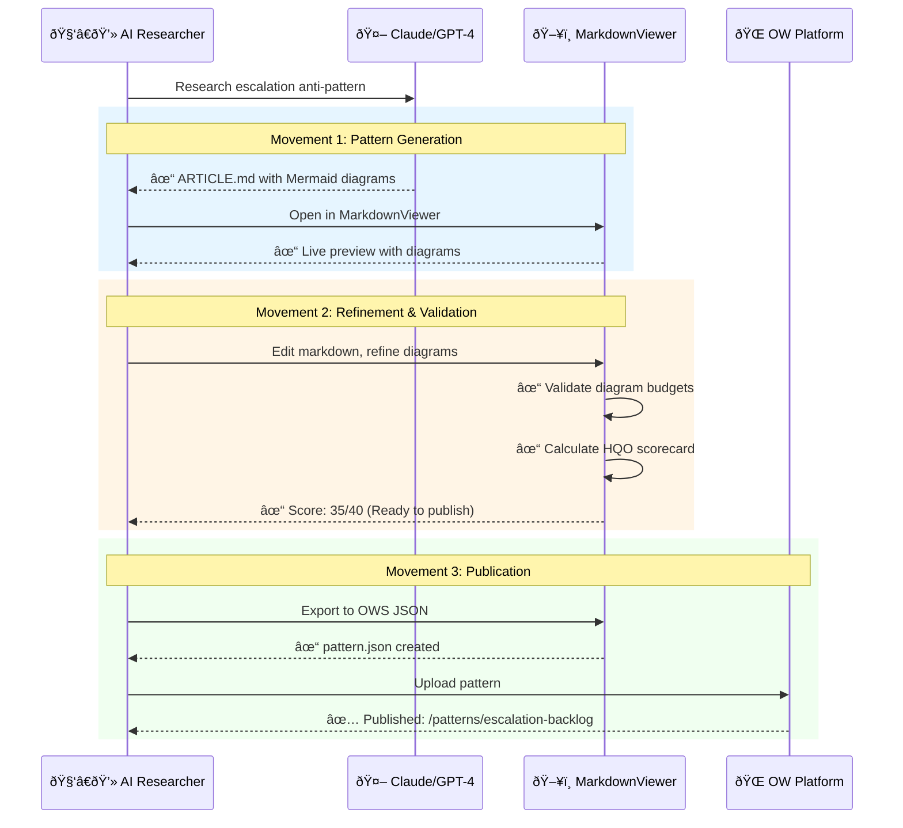
```mermaid
sequenceDiagram
  participant Researcher as 🧑‍💻 AI Researcher
  participant AI as 🤖 Claude/GPT-4
  participant Viewer as 🖥️ MarkdownViewer
  participant Platform as 🌐 OW Platform
  
  Researcher->>AI: Research escalation anti-pattern
  rect rgb(230, 245, 255)
  Note over Researcher,Viewer: Movement 1: Pattern Generation
  AI-->>Researcher: ✓ ARTICLE.md with Mermaid diagrams
  Researcher->>Viewer: Open in MarkdownViewer
  Viewer-->>Researcher: ✓ Live preview with diagrams
  end
  
  rect rgb(255, 245, 230)
  Note over Researcher,Viewer: Movement 2: Refinement & Validation  
  Researcher->>Viewer: Edit markdown, refine diagrams
  Viewer->>Viewer: ✓ Validate diagram budgets
  Viewer->>Viewer: ✓ Calculate HQO scorecard
  Viewer-->>Researcher: ✓ Score: 35/40 (Ready to publish)
  end
  
  rect rgb(240, 255, 240)
  Note over Researcher,Platform: Movement 3: Publication
  Researcher->>Viewer: Export to OWS JSON
  Viewer-->>Researcher: ✓ pattern.json created
  Researcher->>Platform: Upload pattern
  Platform-->>Researcher: ✅ Published: /patterns/escalation-backlog
  end
```

## Business Value

## Governance

### Policies
- All patterns must score ≥30/40 on HQO rubric before publication
- No dimension may score below 3 on HQO rubric
- Mermaid diagrams must adhere to budget constraints (≤7 actors, ≤18 steps)
- Patterns must include all required sections per OWS template
- AI-generated content must be reviewed and refined by human expert

### Metrics
- Pattern generation time (research → publication)
- HQO score distribution across published patterns
- AI token usage per pattern
- Pattern revision cycles before publication
- User engagement metrics (views, downloads, implementations)

## Workflow Movements

### Movement 1: AI-Assisted Pattern Generation

Use AI (Claude, GPT-4) to research and generate initial pattern draft in markdown format following OWS template structure

**Tempo**: 120 | **Status**: active

#### User Story

**As a** AI Content Researcher,
**I want to** Generate comprehensive pattern draft from operational anti-pattern research,
**So that** Accelerate initial content creation from hours to minutes with AI assistance.

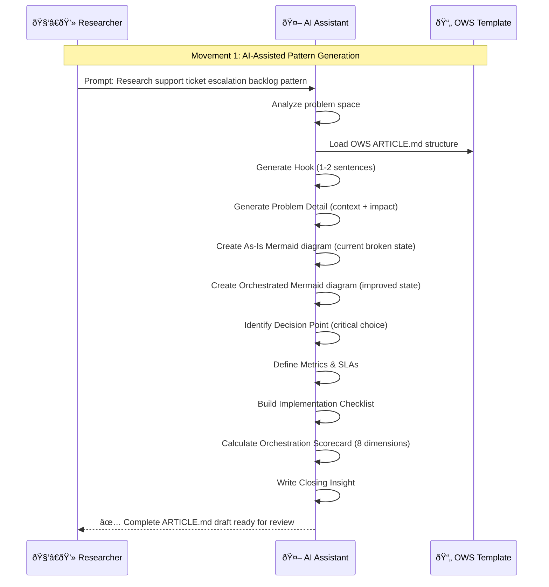
```mermaid
sequenceDiagram
  participant Researcher as 🧑‍💻 Researcher
  participant AI as 🤖 AI Assistant
  participant Template as 📄 OWS Template
  
  Note over Researcher,Template: Movement 1: AI-Assisted Pattern Generation
  
  Researcher->>AI: Prompt: Research support ticket escalation backlog pattern
  AI->>AI: Analyze problem space
  AI->>Template: Load OWS ARTICLE.md structure
  AI->>AI: Generate Hook (1-2 sentences)
  AI->>AI: Generate Problem Detail (context + impact)
  AI->>AI: Create As-Is Mermaid diagram (current broken state)
  AI->>AI: Create Orchestrated Mermaid diagram (improved state)
  AI->>AI: Identify Decision Point (critical choice)
  AI->>AI: Define Metrics & SLAs
  AI->>AI: Build Implementation Checklist
  AI->>AI: Calculate Orchestration Scorecard (8 dimensions)
  AI->>AI: Write Closing Insight
  AI-->>Researcher: ✅ Complete ARTICLE.md draft ready for review
```

**Beats**: 5

#### Beat 1: Load Template and Structure
- **Handler**: `AI Prompt Engineering with OWS Template`
- **External System**: Anthropic / OpenAI - Claude 3.5 Sonnet / GPT-4 (api)
- **Integration**: AI model receives OWS template as context in system prompt
- **Event**: template.loaded
- **Test**: [docs/examples/article-template.md](../../docs/examples/article-template.md) - `AI can parse and identify all 9 required sections`

**User Story**:

- **Persona**: AI Researcher
- **Goal**: Ensure AI understands expected pattern structure
- **Benefit**: Generates properly formatted content matching platform requirements

**User Story Diagram**:

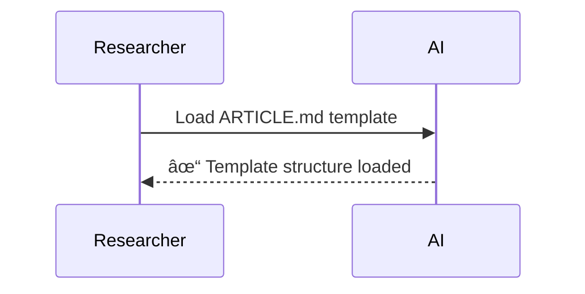
```mermaid
sequenceDiagram
  participant R as Researcher
  participant AI
  R->>AI: Load ARTICLE.md template
  AI-->>R: ✓ Template structure loaded
```

**Visual Diagram**:

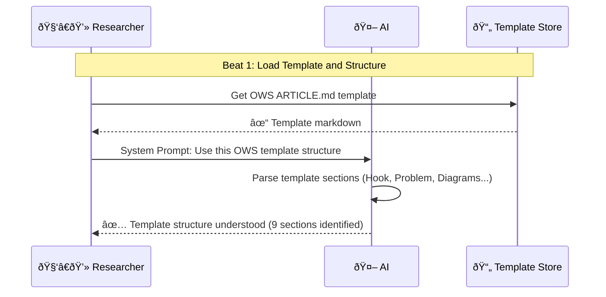
```mermaid
sequenceDiagram
  participant Researcher as 🧑‍💻 Researcher
  participant AI as 🤖 AI
  participant Template as 📄 Template Store
  
  Note over Researcher,Template: Beat 1: Load Template and Structure
  
  Researcher->>Template: Get OWS ARTICLE.md template
  Template-->>Researcher: ✓ Template markdown
  Researcher->>AI: System Prompt: Use this OWS template structure
  AI->>AI: Parse template sections (Hook, Problem, Diagrams...)
  AI-->>Researcher: ✅ Template structure understood (9 sections identified)
```

**Acceptance Criteria**:
- **Given**: OWS ARTICLE.md template available
- **When**: Researcher provides template to AI
- **Then**: AI acknowledges template structure

**Notes**:
- Template should include inline examples for each section
- Diagram budget constraints should be explicit in template comments

#### Beat 2: Generate Hook
- **Handler**: `AI Content Generation`
- **External System**: Anthropic - Claude 3.5 Sonnet (api)
- **Integration**: Generate compelling hook that resonates with practitioners
- **Event**: hook.generated
- **Test**: [N/A - AI generated content](../../N/A - AI generated content) - `Generated hooks score ≥7/10 on readability and engagement`

**User Story**:

- **Persona**: Content Creator
- **Goal**: Create hook that immediately resonates with target audience
- **Benefit**: Increase pattern engagement and readership

**User Story Diagram**:

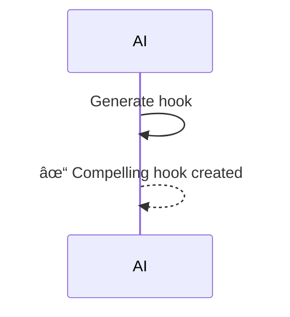
```mermaid
sequenceDiagram
  participant AI
  AI->>AI: Generate hook
  AI-->>AI: ✓ Compelling hook created
```

**Visual Diagram**:

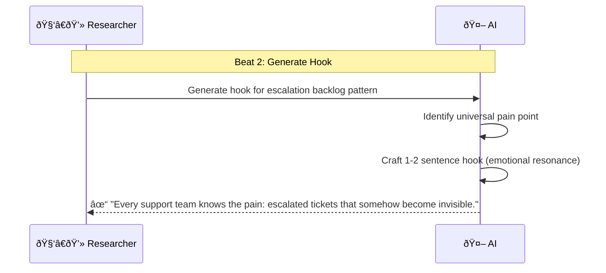
```mermaid
sequenceDiagram
  participant Researcher as 🧑‍💻 Researcher
  participant AI as 🤖 AI
  
  Note over Researcher,AI: Beat 2: Generate Hook
  
  Researcher->>AI: Generate hook for escalation backlog pattern
  AI->>AI: Identify universal pain point
  AI->>AI: Craft 1-2 sentence hook (emotional resonance)
  AI-->>Researcher: ✓ "Every support team knows the pain: escalated tickets that somehow become invisible."
```

**Acceptance Criteria**:
- **Given**: Pattern topic identified
- **When**: AI generates hook
- **Then**: Returns 1-2 sentence hook

**Notes**:
- Good hooks use concrete language, not abstractions
- Example: 'Escalated tickets disappear into a queue' vs 'Escalation process lacks visibility'

#### Beat 3: Generate Problem Detail
- **Handler**: `AI Content Generation with Research`
- **External System**: Anthropic - Claude 3.5 Sonnet (api)
- **Integration**: Generate detailed problem analysis with broken signal identification
- **Event**: problem.detailed
- **Test**: [N/A - AI generated content](../../N/A - AI generated content) - `Problem descriptions identify orchestration gaps in ≥80% of cases`

**User Story**:

- **Persona**: Operator seeking solutions
- **Goal**: Understand root cause and systemic nature of problem
- **Benefit**: Recognize own operational challenges in pattern description

**User Story Diagram**:

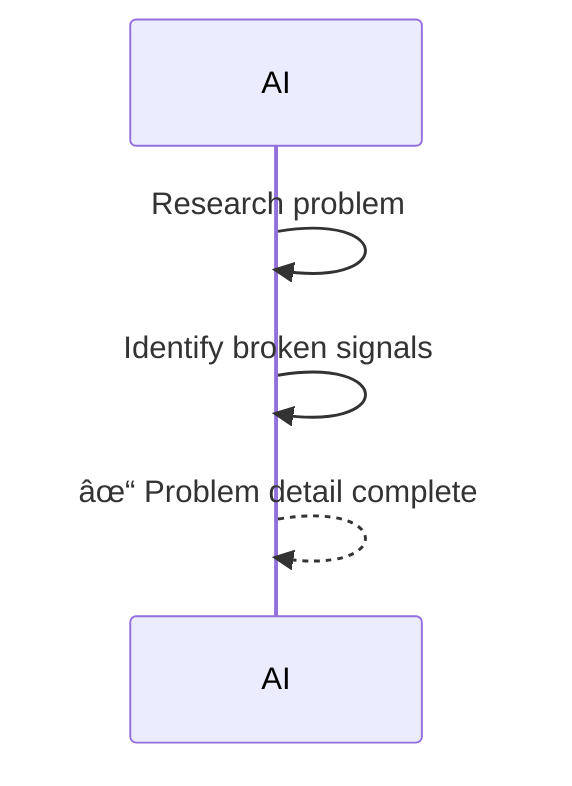
```mermaid
sequenceDiagram
  participant AI
  AI->>AI: Research problem
  AI->>AI: Identify broken signals
  AI-->>AI: ✓ Problem detail complete
```

**Visual Diagram**:

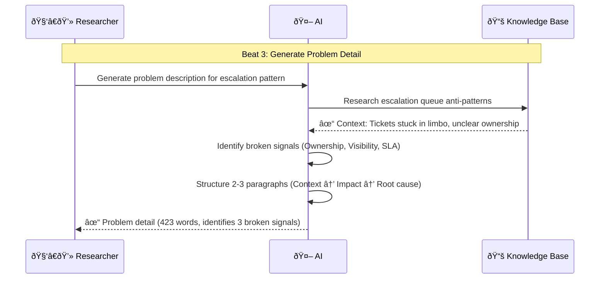
```mermaid
sequenceDiagram
  participant Researcher as 🧑‍💻 Researcher
  participant AI as 🤖 AI
  participant Knowledge as 📚 Knowledge Base
  
  Note over Researcher,Knowledge: Beat 3: Generate Problem Detail
  
  Researcher->>AI: Generate problem description for escalation pattern
  AI->>Knowledge: Research escalation queue anti-patterns
  Knowledge-->>AI: ✓ Context: Tickets stuck in limbo, unclear ownership
  AI->>AI: Identify broken signals (Ownership, Visibility, SLA)
  AI->>AI: Structure 2-3 paragraphs (Context → Impact → Root cause)
  AI-->>Researcher: ✓ Problem detail (423 words, identifies 3 broken signals)
```

**Acceptance Criteria**:
- **Given**: Pattern topic and hook
- **When**: Problem detail is generated
- **Then**: Returns 2-3 paragraph description

**Notes**:
- Broken signals: Ownership, Time/SLA, Capacity, Visibility, Customer Loop, Escalation, Handoffs, Documentation
- Focus on pattern, not specific company failures

#### Beat 4: Generate Mermaid Diagrams
- **Handler**: `AI Mermaid Diagram Generation with Budget Validation`
- **External System**: Anthropic - Claude 3.5 Sonnet (api)
- **Integration**: Generate Mermaid sequence diagrams within budget constraints
- **Event**: diagrams.generated
- **Test**: [N/A - AI generated content with schema validation](../../N/A - AI generated content with schema validation) - `Generated diagrams pass budget validation ≥95% of time`

**User Story**:

- **Persona**: Visual learner
- **Goal**: See before/after transformation in diagram form
- **Benefit**: Quickly grasp orchestration improvement without reading prose

**User Story Diagram**:

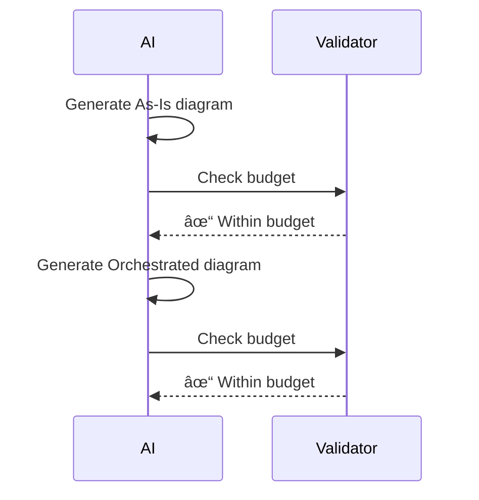
```mermaid
sequenceDiagram
  participant AI
  participant Validator
  AI->>AI: Generate As-Is diagram
  AI->>Validator: Check budget
  Validator-->>AI: ✓ Within budget
  AI->>AI: Generate Orchestrated diagram
  AI->>Validator: Check budget
  Validator-->>AI: ✓ Within budget
```

**Visual Diagram**:

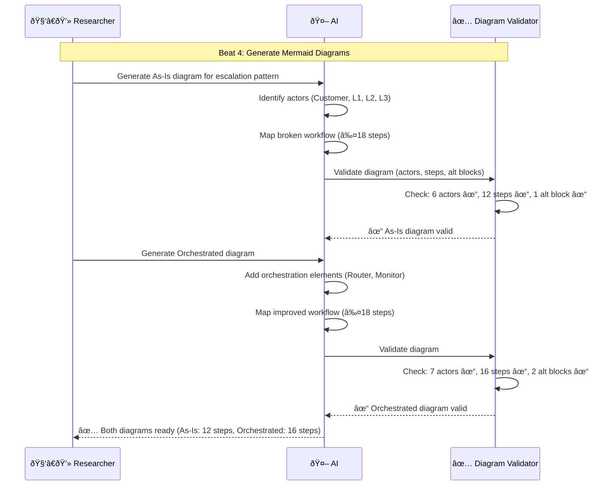
```mermaid
sequenceDiagram
  participant Researcher as 🧑‍💻 Researcher
  participant AI as 🤖 AI
  participant Validator as ✅ Diagram Validator
  
  Note over Researcher,Validator: Beat 4: Generate Mermaid Diagrams
  
  Researcher->>AI: Generate As-Is diagram for escalation pattern
  AI->>AI: Identify actors (Customer, L1, L2, L3)
  AI->>AI: Map broken workflow (≤18 steps)
  AI->>Validator: Validate diagram (actors, steps, alt blocks)
  Validator->>Validator: Check: 6 actors ✓, 12 steps ✓, 1 alt block ✓
  Validator-->>AI: ✓ As-Is diagram valid
  
  Researcher->>AI: Generate Orchestrated diagram
  AI->>AI: Add orchestration elements (Router, Monitor)
  AI->>AI: Map improved workflow (≤18 steps)
  AI->>Validator: Validate diagram
  Validator->>Validator: Check: 7 actors ✓, 16 steps ✓, 2 alt blocks ✓
  Validator-->>AI: ✓ Orchestrated diagram valid
  
  AI-->>Researcher: ✅ Both diagrams ready (As-Is: 12 steps, Orchestrated: 16 steps)
```

**Acceptance Criteria**:
- **Given**: Problem description complete
- **When**: Diagrams are generated
- **Then**: Returns 2 Mermaid sequence diagrams (As-Is + Orchestrated)

**Notes**:
- Diagram budget: ≤7 actors, ≤18 steps, ≤2 alt blocks, ≤8 steps per alt
- If diagram exceeds budget, AI should decompose pattern into smaller scope

#### Beat 5: Complete Remaining Sections
- **Handler**: `AI Multi-Section Content Generation`
- **External System**: Anthropic - Claude 3.5 Sonnet (api)
- **Integration**: Generate Decision Point, Metrics, Checklist (6-8 items), Scorecard (8 dimensions), Closing Insight
- **Event**: markdown.draft.generated
- **Test**: [N/A - AI generated content with HQO validation](../../N/A - AI generated content with HQO validation) - `Generated patterns score ≥30/40 on HQO rubric ≥90% of time`

**User Story**:

- **Persona**: Implementation leader
- **Goal**: Receive actionable guidance for pattern implementation
- **Benefit**: Clear roadmap from understanding to execution

**User Story Diagram**:

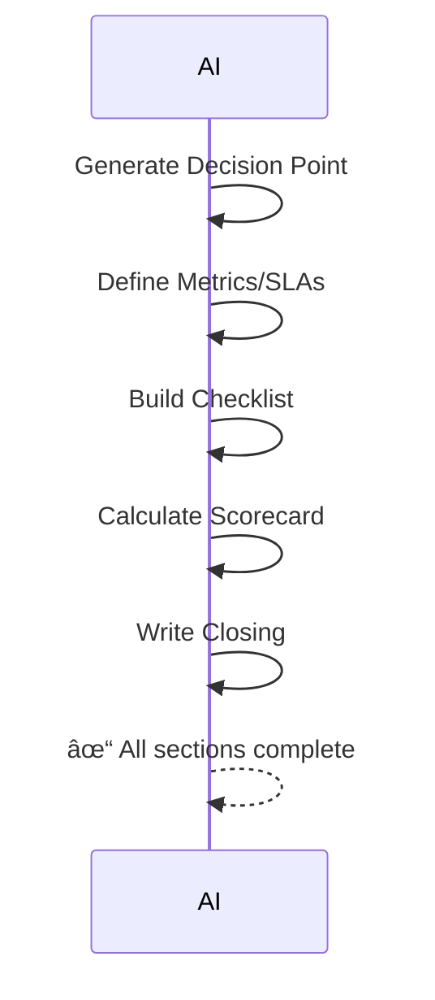
```mermaid
sequenceDiagram
  participant AI
  AI->>AI: Generate Decision Point
  AI->>AI: Define Metrics/SLAs
  AI->>AI: Build Checklist
  AI->>AI: Calculate Scorecard
  AI->>AI: Write Closing
  AI-->>AI: ✓ All sections complete
```

**Visual Diagram**:

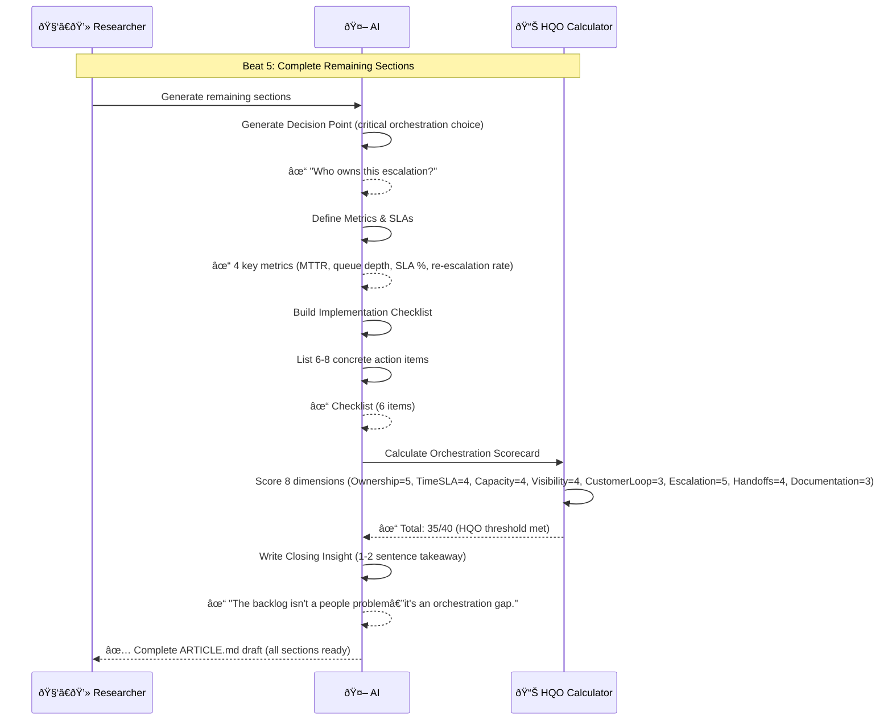
```mermaid
sequenceDiagram
  participant Researcher as 🧑‍💻 Researcher
  participant AI as 🤖 AI
  participant Scorecard as 📊 HQO Calculator
  
  Note over Researcher,Scorecard: Beat 5: Complete Remaining Sections
  
  Researcher->>AI: Generate remaining sections
  
  AI->>AI: Generate Decision Point (critical orchestration choice)
  AI-->>AI: ✓ "Who owns this escalation?"
  
  AI->>AI: Define Metrics & SLAs
  AI-->>AI: ✓ 4 key metrics (MTTR, queue depth, SLA %, re-escalation rate)
  
  AI->>AI: Build Implementation Checklist
  AI->>AI: List 6-8 concrete action items
  AI-->>AI: ✓ Checklist (6 items)
  
  AI->>Scorecard: Calculate Orchestration Scorecard
  Scorecard->>Scorecard: Score 8 dimensions (Ownership=5, TimeSLA=4, Capacity=4, Visibility=4, CustomerLoop=3, Escalation=5, Handoffs=4, Documentation=3)
  Scorecard-->>AI: ✓ Total: 35/40 (HQO threshold met)
  
  AI->>AI: Write Closing Insight (1-2 sentence takeaway)
  AI-->>AI: ✓ "The backlog isn't a people problem—it's an orchestration gap."
  
  AI-->>Researcher: ✅ Complete ARTICLE.md draft (all sections ready)
```

**Acceptance Criteria**:
- **Given**: Diagrams and problem sections complete
- **When**: Remaining sections are generated
- **Then**: Returns complete ARTICLE.md with all sections

**Notes**:
- HQO dimensions: Ownership, Time/SLA, Capacity, Visibility, Customer Loop, Escalation, Handoffs, Documentation
- Scorecard should reflect improvements shown in Orchestrated diagram

---

### Movement 2: Desktop Preview & Validation

Use MarkdownViewer desktop application to preview rendered pattern, validate Mermaid diagrams, calculate HQO scorecard, and refine content

**Tempo**: 100 | **Status**: active

#### User Story

**As a** Content Quality Reviewer,
**I want to** Verify pattern quality before publication,
**So that** Catch formatting issues, validate diagrams, ensure HQO standards met.

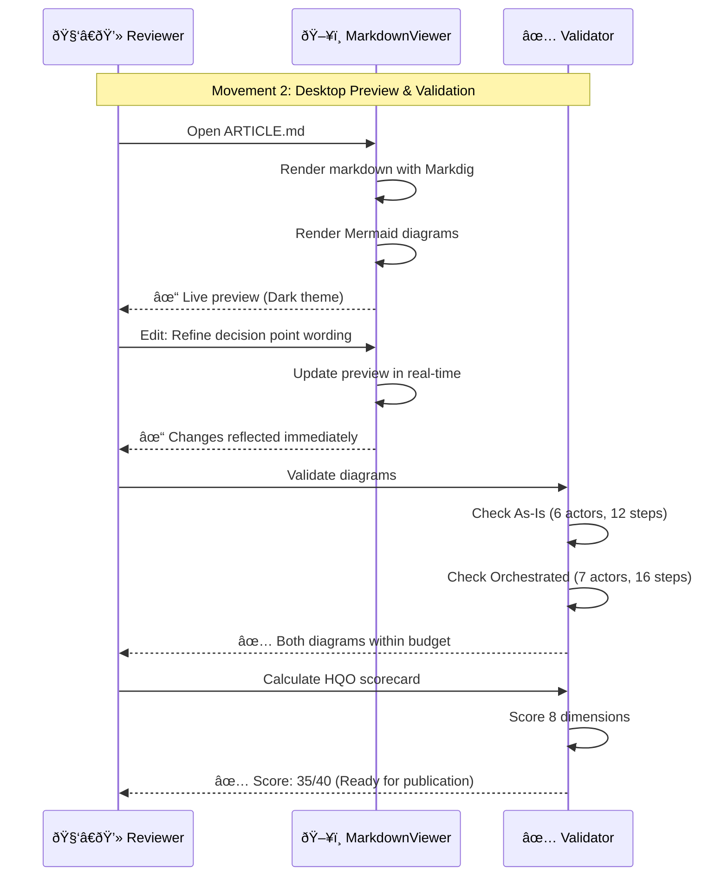
```mermaid
sequenceDiagram
  participant Reviewer as 🧑‍💻 Reviewer
  participant Viewer as 🖥️ MarkdownViewer
  participant Validator as ✅ Validator
  
  Note over Reviewer,Validator: Movement 2: Desktop Preview & Validation
  
  Reviewer->>Viewer: Open ARTICLE.md
  Viewer->>Viewer: Render markdown with Markdig
  Viewer->>Viewer: Render Mermaid diagrams
  Viewer-->>Reviewer: ✓ Live preview (Dark theme)
  
  Reviewer->>Viewer: Edit: Refine decision point wording
  Viewer->>Viewer: Update preview in real-time
  Viewer-->>Reviewer: ✓ Changes reflected immediately
  
  Reviewer->>Validator: Validate diagrams
  Validator->>Validator: Check As-Is (6 actors, 12 steps)
  Validator->>Validator: Check Orchestrated (7 actors, 16 steps)
  Validator-->>Reviewer: ✅ Both diagrams within budget
  
  Reviewer->>Validator: Calculate HQO scorecard
  Validator->>Validator: Score 8 dimensions
  Validator-->>Reviewer: ✅ Score: 35/40 (Ready for publication)
```

**Beats**: 5

#### Beat 1: Render Markdown Preview
- **Handler**: `MarkdownViewer.MainWindow + MarkdownService`
- **Source**: [Tools/MarkdownViewer/MainWindow.xaml.cs + Services/MarkdownService.cs](../../Tools/MarkdownViewer/MainWindow.xaml.cs + Services/MarkdownService.cs)
- **Event**: preview.rendered
- **Test**: [Tools/MarkdownViewer/Tests/MarkdownService.Tests.cs](../../Tools/MarkdownViewer/Tests/MarkdownService.Tests.cs) - `TestConvertToHtml_MermaidDiagram_RendersCorrectly`

**User Story**:

- **Persona**: Content Reviewer
- **Goal**: See how pattern will look when published
- **Benefit**: Catch formatting issues before publication

**User Story Diagram**:

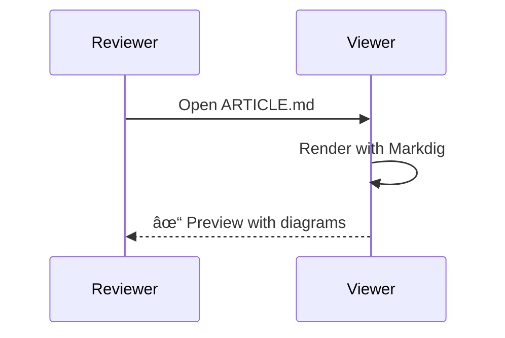
```mermaid
sequenceDiagram
  participant R as Reviewer
  participant Viewer
  R->>Viewer: Open ARTICLE.md
  Viewer->>Viewer: Render with Markdig
  Viewer-->>R: ✓ Preview with diagrams
```

**Visual Diagram**:

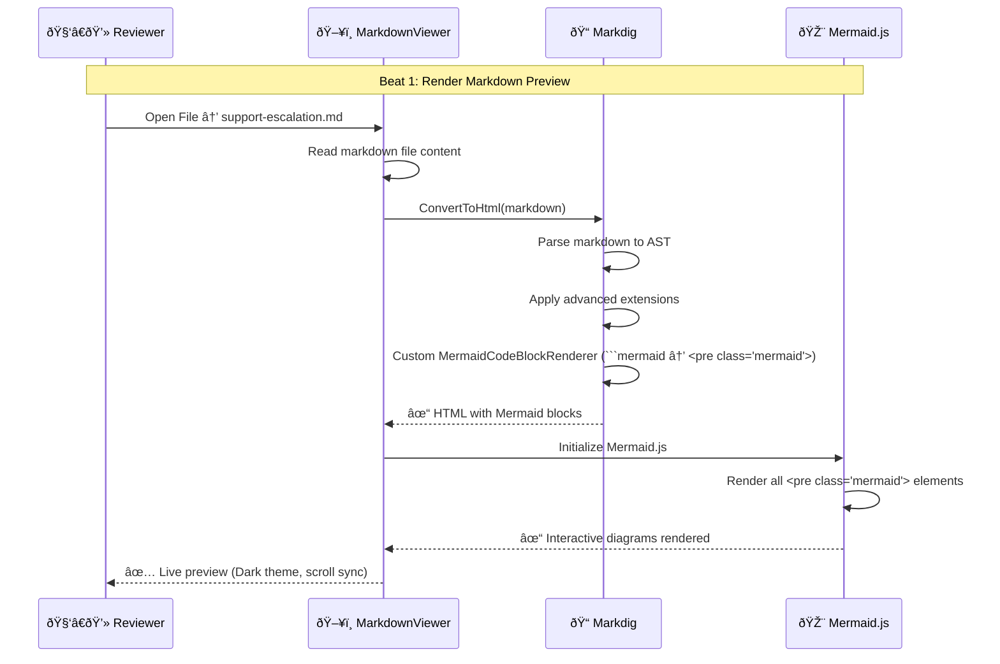
```mermaid
sequenceDiagram
  participant Reviewer as 🧑‍💻 Reviewer
  participant Viewer as 🖥️ MarkdownViewer
  participant Markdig as 📝 Markdig
  participant Mermaid as 🎨 Mermaid.js
  
  Note over Reviewer,Mermaid: Beat 1: Render Markdown Preview
  
  Reviewer->>Viewer: Open File → support-escalation.md
  Viewer->>Viewer: Read markdown file content
  Viewer->>Markdig: ConvertToHtml(markdown)
  Markdig->>Markdig: Parse markdown to AST
  Markdig->>Markdig: Apply advanced extensions
  Markdig->>Markdig: Custom MermaidCodeBlockRenderer (```mermaid → <pre class="mermaid">)
  Markdig-->>Viewer: ✓ HTML with Mermaid blocks
  Viewer->>Mermaid: Initialize Mermaid.js
  Mermaid->>Mermaid: Render all <pre class="mermaid"> elements
  Mermaid-->>Viewer: ✓ Interactive diagrams rendered
  Viewer-->>Reviewer: ✅ Live preview (Dark theme, scroll sync)
```

**Acceptance Criteria**:
- **Given**: ARTICLE.md file available
- **When**: File opened in MarkdownViewer
- **Then**: Renders markdown with proper formatting

**Notes**:
- MarkdownViewer uses same Markdig pipeline as Blazor web app
- WYSIWYG: What you see in desktop app = what users see on web

#### Beat 2: Edit and Refine Content
- **Handler**: `MarkdownViewer.FileWatcher + ReloadContent`
- **Source**: [Tools/MarkdownViewer/MainWindow.xaml.cs](../../Tools/MarkdownViewer/MainWindow.xaml.cs)
- **Event**: content.refined
- **Test**: [N/A - Desktop app feature](../../N/A - Desktop app feature) - `File watcher detects changes and refreshes view`

**User Story**:

- **Persona**: Content Editor
- **Goal**: Iterate quickly on content with instant feedback
- **Benefit**: See changes immediately without manual refresh

**User Story Diagram**:

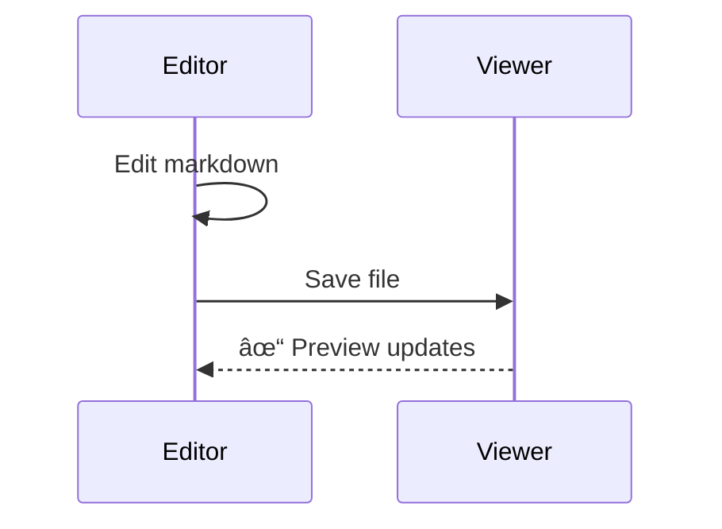
```mermaid
sequenceDiagram
  participant E as Editor
  participant Viewer
  E->>E: Edit markdown
  E->>Viewer: Save file
  Viewer-->>E: ✓ Preview updates
```

**Visual Diagram**:

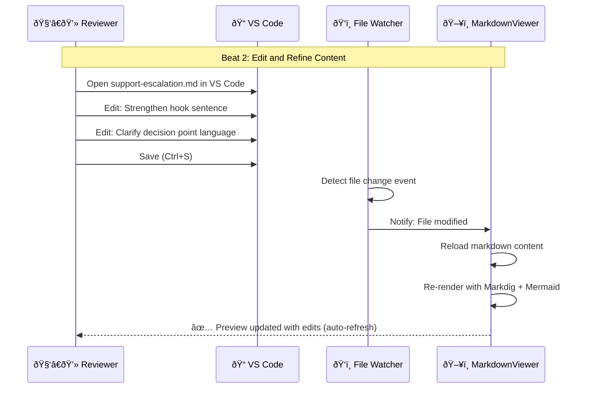
```mermaid
sequenceDiagram
  participant Reviewer as 🧑‍💻 Reviewer
  participant Editor as 📝 VS Code
  participant FileWatcher as 👁️ File Watcher
  participant Viewer as 🖥️ MarkdownViewer
  
  Note over Reviewer,Viewer: Beat 2: Edit and Refine Content
  
  Reviewer->>Editor: Open support-escalation.md in VS Code
  Reviewer->>Editor: Edit: Strengthen hook sentence
  Reviewer->>Editor: Edit: Clarify decision point language
  Reviewer->>Editor: Save (Ctrl+S)
  
  FileWatcher->>FileWatcher: Detect file change event
  FileWatcher->>Viewer: Notify: File modified
  Viewer->>Viewer: Reload markdown content
  Viewer->>Viewer: Re-render with Markdig + Mermaid
  Viewer-->>Reviewer: ✅ Preview updated with edits (auto-refresh)
```

**Acceptance Criteria**:
- **Given**: ARTICLE.md open in MarkdownViewer and editor
- **When**: File is saved after edits
- **Then**: Preview automatically refreshes

**Notes**:
- Use F5 manual refresh if file watcher disabled
- Edit/preview workflow mirrors live web development

#### Beat 3: Validate Diagram Budgets
- **Handler**: `MermaidDiagramValidator (future enhancement)`
- **Source**: [Tools/MarkdownViewer/Services/MermaidDiagramValidator.cs (planned)](../../Tools/MarkdownViewer/Services/MermaidDiagramValidator.cs (planned))
- **Event**: diagram.validated
- **Test**: [Tools/MarkdownViewer/Tests/MermaidDiagramValidator.Tests.cs (planned)](../../Tools/MarkdownViewer/Tests/MermaidDiagramValidator.Tests.cs (planned)) - `TestValidateDiagram_WithinBudget_ReturnsPass`

**User Story**:

- **Persona**: Pattern Quality Enforcer
- **Goal**: Ensure diagrams meet simplicity constraints
- **Benefit**: Maintain no-scroll diagram principle across all patterns

**User Story Diagram**:

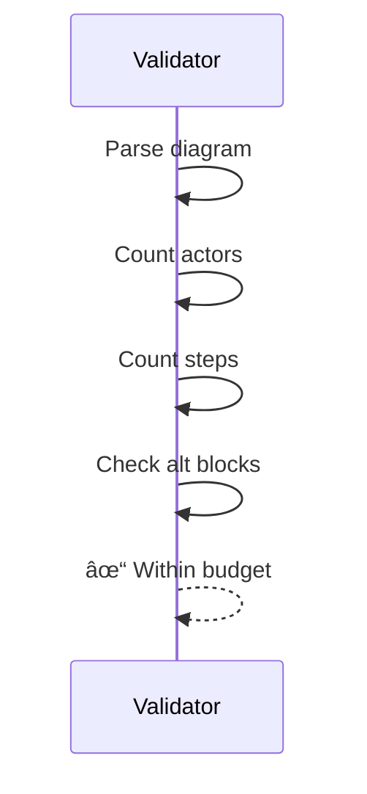
```mermaid
sequenceDiagram
  participant V as Validator
  V->>V: Parse diagram
  V->>V: Count actors
  V->>V: Count steps
  V->>V: Check alt blocks
  V-->>V: ✓ Within budget
```

**Visual Diagram**:

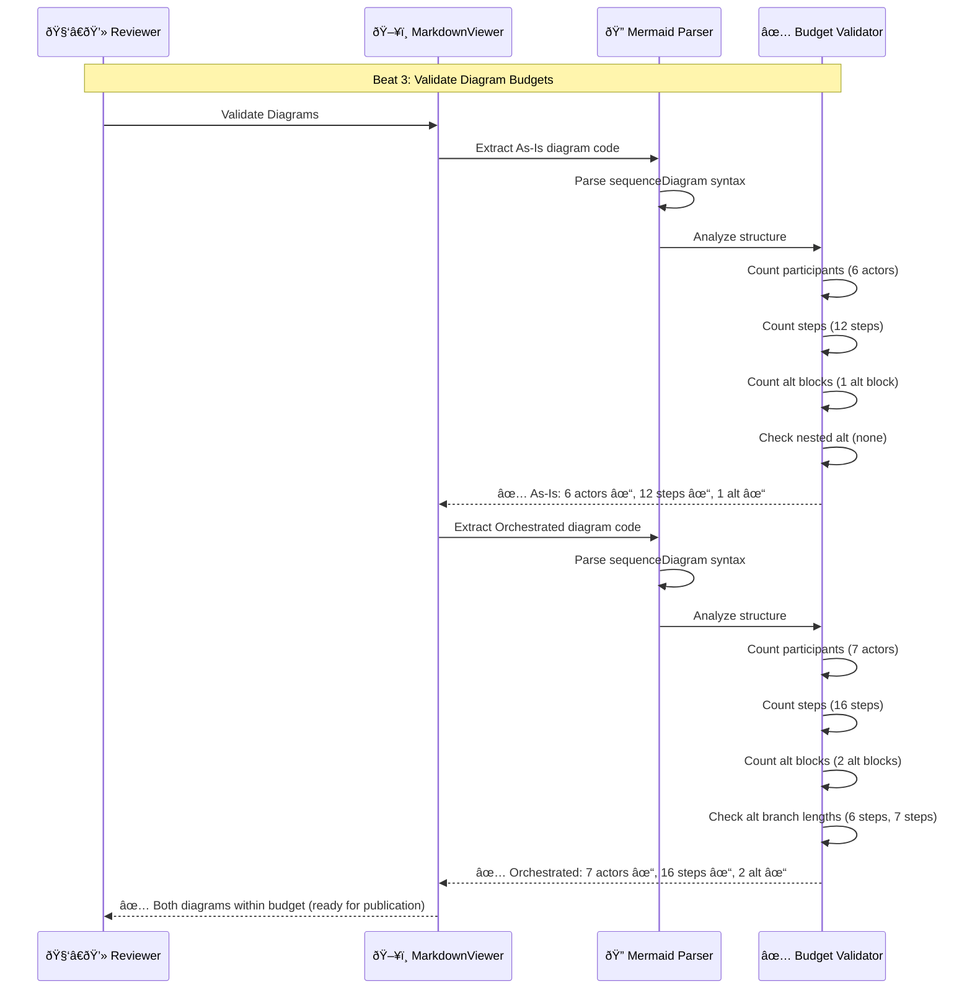
```mermaid
sequenceDiagram
  participant Reviewer as 🧑‍💻 Reviewer
  participant Viewer as 🖥️ MarkdownViewer
  participant Parser as 🔍 Mermaid Parser
  participant Validator as ✅ Budget Validator
  
  Note over Reviewer,Validator: Beat 3: Validate Diagram Budgets
  
  Reviewer->>Viewer: Validate Diagrams
  
  Viewer->>Parser: Extract As-Is diagram code
  Parser->>Parser: Parse sequenceDiagram syntax
  Parser->>Validator: Analyze structure
  Validator->>Validator: Count participants (6 actors)
  Validator->>Validator: Count steps (12 steps)
  Validator->>Validator: Count alt blocks (1 alt block)
  Validator->>Validator: Check nested alt (none)
  Validator-->>Viewer: ✅ As-Is: 6 actors ✓, 12 steps ✓, 1 alt ✓
  
  Viewer->>Parser: Extract Orchestrated diagram code
  Parser->>Parser: Parse sequenceDiagram syntax
  Parser->>Validator: Analyze structure
  Validator->>Validator: Count participants (7 actors)
  Validator->>Validator: Count steps (16 steps)
  Validator->>Validator: Count alt blocks (2 alt blocks)
  Validator->>Validator: Check alt branch lengths (6 steps, 7 steps)
  Validator-->>Viewer: ✅ Orchestrated: 7 actors ✓, 16 steps ✓, 2 alt ✓
  
  Viewer-->>Reviewer: ✅ Both diagrams within budget (ready for publication)
```

**Acceptance Criteria**:
- **Given**: Mermaid diagram code in ARTICLE.md
- **When**: Validation is triggered
- **Then**: Returns pass/fail for each constraint

**Notes**:
- Future enhancement: Add diagram validator to MarkdownViewer
- Regex parse or use Mermaid AST if available

#### Beat 4: Calculate HQO Scorecard
- **Handler**: `HQOScorecardCalculator (future enhancement)`
- **Source**: [Tools/MarkdownViewer/Services/HQOScorecardCalculator.cs (planned)](../../Tools/MarkdownViewer/Services/HQOScorecardCalculator.cs (planned))
- **Event**: hqo.scorecard.calculated
- **Test**: [Tools/MarkdownViewer/Tests/HQOScorecardCalculator.Tests.cs (planned)](../../Tools/MarkdownViewer/Tests/HQOScorecardCalculator.Tests.cs (planned)) - `TestCalculateHQO_ValidPattern_ReturnsScorecard`

**User Story**:

- **Persona**: Quality Assurance Reviewer
- **Goal**: Verify pattern meets High Quality Orchestration standards
- **Benefit**: Ensure published patterns maintain platform quality bar

**User Story Diagram**:

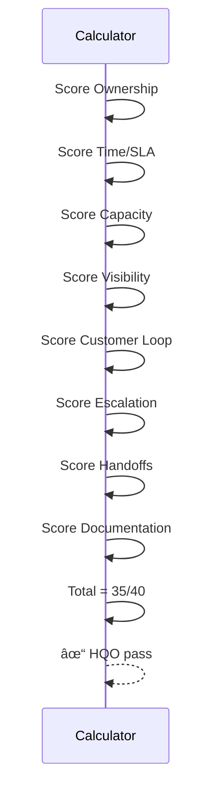
```mermaid
sequenceDiagram
  participant C as Calculator
  C->>C: Score Ownership
  C->>C: Score Time/SLA
  C->>C: Score Capacity
  C->>C: Score Visibility
  C->>C: Score Customer Loop
  C->>C: Score Escalation
  C->>C: Score Handoffs
  C->>C: Score Documentation
  C->>C: Total = 35/40
  C-->>C: ✓ HQO pass
```

**Visual Diagram**:

```mermaid
sequenceDiagram
  participant Reviewer as 🧑‍💻 Reviewer
  participant Viewer as 🖥️ MarkdownViewer
  participant Calculator as 📊 HQO Calculator
  participant Diagram as 🎨 Diagram Analyzer
  
  Note over Reviewer,Diagram: Beat 4: Calculate HQO Scorecard
  
  Reviewer->>Viewer: Calculate HQO Score
  Viewer->>Calculator: Analyze pattern for HQO dimensions
  
  Calculator->>Diagram: Check Orchestrated diagram for ownership clarity
  Diagram-->>Calculator: ✓ Explicit L2 owner assignment → Ownership = 5
  
  Calculator->>Diagram: Check for SLA monitoring mechanism
  Diagram-->>Calculator: ✓ SLA Monitor present → Time/SLA = 4
  
  Calculator->>Diagram: Check for capacity-aware routing
  Diagram-->>Calculator: ✓ Smart Router with capacity → Capacity = 4
  
  Calculator->>Diagram: Check for visibility/tracking
  Diagram-->>Calculator: ✓ Queue monitoring visible → Visibility = 4
  
  Calculator->>Diagram: Check for customer communication loop
  Diagram-->>Calculator: ⚠️ Auto-response only → Customer Loop = 3
  
  Calculator->>Diagram: Check for escalation handling
  Diagram-->>Calculator: ✓ Clear escalation routing → Escalation = 5
  
  Calculator->>Diagram: Check for handoff quality
  Diagram-->>Calculator: ✓ Context transfer present → Handoffs = 4
  
  Calculator->>Diagram: Check for documentation/runbook
  Diagram-->>Calculator: ⚠️ Mentioned but not detailed → Documentation = 3
  
  Calculator->>Calculator: Calculate total: 5+4+4+4+3+5+4+3 = 35/40
  Calculator->>Calculator: Validate: Total ≥30 ✓, No dimension <3 ✓
  
  Calculator-->>Viewer: ✅ HQO Scorecard: 35/40 (Pass - Ready for publication)
  Viewer-->>Reviewer: Display scorecard with dimension breakdown
```

**Acceptance Criteria**:
- **Given**: Complete pattern with Orchestrated diagram
- **When**: HQO calculation is triggered
- **Then**: Returns score for each of 8 dimensions

**Notes**:
- Future enhancement: Automated HQO scoring in MarkdownViewer
- HQO scoring could use AI-assisted analysis of diagram elements
- 8 dimensions: Ownership, Time/SLA, Capacity, Visibility, Customer Loop, Escalation, Handoffs, Documentation

#### Beat 5: Export HTML Preview
- **Handler**: `MarkdownViewer.ExportToHtml`
- **Source**: [Tools/MarkdownViewer/MainWindow.xaml.cs](../../Tools/MarkdownViewer/MainWindow.xaml.cs)
- **Event**: html.exported
- **Test**: [N/A - Desktop app feature](../../N/A - Desktop app feature) - `Exported HTML opens correctly in Chrome, Firefox, Edge`

**User Story**:

- **Persona**: Pattern Reviewer
- **Goal**: Share pattern draft with team for feedback
- **Benefit**: Enable offline review without requiring MarkdownViewer installation

**User Story Diagram**:

```mermaid
sequenceDiagram
  participant R as Reviewer
  participant Viewer
  R->>Viewer: Export HTML
  Viewer->>Viewer: Generate HTML
  Viewer-->>R: ✓ HTML saved
```

**Visual Diagram**:

```mermaid
sequenceDiagram
  participant Reviewer as 🧑‍💻 Reviewer
  participant Viewer as 🖥️ MarkdownViewer
  participant Exporter as 📤 HTML Exporter
  participant FileSystem as 💾 File System
  
  Note over Reviewer,FileSystem: Beat 5: Export HTML Preview
  
  Reviewer->>Viewer: File → Export to HTML
  Viewer->>Exporter: Generate standalone HTML
  Exporter->>Exporter: Convert markdown to HTML (Markdig)
  Exporter->>Exporter: Embed CSS styles (light-theme.css)
  Exporter->>Exporter: Include Mermaid.js CDN link
  Exporter->>Exporter: Wrap in complete HTML document
  Exporter->>FileSystem: Write support-escalation.html (284KB)
  FileSystem-->>Exporter: ✓ File saved
  Exporter-->>Viewer: ✓ Export complete
  Viewer-->>Reviewer: ✅ HTML exported: C:\Exports\support-escalation.html
```

**Acceptance Criteria**:
- **Given**: Rendered pattern in MarkdownViewer
- **When**: Export to HTML is triggered
- **Then**: Generates standalone HTML file

**Notes**:
- Exported HTML can be sent via email for review
- Useful for stakeholder approval before publication

---

### Movement 3: JSON Conversion & Publication

Convert validated ARTICLE.md to OWS JSON schema, validate structure, and publish to Orchestration Wisdom platform

**Tempo**: 120 | **Status**: active

#### User Story

**As a** Content Publisher,
**I want to** Publish validated pattern to production platform,
**So that** Make pattern discoverable and usable by platform users.

```mermaid
sequenceDiagram
  participant Publisher as 🧑‍💻 Publisher
  participant Converter as 🔄 JSON Converter
  participant Platform as 🌐 OW Platform
  participant Analytics as 📊 Analytics
  
  Note over Publisher,Analytics: Movement 3: JSON Conversion & Publication
  
  Publisher->>Converter: Convert ARTICLE.md to JSON
  Converter->>Converter: Parse markdown sections
  Converter->>Converter: Extract Mermaid diagrams
  Converter->>Converter: Build Pattern JSON
  Converter-->>Publisher: ✓ pattern.json created
  
  Publisher->>Platform: Upload pattern.json
  Platform->>Platform: Validate against OWS schema
  Platform->>Platform: Load into PatternService
  Platform-->>Publisher: ✅ Published: /patterns/support-escalation
  
  Platform->>Analytics: Track publication event
  Analytics-->>Platform: ✓ Analytics recorded
```

**Beats**: 5

#### Beat 1: Convert Markdown to JSON
- **Handler**: `MarkdownViewer.ExportToOWSJson OR Convert-PatternToJSON.ps1`
- **Source**: [Tools/MarkdownViewer/Services/PatternJsonExporter.cs (planned) OR Tools/Convert-PatternToJSON.ps1](../../Tools/MarkdownViewer/Services/PatternJsonExporter.cs (planned) OR Tools/Convert-PatternToJSON.ps1)
- **Event**: json.pattern.created
- **Test**: [Tools/Tests/PatternJsonExporter.Tests.cs OR Tools/Tests/Convert-PatternToJSON.Tests.ps1](../../Tools/Tests/PatternJsonExporter.Tests.cs OR Tools/Tests/Convert-PatternToJSON.Tests.ps1) - `TestConvertMarkdownToJson_ValidArticle_ReturnsValidJson`

**User Story**:

- **Persona**: Content Publisher
- **Goal**: Convert validated markdown to structured JSON for platform ingestion
- **Benefit**: Enable dynamic rendering and filtering on web platform

**User Story Diagram**:

```mermaid
sequenceDiagram
  participant P as Publisher
  participant Converter
  P->>Converter: Convert to JSON
  Converter->>Converter: Parse markdown
  Converter->>Converter: Extract diagrams
  Converter->>Converter: Build JSON
  Converter-->>P: ✓ pattern.json
```

**Visual Diagram**:

```mermaid
sequenceDiagram
  participant Publisher as 🧑‍💻 Publisher
  participant Parser as 🔍 Markdown Parser
  participant Builder as 🏗️ JSON Builder
  participant FileSystem as 💾 File System
  
  Note over Publisher,FileSystem: Beat 1: Convert Markdown to JSON
  
  Publisher->>Parser: Parse ARTICLE.md
  Parser->>Parser: Extract front matter / metadata
  Parser->>Parser: Split by section headings (## Hook, ## Problem, etc.)
  Parser->>Parser: Extract ```mermaid blocks
  Parser-->>Builder: ✓ Structured sections
  
  Builder->>Builder: Build Pattern object
  Builder->>Builder: Set id: "support-ticket-escalation"
  Builder->>Builder: Set slug: "support-ticket-escalation-backlog"
  Builder->>Builder: Set title: "Support Ticket Escalation Backlog"
  Builder->>Builder: Set hookMarkdown: "..."
  Builder->>Builder: Set asIsDiagramMermaid: "sequenceDiagram\n..."
  Builder->>Builder: Set orchestratedDiagramMermaid: "sequenceDiagram\n..."
  Builder->>Builder: Set scorecard: { Ownership: 5, TimeSLA: 4, ... }
  Builder->>Builder: Set components: [{id, name, description}, ...]
  
  Builder->>FileSystem: Write pattern.json (formatted, UTF-8)
  FileSystem-->>Builder: ✓ File saved (8.4KB)
  Builder-->>Publisher: ✅ support-escalation.pattern.json created
```

**Acceptance Criteria**:
- **Given**: Valid ARTICLE.md with all sections
- **When**: Conversion is triggered
- **Then**: Generates OWS-compliant Pattern JSON

**Notes**:
- Two options: Desktop app export OR PowerShell script
- PowerShell option useful for batch conversion of multiple patterns

#### Beat 2: Validate JSON Schema
- **Handler**: `JsonSchemaValidator OR dotnet test with schema validation`
- **Source**: [schemas/pattern.schema.json + validation script](../../schemas/pattern.schema.json + validation script)
- **Event**: schema.validated
- **Test**: [schemas/tests/pattern-schema-validation.tests.js](../../schemas/tests/pattern-schema-validation.tests.js) - `TestValidatePattern_CompliantJson_ReturnsSuccess`

**User Story**:

- **Persona**: Platform Integrator
- **Goal**: Ensure only valid patterns are published to platform
- **Benefit**: Prevent runtime errors from malformed pattern data

**User Story Diagram**:

```mermaid
sequenceDiagram
  participant V as Validator
  V->>V: Load schema
  V->>V: Load pattern JSON
  V->>V: Validate structure
  V-->>V: ✓ Valid
```

**Visual Diagram**:

```mermaid
sequenceDiagram
  participant Publisher as 🧑‍💻 Publisher
  participant Validator as ✅ JSON Validator
  participant Schema as 📋 Pattern Schema
  
  Note over Publisher,Schema: Beat 2: Validate JSON Schema
  
  Publisher->>Validator: Validate pattern.json
  Validator->>Schema: Load Pattern schema definition
  Schema-->>Validator: ✓ Schema loaded
  
  Validator->>Validator: Check required fields (id, slug, title, hookMarkdown, diagrams, scorecard)
  Validator->>Validator: Validate data types (string, number, object, array)
  Validator->>Validator: Check scorecard structure (8 dimensions, each 0-5)
  Validator->>Validator: Validate components array (id, name, description)
  Validator->>Validator: Check HQO constraints (total ≥30, no dim <3)
  
  alt Schema Valid
    Validator-->>Publisher: ✅ Schema validation passed
  else Schema Invalid
    Validator-->>Publisher: ❌ Validation failed: Missing 'components' array
    Publisher->>Publisher: Fix JSON and retry
  end
```

**Acceptance Criteria**:
- **Given**: Generated pattern.json file
- **When**: Schema validation is run
- **Then**: Returns pass/fail with specific error messages

**Notes**:
- Use JSON Schema Draft-07 or later
- Consider JSON Schema $ref for reusable definitions

#### Beat 3: Commit to Repository
- **Handler**: `git add + commit + push`
- **Source**: [N/A - Git command line](../../N/A - Git command line)
- **Event**: pattern.committed
- **Test**: [N/A - Git operation](../../N/A - Git operation) - `Pattern appears in git log and GitHub/GitLab`

**User Story**:

- **Persona**: Content Manager
- **Goal**: Version control pattern content
- **Benefit**: Track pattern evolution and enable rollback if needed

**User Story Diagram**:

```mermaid
sequenceDiagram
  participant P as Publisher
  participant Git
  P->>Git: git add pattern.json
  P->>Git: git commit -m "..."
  P->>Git: git push
  Git-->>P: ✓ Pushed
```

**Visual Diagram**:

```mermaid
sequenceDiagram
  participant Publisher as 🧑‍💻 Publisher
  participant Git as 📦 Git
  participant Remote as ☁️ GitHub/GitLab
  
  Note over Publisher,Remote: Beat 3: Commit to Repository
  
  Publisher->>Git: git status
  Git-->>Publisher: ✓ Untracked: patterns/support-escalation.pattern.json
  
  Publisher->>Git: git add patterns/support-escalation.pattern.json
  Git-->>Publisher: ✓ Staged
  
  Publisher->>Git: git commit -m "Add support escalation pattern (HQO: 35/40)"
  Git->>Git: Create commit with timestamp and author
  Git-->>Publisher: ✓ Committed [abc123f]
  
  Publisher->>Git: git push origin main
  Git->>Remote: Push commits
  Remote-->>Git: ✓ Accepted
  Git-->>Publisher: ✅ Pushed to remote (main branch)
```

**Acceptance Criteria**:
- **Given**: Valid pattern.json file
- **When**: Git commit and push are executed
- **Then**: Pattern file committed to repository

**Notes**:
- Consider PR workflow for team review before merge to main
- Tag releases for production deployments

#### Beat 4: Deploy to Platform
- **Handler**: `OrchestrationWisdom.PatternService.LoadPatterns()`
- **Source**: [src/OrchestrationWisdom/Services/PatternService.cs](../../src/OrchestrationWisdom/Services/PatternService.cs)
- **Event**: pattern.published
- **Test**: [src/OrchestrationWisdom/Tests/PatternService.Tests.cs](../../src/OrchestrationWisdom/Tests/PatternService.Tests.cs) - `TestGetPatternBySlug_PublishedPattern_ReturnsPattern`

**User Story**:

- **Persona**: Platform User
- **Goal**: Discover and read newly published pattern
- **Benefit**: Access latest operational knowledge immediately

**User Story Diagram**:

```mermaid
sequenceDiagram
  participant Platform
  participant Git
  Platform->>Git: Pull latest
  Platform->>Platform: Load patterns
  Platform->>Platform: Render page
  Platform-->>Platform: ✓ Live
```

**Visual Diagram**:

```mermaid
sequenceDiagram
  participant CICD as ⚙️ CI/CD Pipeline
  participant Git as 📦 Git Repo
  participant Platform as 🌐 Orchestration Wisdom
  participant PatternService as 📂 Pattern Service
  participant MarkdownService as 📝 Markdown Service
  participant Browser as 🌐 User Browser
  
  Note over CICD,Browser: Beat 4: Deploy to Platform
  
  CICD->>Git: Detect new commit (webhook trigger)
  CICD->>CICD: Run tests (dotnet test)
  CICD->>CICD: Build app (dotnet build)
  CICD->>Platform: Deploy to production
  Platform-->>CICD: ✓ Deployment successful
  
  Platform->>PatternService: Reload patterns from /patterns folder
  PatternService->>PatternService: Read support-escalation.pattern.json
  PatternService->>PatternService: Deserialize to Pattern model
  PatternService-->>Platform: ✓ Pattern loaded
  
  Browser->>Platform: GET /patterns/support-ticket-escalation
  Platform->>PatternService: GetPatternBySlug("support-ticket-escalation")
  PatternService-->>Platform: ✓ Pattern data
  Platform->>MarkdownService: ConvertToHtml(pattern.HookMarkdown)
  MarkdownService-->>Platform: ✓ HTML content
  Platform->>Platform: Render PatternDetail.razor with Mermaid.js
  Platform-->>Browser: ✅ Pattern page rendered (live at /patterns/support-ticket-escalation)
```

**Acceptance Criteria**:
- **Given**: Pattern committed to repository
- **When**: CI/CD pipeline runs
- **Then**: Pattern is live on production platform

**Notes**:
- Consider pattern caching for performance
- Add pattern sitemap.xml for SEO

#### Beat 5: Track Publication Event
- **Handler**: `AnalyticsService.TrackEvent("pattern_published")`
- **Source**: [src/OrchestrationWisdom/Services/AnalyticsService.cs (planned)](../../src/OrchestrationWisdom/Services/AnalyticsService.cs (planned))
- **Event**: analytics.tracked
- **Test**: [src/OrchestrationWisdom/Tests/AnalyticsService.Tests.cs (planned)](../../src/OrchestrationWisdom/Tests/AnalyticsService.Tests.cs (planned)) - `TestTrackPatternPublication_ValidEvent_LogsSuccessfully`

**User Story**:

- **Persona**: Platform Analytics Manager
- **Goal**: Track pattern publication metrics for platform growth insights
- **Benefit**: Measure content velocity and quality trends

**User Story Diagram**:

```mermaid
sequenceDiagram
  participant Platform
  participant Analytics
  Platform->>Analytics: Track event
  Analytics->>Analytics: Log metadata
  Analytics-->>Platform: ✓ Tracked
```

**Visual Diagram**:

```mermaid
sequenceDiagram
  participant Platform as 🌐 Platform
  participant Analytics as 📊 Analytics Engine
  participant DataWarehouse as 🗄️ Data Warehouse
  
  Note over Platform,DataWarehouse: Beat 5: Track Publication Event
  
  Platform->>Analytics: TrackEvent("pattern_published")
  Analytics->>Analytics: Build event payload
  Analytics->>Analytics: Add metadata (PatternId: "support-escalation", HQOScore: 35, Author: "AI_Researcher")
  Analytics->>Analytics: Add timestamp (2026-01-11T14:23:45Z)
  Analytics->>DataWarehouse: Write event record
  DataWarehouse-->>Analytics: ✓ Event stored
  Analytics-->>Platform: ✅ Analytics event tracked (EventId: evt_001)
```

**Acceptance Criteria**:
- **Given**: Pattern published successfully
- **When**: Analytics tracking is triggered
- **Then**: Event logged with complete metadata

**Notes**:
- Use for platform metrics: patterns/month, average HQO score, top authors
- Consider privacy: anonymize author if needed

---

## Metadata

- **Version**: 1.0.0
- **Author**: Orchestration Wisdom Team
- **Created**: 2026-01-11
- **Tags**: content-authoring, ai-assisted, pattern-generation, markdown-workflow

---

_This documentation was auto-generated from the canonical sequence definition._
_**Canonical Reference**: [mvp-v0-user-experience.json](../../sequences/mvp-v0-user-experience.json)_
