# Pattern Publication Process

> **Domain**: orchestration-wisdom | **Status**: active | **Auto-generated from**: [pattern-publication-process.json](../../sequences/pattern-publication-process.json)

## Table of Contents

- [Overview](#overview)
- [User Story](#user-story)
- [Business Value](#business-value)
- [Governance](#governance)
- [Workflow Movements](#workflow-movements)
  - [Movement 1: Pattern Submission & Intake](#movement-1-pattern-submission--intake)
    - [Beat 1: Receive Pattern Submission](#beat-1-receive-pattern-submission)
    - [Beat 2: Extract Pattern Metadata](#beat-2-extract-pattern-metadata)
    - [Beat 3: Create Publication Ticket](#beat-3-create-publication-ticket)
  - [Movement 2: Schema Validation & Quality Checks](#movement-2-schema-validation--quality-checks)
    - [Beat 4: Validate Against Schema](#beat-4-validate-against-schema)
    - [Beat 5: Calculate HQO Scorecard](#beat-5-calculate-hqo-scorecard)
    - [Beat 6: Validate Diagram Budgets](#beat-6-validate-diagram-budgets)
    - [Beat 7: Generate Validation Report](#beat-7-generate-validation-report)
  - [Movement 3: Editorial Review & Approval](#movement-3-editorial-review--approval)
    - [Beat 8: Route to Reviewer Queue](#beat-8-route-to-reviewer-queue)
    - [Beat 9: Conduct Content Review](#beat-9-conduct-content-review)
    - [Beat 10: Review Decision & Feedback](#beat-10-review-decision--feedback)
  - [Movement 4: Build & Deployment Preparation](#movement-4-build--deployment-preparation)
    - [Beat 11: Trigger CI/CD Pipeline](#beat-11-trigger-cicd-pipeline)
    - [Beat 12: Run Integration Tests](#beat-12-run-integration-tests)
    - [Beat 13: Build Deployment Package](#beat-13-build-deployment-package)
    - [Beat 14: Stage to Staging Environment](#beat-14-stage-to-staging-environment)
  - [Movement 5: Production Deployment & Verification](#movement-5-production-deployment--verification)
    - [Beat 15: Deploy to Production](#beat-15-deploy-to-production)
    - [Beat 16: Run Production Smoke Tests](#beat-16-run-production-smoke-tests)
    - [Beat 17: Initialize Engagement Tracking](#beat-17-initialize-engagement-tracking)
    - [Beat 18: Send Publication Notification](#beat-18-send-publication-notification)
  - [Movement 6: Post-Publication Monitoring & Support](#movement-6-post-publication-monitoring--support)
    - [Beat 19: Monitor Initial Engagement](#beat-19-monitor-initial-engagement)
    - [Beat 20: Collect User Feedback](#beat-20-collect-user-feedback)
    - [Beat 21: Escalate Critical Issues](#beat-21-escalate-critical-issues)
    - [Beat 22: Track Long-term Impact](#beat-22-track-long-term-impact)
- [Metadata](#metadata)

## Overview

Complete end-to-end workflow for validating, reviewing, approving, and publishing orchestration patterns to the platform with monitoring and rollback capabilities

**Purpose**: Ensure patterns meet quality standards, governance requirements, and user needs before publication while providing visibility into the publication process and ability to roll back if issues arise

**Trigger**: Pattern author submits completed pattern for publication review, or system identifies pattern ready for automated publication

### Overview Diagram

```mermaid
sequenceDiagram
  participant Author as 📝 Pattern Author
  participant Platform as 🌐 Publication System
  participant Reviewer as 👁️ Pattern Reviewer
  participant CI as 🔧 CI/CD Pipeline
  participant Live as 📡 Live Platform
  participant Monitor as 📊 Monitoring
  
  Author->>Platform: Submit pattern for publication
  activate Platform
  Platform->>Platform: Validate schema & constraints
  Platform-->>Author: ✓ Validation passed
  
  rect rgb(230, 245, 255)
  Note over Platform,Reviewer: Review Phase
  Platform->>Reviewer: Route to content reviewer
  Reviewer->>Reviewer: Review quality & accuracy
  Reviewer-->>Platform: ✓ Approved
  end
  
  rect rgb(240, 255, 240)
  Note over Platform,CI: Deployment Phase
  Platform->>CI: Trigger CI/CD pipeline
  CI->>CI: Run full test suite
  CI->>CI: Build artifacts
  CI-->>Platform: ✓ Build successful
  Platform->>Live: Deploy to staging
  Platform->>Live: Run smoke tests
  Platform-->>Live: ✓ Deploy to production
  end
  
  rect rgb(255, 250, 240)
  Note over Live,Monitor: Monitoring Phase
  Live->>Monitor: Track publication metrics
  Monitor-->>Platform: ✓ Initial metrics healthy
  Platform-->>Author: ✓ Pattern published successfully
  end
  
  deactivate Platform
```

## User Story

**As a** Pattern Author / Editorial Team,
**I want to** Publish validated, high-quality patterns to the platform with confidence that they meet all standards,
**So that** Users receive only patterns that solve real problems, are well-documented, and have been vetted for quality and accuracy.

### User Story Diagram

```mermaid
sequenceDiagram
  participant Author as 📝 Pattern Author
  participant System as 🔄 Publication System
  participant Reviewer as 👁️ Reviewer
  participant Users as 👥 End Users
  
  Author->>System: Submit pattern (markdown + diagrams)
  System->>System: Validate schema, HQO score, diagram budgets
  System-->>Author: Validation report
  
  alt Validation Failed
    Author->>Author: Fix issues
    Author->>System: Resubmit
  else Validation Passed
    System->>Reviewer: Route for review
    Reviewer->>Reviewer: Check accuracy & quality
    
    alt Review Issues Found
      Reviewer-->>Author: Request changes
      Author->>System: Submit revised version
    else Review Approved
      Reviewer-->>System: Approve for publication
      System->>System: Deploy to platform
      System->>Users: Pattern now available
      Users-->>Author: Pattern gets engagement
    end
  end
```

## Business Value

Enforces quality gates that prevent low-quality patterns from reaching users, ensures compliance with organizational standards, provides audit trail for governance, and enables rapid iteration on published patterns

## Governance

### Policies
- All patterns must pass schema validation before review
- HQO score must be ≥30/40 across 8 dimensions before publication
- Diagram budgets must be enforced (≤7 actors, ≤18 steps, ≤2 alt blocks)
- At least one reviewer approval required before deployment to production
- All patterns must include acceptance criteria and implementation checklist
- Version history must be maintained for all published patterns
- Failed publications must be rolled back within 5 minutes of detection
- All publication events must be logged for audit trail

### Metrics
- Publication success rate (% of submissions that publish without rollback)
- Review cycle time (hours from submission to approval)
- Deployment duration (minutes from approval to live)
- Validation failure rate (% of submissions failing validation)
- Post-publication incident rate (critical issues within 24 hours)
- Pattern adoption rate (% of users viewing newly published patterns)
- Time to first fix (hours from issue report to patch deployment)

## Workflow Movements

### Movement 1: Pattern Submission & Intake

Author submits pattern for publication and system captures metadata

**Tempo**: Measured | **Status**: active

#### User Story

**As a** Pattern Author,
**I want to** Submit a completed pattern with all required sections,
**So that** System captures metadata and prepares pattern for validation.

**Beats**: 3

#### Beat 1: Receive Pattern Submission
- **Handler**: `PatternPublicationService.ReceiveSubmissionAsync`
- **Source**: [src/OrchestrationWisdom/Services/PatternPublicationService.cs](../../src/OrchestrationWisdom/Services/PatternPublicationService.cs)
- **Event**: pattern.submission.received
- **Test**: [src/OrchestrationWisdom/Tests/Services/PatternPublicationServiceTests.cs](../../src/OrchestrationWisdom/Tests/Services/PatternPublicationServiceTests.cs) - `ReceiveSubmission_CapturesMetadata_WhenValidPayloadProvided`

**Acceptance Criteria**:
- **Given**: Pattern author submits JSON payload with required fields (id, name, sections, diagrams)
- **When**: ReceiveSubmissionAsync is called
- **Then**: Pattern is stored with submission timestamp and author metadata
- **Given**: Pattern JSON includes all 9 sections (hook, problem, as-is diagram, etc.)
- **When**: System receives submission
- **Then**: All sections are indexed and searchable

**Notes**:
- Capture submission timestamp in UTC
- Store author ID and email for notifications
- Create submission audit log entry
- Lock pattern from editing during publication process

#### Beat 2: Extract Pattern Metadata
- **Handler**: `PatternMetadataExtractor.ExtractAsync`
- **Source**: [src/OrchestrationWisdom/Services/PatternMetadataExtractor.cs](../../src/OrchestrationWisdom/Services/PatternMetadataExtractor.cs)
- **Event**: pattern.metadata.extracted
- **Test**: [src/OrchestrationWisdom/Tests/Services/PatternMetadataExtractorTests.cs](../../src/OrchestrationWisdom/Tests/Services/PatternMetadataExtractorTests.cs) - `Extract_ParsesDiagrams_WhenMermaidPresent`

**Acceptance Criteria**:
- **Given**: Pattern JSON with mermaid diagrams in asIsDiagramMermaid and orchestratedDiagramMermaid fields
- **When**: ExtractAsync processes the pattern
- **Then**: Diagrams are parsed and analyzed for actor count, step count, and alt blocks
- **Given**: Pattern includes HQO scorecard with 8 dimensions
- **When**: Metadata extraction runs
- **Then**: Score is validated and stored (≥3 each dimension, ≥30 total)

**Notes**:
- Parse mermaid syntax for diagram analysis
- Extract all referenced industries and broken signals
- Count total words in pattern sections
- Identify implementation complexity level

#### Beat 3: Create Publication Ticket
- **Handler**: `PublicationWorkflowOrchestrator.CreateTicketAsync`
- **Source**: [src/OrchestrationWisdom/Services/PublicationWorkflowOrchestrator.cs](../../src/OrchestrationWisdom/Services/PublicationWorkflowOrchestrator.cs)
- **Event**: publication.ticket.created
- **Test**: [src/OrchestrationWisdom/Tests/Services/PublicationWorkflowOrchestratorTests.cs](../../src/OrchestrationWisdom/Tests/Services/PublicationWorkflowOrchestratorTests.cs) - `CreateTicket_GeneratesUniqueTicketId_AndRoutesToQueue`

**Acceptance Criteria**:
- **Given**: Pattern metadata has been extracted
- **When**: CreateTicketAsync is called
- **Then**: Publication ticket is created with unique ID and added to validation queue
- **Given**: Ticket created with timestamp and author information
- **When**: Ticket enters validation workflow
- **Then**: Author receives confirmation email with ticket number and estimated review time

**Notes**:
- Generate unique ticket ID (e.g., PUB-2024-001)
- Set initial status to 'submission_received'
- Assign priority based on pattern topic demand
- Send acknowledgment email to author with next steps

---

### Movement 2: Schema Validation & Quality Checks

Automated validation of pattern against schema, HQO scoring, and diagram budgets

**Tempo**: Quick | **Status**: active

#### User Story

**As a** Pattern Author,
**I want to** Get immediate feedback on technical compliance,
**So that** Know within minutes if pattern meets baseline requirements before human review.

**Beats**: 4

#### Beat 4: Validate Against Schema
- **Handler**: `SchemaValidator.ValidateAsync`
- **Source**: [src/OrchestrationWisdom/Services/SchemaValidator.cs](../../src/OrchestrationWisdom/Services/SchemaValidator.cs)
- **Event**: pattern.schema.validated
- **Test**: [src/OrchestrationWisdom/Tests/Services/SchemaValidatorTests.cs](../../src/OrchestrationWisdom/Tests/Services/SchemaValidatorTests.cs) - `Validate_RejectsPattern_WhenRequiredFieldsMissing`

**Acceptance Criteria**:
- **Given**: Pattern JSON missing one or more required fields (hookMarkdown, asIsDiagramMermaid, orchestratedDiagramMermaid, scorecard)
- **When**: ValidateAsync executes
- **Then**: Validation fails with detailed error listing all missing fields
- **Given**: Pattern includes all required fields with valid data types
- **When**: Schema validation runs
- **Then**: Pattern passes validation and moves to scorecard check

**Notes**:
- Use pattern.schema.json (Draft-07) for validation
- Report field-level errors with location and required type
- Provide clear remediation guidance in error messages
- Cache schema validation results for performance

#### Beat 5: Calculate HQO Scorecard
- **Handler**: `HQOScorecardCalculator.CalculateAndValidateAsync`
- **Source**: [Tools/MarkdownViewer/Services/HQOScorecardCalculator.cs](../../Tools/MarkdownViewer/Services/HQOScorecardCalculator.cs)
- **Event**: pattern.hqo.calculated
- **Test**: [Tools/MarkdownViewer/Tests/HQOScorecardCalculatorTests.cs](../../Tools/MarkdownViewer/Tests/HQOScorecardCalculatorTests.cs) - `Calculate_RejectsScorecard_WhenDimensionBelow3`

**Acceptance Criteria**:
- **Given**: HQO scorecard with one dimension scoring <3/5
- **When**: CalculateAndValidateAsync evaluates
- **Then**: Validation fails with message identifying weak dimensions
- **Given**: All dimensions ≥3/5 but total score <30/40
- **When**: Scorecard validation runs
- **Then**: Validation fails indicating which dimensions need improvement
- **Given**: Scorecard meets all thresholds (each ≥3, total ≥30)
- **When**: Calculation completes
- **Then**: Pattern is flagged as 'quality_approved' and moves to diagram validation

**Notes**:
- Score dimensions: Ownership, TimeSLA, Capacity, Visibility, CustomerLoop, Escalation, Handoffs, Documentation
- Each dimension 1-5 scale, total possible 40
- Publication threshold: each ≥3/5, total ≥30/40
- Store score calculation timestamp for audit

#### Beat 6: Validate Diagram Budgets
- **Handler**: `MermaidDiagramValidator.ValidateDiagramsAsync`
- **Source**: [Tools/MarkdownViewer/Services/MermaidDiagramValidator.cs](../../Tools/MarkdownViewer/Services/MermaidDiagramValidator.cs)
- **Event**: pattern.diagrams.validated
- **Test**: [Tools/MarkdownViewer/Tests/MermaidDiagramValidatorTests.cs](../../Tools/MarkdownViewer/Tests/MermaidDiagramValidatorTests.cs) - `Validate_RejectsPattern_WhenActorCountExceeds7`

**Acceptance Criteria**:
- **Given**: Pattern contains diagram with 8+ actors
- **When**: ValidateDiagramsAsync executes
- **Then**: Validation fails with message: 'As-Is Diagram exceeds actor budget (8/7)'
- **Given**: Pattern includes nested alt blocks in diagram
- **When**: Diagram validation runs
- **Then**: Validation fails with message: 'Diagrams cannot contain nested alt blocks'
- **Given**: Both diagrams (as-is and orchestrated) meet budget constraints
- **When**: Validation completes
- **Then**: Pattern advances to reviewer queue

**Notes**:
- Budget constraints: ≤7 actors per diagram, ≤18 steps, ≤2 alt blocks, no nesting
- Validate both asIsDiagramMermaid and orchestratedDiagramMermaid
- Extract metrics: actual actor count, step count, alt block count for reporting
- Generate visual representation for reviewer dashboard

#### Beat 7: Generate Validation Report
- **Handler**: `ValidationReportGenerator.GenerateAsync`
- **Source**: [src/OrchestrationWisdom/Services/ValidationReportGenerator.cs](../../src/OrchestrationWisdom/Services/ValidationReportGenerator.cs)
- **Event**: pattern.validation.report.generated
- **Test**: [src/OrchestrationWisdom/Tests/Services/ValidationReportGeneratorTests.cs](../../src/OrchestrationWisdom/Tests/Services/ValidationReportGeneratorTests.cs) - `Generate_IncludesAllChecks_InReport`

**Acceptance Criteria**:
- **Given**: Pattern has completed schema, HQO, and diagram validation
- **When**: GenerateAsync is called
- **Then**: Report includes results of all three checks with pass/fail status for each
- **Given**: Any validation check fails
- **When**: Report generation completes
- **Then**: Report includes specific remediation steps author must take
- **Given**: All validations pass
- **When**: Report is generated
- **Then**: Report marks pattern as 'ready_for_review' and routes to reviewer queue

**Notes**:
- Report format: JSON for system use, markdown for author notifications
- Include visual dashboard summary for quick review assessment
- Flag patterns with marginal scores (total 30-32/40) for priority review
- Record report generation timestamp for SLA tracking

---

### Movement 3: Editorial Review & Approval

Human review of pattern accuracy, usefulness, and alignment with platform standards

**Tempo**: Deliberate | **Status**: active

#### User Story

**As a** Content Reviewer,
**I want to** Efficiently review patterns and provide constructive feedback,
**So that** Only high-quality, verified patterns reach users.

**Beats**: 3

#### Beat 8: Route to Reviewer Queue
- **Handler**: `ReviewerQueueManager.RoutePatternAsync`
- **Source**: [src/OrchestrationWisdom/Services/ReviewerQueueManager.cs](../../src/OrchestrationWisdom/Services/ReviewerQueueManager.cs)
- **Event**: pattern.routed.to.reviewer
- **Test**: [src/OrchestrationWisdom/Tests/Services/ReviewerQueueManagerTests.cs](../../src/OrchestrationWisdom/Tests/Services/ReviewerQueueManagerTests.cs) - `Route_AssignsToSpecialistReviewer_BasedOnIndustry`

**Acceptance Criteria**:
- **Given**: Pattern is validated and ready for review
- **When**: RoutePatternAsync is called
- **Then**: Pattern is assigned to appropriate reviewer based on industry expertise
- **Given**: Multiple reviewers available with matching expertise
- **When**: Routing logic executes
- **Then**: Pattern is assigned to reviewer with lightest current queue load
- **Given**: Pattern is assigned to reviewer
- **When**: Routing completes
- **Then**: Reviewer receives notification with 3-day SLA for initial feedback

**Notes**:
- Match reviewer expertise to pattern industries
- Consider reviewer current workload and SLA
- Set review deadline based on pattern priority
- Enable re-routing if reviewer unavailable

#### Beat 9: Conduct Content Review
- **Handler**: `ContentReviewDashboard.SubmitReviewAsync`
- **External System**: Internal - Content Review Dashboard (web_ui)
- **Event**: pattern.review.submitted

**Acceptance Criteria**:
- **Given**: Reviewer accesses review dashboard with pattern details
- **When**: Reviewer reads sections and views diagrams
- **Then**: Reviewer can assess accuracy, clarity, and usefulness
- **Given**: Reviewer identifies issues in pattern content
- **When**: Reviewer submits review with feedback
- **Then**: Feedback is categorized as critical, major, or minor
- **Given**: Reviewer verifies all acceptance criteria are achievable
- **When**: Review is submitted
- **Then**: Reviewer can approve or request changes before approval

**Notes**:
- Provide side-by-side diagram visualization
- Enable inline comments on specific sections
- Track review time for performance metrics
- Allow quick approval for patterns meeting all criteria

#### Beat 10: Review Decision & Feedback
- **Handler**: `ReviewDecisionProcessor.ProcessDecisionAsync`
- **Source**: [src/OrchestrationWisdom/Services/ReviewDecisionProcessor.cs](../../src/OrchestrationWisdom/Services/ReviewDecisionProcessor.cs)
- **Event**: pattern.review.decision.recorded
- **Test**: [src/OrchestrationWisdom/Tests/Services/ReviewDecisionProcessorTests.cs](../../src/OrchestrationWisdom/Tests/Services/ReviewDecisionProcessorTests.cs) - `ProcessDecision_RoutesToApprovalQueue_WhenApprovedDecision`

**Acceptance Criteria**:
- **Given**: Reviewer submits approval decision
- **When**: ProcessDecisionAsync executes
- **Then**: Pattern is moved to approval queue for deployment
- **Given**: Reviewer submits rejection with critical issues
- **When**: Decision is processed
- **Then**: Pattern is returned to author with detailed feedback and opportunity to revise
- **Given**: Reviewer requests minor changes before approval
- **When**: Decision is recorded
- **Then**: Pattern is queued for re-review after author revisions

**Notes**:
- Support three decision states: Approved, Rejected, RequestChanges
- For rejections: clear guidance on what author must fix
- For approval: immediate notification to author
- Track decision and feedback for training/improvement

---

### Movement 4: Build & Deployment Preparation

Prepare pattern for deployment by running tests and building artifacts

**Tempo**: Quick | **Status**: active

#### User Story

**As a** DevOps / Release Engineer,
**I want to** Safely and reliably deploy patterns to production,
**So that** Patterns are deployed with confidence that all tests pass and no regressions occur.

**Beats**: 4

#### Beat 11: Trigger CI/CD Pipeline
- **Handler**: `CIPipelineOrchestrator.TriggerBuildAsync`
- **Source**: [src/OrchestrationWisdom/Services/CIPipelineOrchestrator.cs](../../src/OrchestrationWisdom/Services/CIPipelineOrchestrator.cs)
- **Event**: pattern.build.triggered
- **Test**: [src/OrchestrationWisdom/Tests/Services/CIPipelineOrchestratorTests.cs](../../src/OrchestrationWisdom/Tests/Services/CIPipelineOrchestratorTests.cs) - `Trigger_StartsGitHubActions_WithPatternArtifacts`

**Acceptance Criteria**:
- **Given**: Pattern approved for publication
- **When**: TriggerBuildAsync is called
- **Then**: CI/CD pipeline is initiated with pattern as build artifact
- **Given**: Build pipeline starts
- **When**: Orchestrator receives webhook confirmation
- **Then**: Publication ticket status is updated to 'build_in_progress'

**Notes**:
- Integrate with GitHub Actions or similar CI/CD system
- Pass pattern ID and version as build parameters
- Set build timeout to 15 minutes
- Enable build logs accessible to troubleshooting

#### Beat 12: Run Integration Tests
- **Handler**: `GitHub Actions Workflow`
- **External System**: GitHub - GitHub Actions (ci_cd_system)
- **Event**: pattern.integration.tests.completed

**Acceptance Criteria**:
- **Given**: Pattern added to test suite
- **When**: Integration tests run
- **Then**: Tests verify pattern can be loaded, parsed, and displayed without errors
- **Given**: Tests run with pattern in live environment simulation
- **When**: Testing completes
- **Then**: Tests validate pattern interoperability with existing patterns
- **Given**: Any test fails
- **When**: Build completes
- **Then**: Build fails with detailed error logs provided to author

**Notes**:
- Include schema validation test
- Test pattern rendering in all supported browsers
- Verify diagram rendering and interactivity
- Check for dead links and missing resources

#### Beat 13: Build Deployment Package
- **Handler**: `GitHub Actions Workflow`
- **External System**: GitHub - GitHub Actions (ci_cd_system)
- **Event**: pattern.deployment.package.built

**Acceptance Criteria**:
- **Given**: All tests pass
- **When**: Build stage executes
- **Then**: Deployment package is created containing pattern artifacts and metadata
- **Given**: Package is built
- **When**: Build completes
- **Then**: Package is versioned and tagged with pattern ID and publication timestamp

**Notes**:
- Include pattern JSON, markdown, diagrams in package
- Generate checksums for integrity verification
- Create deployment manifest with installation instructions
- Store package in artifact repository with 30-day retention

#### Beat 14: Stage to Staging Environment
- **Handler**: `DeploymentOrchestrator.DeployToStagingAsync`
- **Source**: [src/OrchestrationWisdom/Services/DeploymentOrchestrator.cs](../../src/OrchestrationWisdom/Services/DeploymentOrchestrator.cs)
- **Event**: pattern.deployed.to.staging
- **Test**: [src/OrchestrationWisdom/Tests/Services/DeploymentOrchestratorTests.cs](../../src/OrchestrationWisdom/Tests/Services/DeploymentOrchestratorTests.cs) - `Deploy_CreatesBackupBeforeDeployment_AndVerifiesDeployment`

**Acceptance Criteria**:
- **Given**: Deployment package is ready
- **When**: DeployToStagingAsync executes
- **Then**: Pattern is deployed to staging environment for final testing
- **Given**: Pattern deployed to staging
- **When**: Deployment completes
- **Then**: Pattern is accessible and functioning identically to production view
- **Given**: Staging deployment succeeds
- **When**: Verification tests pass
- **Then**: Pattern is approved for production deployment

**Notes**:
- Create backup of current production before any deployment
- Run smoke tests in staging environment
- Verify pattern displays correctly in all browsers
- Check analytics tracking is functional
- Enable performance monitoring during staging

---

### Movement 5: Production Deployment & Verification

Deploy pattern to production and verify successful publication

**Tempo**: Deliberate | **Status**: active

#### User Story

**As a** DevOps / Platform Operator,
**I want to** Deploy patterns safely with minimal risk,
**So that** Patterns are live and available to users with high availability and no downtime.

**Beats**: 4

#### Beat 15: Deploy to Production
- **Handler**: `ProductionDeploymentManager.DeployAsync`
- **Source**: [src/OrchestrationWisdom/Services/ProductionDeploymentManager.cs](../../src/OrchestrationWisdom/Services/ProductionDeploymentManager.cs)
- **Event**: pattern.deployed.to.production
- **Test**: [src/OrchestrationWisdom/Tests/Services/ProductionDeploymentManagerTests.cs](../../src/OrchestrationWisdom/Tests/Services/ProductionDeploymentManagerTests.cs) - `Deploy_RollsBackAutomatically_WhenHealthCheckFails`

**Acceptance Criteria**:
- **Given**: Staging verification passed
- **When**: DeployAsync is called
- **Then**: Pattern is deployed to production using blue-green or canary deployment
- **Given**: Production deployment completes
- **When**: Post-deployment health checks run
- **Then**: Pattern availability and performance are verified within SLA
- **Given**: Health checks detect critical issues
- **When**: Post-deployment monitoring completes
- **Then**: Automatic rollback occurs within 2 minutes

**Notes**:
- Use blue-green or canary deployment strategy
- Monitor error rates, latency, and availability during rollout
- Gradual traffic shift (0% → 10% → 25% → 50% → 100%)
- Enable instant rollback if metrics exceed thresholds

#### Beat 16: Run Production Smoke Tests
- **Handler**: `ProductionSmokeTestSuite.RunAsync`
- **Source**: [src/OrchestrationWisdom/Services/ProductionSmokeTestSuite.cs](../../src/OrchestrationWisdom/Services/ProductionSmokeTestSuite.cs)
- **Event**: pattern.production.tests.completed
- **Test**: [src/OrchestrationWisdom/Tests/Services/ProductionSmokeTestSuiteTests.cs](../../src/OrchestrationWisdom/Tests/Services/ProductionSmokeTestSuiteTests.cs) - `Run_VerifiesPatternAccessible_AndSearchable`

**Acceptance Criteria**:
- **Given**: Pattern deployed to production
- **When**: RunAsync executes production tests
- **Then**: Pattern can be accessed directly by URL without errors
- **Given**: Smoke tests run
- **When**: Tests complete
- **Then**: Pattern appears in search and category listings
- **Given**: All tests pass
- **When**: Verification completes
- **Then**: Pattern status updated to 'live'

**Notes**:
- Test direct URL access
- Verify search indexing
- Check category and tag associations
- Test related patterns links
- Verify engagement tracking is initialized

#### Beat 17: Initialize Engagement Tracking
- **Handler**: `EngagementTracker.InitializePatternTrackingAsync`
- **Source**: [src/OrchestrationWisdom/Services/EngagementTracker.cs](../../src/OrchestrationWisdom/Services/EngagementTracker.cs)
- **Event**: pattern.engagement.tracking.initialized
- **Test**: [src/OrchestrationWisdom/Tests/Services/EngagementTrackerTests.cs](../../src/OrchestrationWisdom/Tests/Services/EngagementTrackerTests.cs) - `Initialize_CreatesBaselineMetrics_AndSetsAlerts`

**Acceptance Criteria**:
- **Given**: Pattern is live in production
- **When**: InitializePatternTrackingAsync executes
- **Then**: Engagement metrics collection begins (views, downloads, etc.)
- **Given**: Tracking initialized
- **When**: Baseline metrics are set
- **Then**: Alerts configured for unusual patterns (zero views after 24h, spike in errors)

**Notes**:
- Create analytics event stream for pattern
- Set up real-time dashboards for monitoring
- Configure alerts for anomalies
- Start collecting user interaction data

#### Beat 18: Send Publication Notification
- **Handler**: `NotificationService.SendPublicationNotificationAsync`
- **Source**: [src/OrchestrationWisdom/Services/NotificationService.cs](../../src/OrchestrationWisdom/Services/NotificationService.cs)
- **Event**: pattern.publication.notification.sent
- **Test**: [src/OrchestrationWisdom/Tests/Services/NotificationServiceTests.cs](../../src/OrchestrationWisdom/Tests/Services/NotificationServiceTests.cs) - `SendNotification_IncludesPatternDetailsAndLink`

**Acceptance Criteria**:
- **Given**: Pattern successfully deployed and verified in production
- **When**: SendPublicationNotificationAsync is called
- **Then**: Notifications sent to author and editorial team
- **Given**: Notification sent
- **When**: Message is delivered
- **Then**: Notification includes pattern title, link, publication date, and initial metrics

**Notes**:
- Send email to pattern author with success confirmation
- Notify editorial team of publication
- Post announcement in Slack/Teams if configured
- Add entry to publication log/changelog

---

### Movement 6: Post-Publication Monitoring & Support

Monitor pattern health and provide support for issues

**Tempo**: Continuous | **Status**: active

#### User Story

**As a** Platform Operations / Support Team,
**I want to** Quickly identify and resolve any issues with published patterns,
**So that** Users experience high availability, patterns continue to deliver value.

**Beats**: 4

#### Beat 19: Monitor Initial Engagement
- **Handler**: `EngagementMonitor.MonitorAsync`
- **Source**: [src/OrchestrationWisdom/Services/EngagementMonitor.cs](../../src/OrchestrationWisdom/Services/EngagementMonitor.cs)
- **Event**: pattern.engagement.monitored
- **Test**: [src/OrchestrationWisdom/Tests/Services/EngagementMonitorTests.cs](../../src/OrchestrationWisdom/Tests/Services/EngagementMonitorTests.cs) - `Monitor_AlertsOnZeroViewsAfter24Hours`

**Acceptance Criteria**:
- **Given**: Pattern live for 24 hours
- **When**: MonitorAsync checks engagement metrics
- **Then**: Alert is triggered if views are 0 or significantly below category average
- **Given**: Pattern receiving normal engagement
- **When**: Monitoring runs every hour
- **Then**: Metrics are updated and visible on publication dashboard

**Notes**:
- Track views, downloads, unique visitors, bounce rate
- Compare against category baseline
- Alert on anomalies (too low, too high)
- Provide daily summary to author

#### Beat 20: Collect User Feedback
- **Handler**: `FeedbackCollector.CollectAsync`
- **Source**: [src/OrchestrationWisdom/Services/FeedbackCollector.cs](../../src/OrchestrationWisdom/Services/FeedbackCollector.cs)
- **Event**: pattern.feedback.collected
- **Test**: [src/OrchestrationWisdom/Tests/Services/FeedbackCollectorTests.cs](../../src/OrchestrationWisdom/Tests/Services/FeedbackCollectorTests.cs) - `Collect_ProcessesUserRatings_AndComments`

**Acceptance Criteria**:
- **Given**: Users viewing pattern in first 2 weeks
- **When**: CollectAsync triggers feedback collection
- **Then**: Users are prompted for 1-5 star rating and optional comment
- **Given**: Feedback submitted
- **When**: System receives ratings/comments
- **Then**: Feedback is aggregated and visible to author for iteration

**Notes**:
- Show feedback prompt after 2 minutes on pattern page
- Collect structured rating and free-form comments
- Allow users to report issues/errors directly
- Aggregate feedback for author visibility

#### Beat 21: Escalate Critical Issues
- **Handler**: `IssueEscalationManager.EscalateAsync`
- **Source**: [src/OrchestrationWisdom/Services/IssueEscalationManager.cs](../../src/OrchestrationWisdom/Services/IssueEscalationManager.cs)
- **Event**: pattern.issue.escalated
- **Test**: [src/OrchestrationWisdom/Tests/Services/IssueEscalationManagerTests.cs](../../src/OrchestrationWisdom/Tests/Services/IssueEscalationManagerTests.cs) - `Escalate_AlertsTeamOnMultipleUserReports`

**Acceptance Criteria**:
- **Given**: Multiple users report the same issue (3+ reports within 1 hour)
- **When**: EscalateAsync detects critical issue
- **Then**: Support team and author are immediately notified with issue details
- **Given**: Critical issue reported
- **When**: Escalation triggered
- **Then**: Pattern can be depublished/rolled back if issue is blocking

**Notes**:
- Define critical issues: data errors, broken diagrams, harmful guidance
- Trigger escalation at 3+ reports or 100 error rate spike
- Enable immediate rollback decision for critical issues
- Track issue resolution time for metrics

#### Beat 22: Track Long-term Impact
- **Handler**: `ImpactAnalyzer.AnalyzeAsync`
- **Source**: [src/OrchestrationWisdom/Services/ImpactAnalyzer.cs](../../src/OrchestrationWisdom/Services/ImpactAnalyzer.cs)
- **Event**: pattern.impact.analyzed
- **Test**: [src/OrchestrationWisdom/Tests/Services/ImpactAnalyzerTests.cs](../../src/OrchestrationWisdom/Tests/Services/ImpactAnalyzerTests.cs) - `Analyze_CalculatesROI_BasedOnUsageAndFeedback`

**Acceptance Criteria**:
- **Given**: Pattern has been live for 30 days
- **When**: AnalyzeAsync runs quarterly impact analysis
- **Then**: ROI calculated based on engagement, feedback, and implementation reports
- **Given**: Impact analysis complete
- **When**: Results are compiled
- **Then**: Author receives impact report with usage statistics and user testimonials

**Notes**:
- Calculate total views, unique users, time spent
- Estimate implementation count from feedback
- Measure adoption rate vs. similar patterns
- Provide recommendations for iteration or new related patterns

---

## Metadata

- **Version**: 1.0
- **Author**: Orchestration Wisdom Platform
- **Created**: 2026-01-11
- **Tags**: pattern-publication, validation, approval-workflow, deployment, quality-assurance, monitoring

---

_This documentation was auto-generated from the canonical sequence definition._
_**Canonical Reference**: [pattern-publication-process.json](../../sequences/pattern-publication-process.json)_
