# Production Authentication & Session Management

> **Domain**: orchestration-wisdom | **Status**: active | **Auto-generated from**: [production-authentication.json](../.././sequences/production-authentication.json)

## Table of Contents

- [Overview](#overview)
- [User Story](#user-story)
- [Business Value](#business-value)
- [Governance](#governance)
- [Workflow Movements](#workflow-movements)
  - [Movement 1: Password Security Implementation](#movement-1-password-security-implementation)
    - [Beat 1: Install BCrypt.Net Package](#beat-1-install-bcryptnet-package)
    - [Beat 2: Create Password Hashing Service](#beat-2-create-password-hashing-service)
    - [Beat 3: Implement Password Verification](#beat-3-implement-password-verification)
    - [Beat 4: Update User Registration with Hashing](#beat-4-update-user-registration-with-hashing)
  - [Movement 2: Redis Session Storage](#movement-2-redis-session-storage)
    - [Beat 5: Install StackExchange.Redis Package](#beat-5-install-stackexchangeredis-package)
    - [Beat 6: Configure Redis Connection](#beat-6-configure-redis-connection)
    - [Beat 7: Implement Redis Session Manager](#beat-7-implement-redis-session-manager)
    - [Beat 8: Implement Session Retrieval from Redis](#beat-8-implement-session-retrieval-from-redis)
  - [Movement 3: HTTP Cookie Authentication](#movement-3-http-cookie-authentication)
    - [Beat 9: Configure Cookie Authentication](#beat-9-configure-cookie-authentication)
    - [Beat 10: Create Authentication Cookie on Sign In](#beat-10-create-authentication-cookie-on-sign-in)
    - [Beat 11: Validate Session from Cookie](#beat-11-validate-session-from-cookie)
  - [Movement 4: OAuth Integration](#movement-4-oauth-integration)
    - [Beat 12: Install OAuth Authentication Packages](#beat-12-install-oauth-authentication-packages)
    - [Beat 13: Register OAuth Applications](#beat-13-register-oauth-applications)
    - [Beat 14: Configure OAuth Providers](#beat-14-configure-oauth-providers)
    - [Beat 15: Implement OAuth Challenge](#beat-15-implement-oauth-challenge)
    - [Beat 16: Handle OAuth Callback](#beat-16-handle-oauth-callback)
  - [Movement 5: Security Hardening](#movement-5-security-hardening)
    - [Beat 17: Implement Rate Limiting](#beat-17-implement-rate-limiting)
    - [Beat 18: Add CSRF Token Validation](#beat-18-add-csrf-token-validation)
    - [Beat 19: Implement Security Logging](#beat-19-implement-security-logging)
  - [Movement 6: Testing & Validation](#movement-6-testing--validation)
    - [Beat 20: Unit Test Password Hashing](#beat-20-unit-test-password-hashing)
    - [Beat 21: Integration Test Redis Session Storage](#beat-21-integration-test-redis-session-storage)
    - [Beat 22: End-to-End Test OAuth Flow](#beat-22-end-to-end-test-oauth-flow)
- [Metadata](#metadata)

## Overview

Production-ready authentication with password hashing, OAuth integration, and persistent session management using cookies and distributed cache

**Purpose**: Replace demo authentication with secure, scalable authentication suitable for production deployment with proper password security, OAuth flows, and session persistence

**Trigger**: User attempts to sign in with credentials or OAuth provider, or system validates existing session

### Overview Diagram

```mermaid
sequenceDiagram
  participant User as 👤 User
  participant Browser as 🌐 Browser
  participant App as 🔐 Auth Service
  participant DB as 💾 User Database
  participant Cache as 📦 Redis Cache
  participant OAuth as 🔑 OAuth Provider

  Note over User,OAuth: Email/Password Authentication
  User->>Browser: Enter email/password
  Browser->>App: POST /api/auth/signin
  App->>DB: Lookup user by email
  DB-->>App: User record with password hash
  App->>App: Verify password hash (bcrypt)
  App->>Cache: Store session (24h TTL)
  App->>Browser: Set HTTP-only cookie
  Browser-->>User: Redirect to workspace

  Note over User,OAuth: OAuth Flow
  User->>Browser: Click "Continue with Google"
  Browser->>App: GET /api/auth/oauth/google
  App-->>Browser: Redirect to Google OAuth
  Browser->>OAuth: Authorization request
  OAuth-->>Browser: Redirect with auth code
  Browser->>App: GET /api/auth/callback?code=xxx
  App->>OAuth: Exchange code for token
  OAuth-->>App: Access token + user info
  App->>DB: Create/update user from OAuth
  App->>Cache: Store session
  App->>Browser: Set HTTP-only cookie
  Browser-->>User: Redirect to workspace
```

## User Story

**As a** Platform User / Content Creator,
**I want to** Sign in securely with email/password or OAuth and maintain authenticated session across browser sessions,
**So that** Secure access to creator tools with industry-standard authentication, seamless OAuth integration, and persistent sessions that survive server restarts.

### User Story Diagram

```mermaid
sequenceDiagram
  participant User as 👤 User
  participant System as 🔐 Auth System

  User->>System: Sign in with Google
  System->>System: OAuth flow
  System-->>User: Authenticated + session cookie
  
  Note over User,System: Session persists across requests
  
  User->>System: Navigate to workspace
  System->>System: Validate session from cookie
  System-->>User: Workspace access granted
  
  Note over User,System: Days later, still authenticated
  
  User->>System: Return to platform
  System->>System: Check session validity
  System-->>User: Still authenticated - no re-login
```

## Business Value

Ensures user data security, enables horizontal scaling with session persistence, provides seamless OAuth integration, and meets security compliance requirements (SOC2, GDPR)

## Governance

### Policies
- All passwords must be hashed with bcrypt (cost factor 12)
- Sessions must be stored in distributed cache (Redis) for horizontal scaling
- Session cookies must be HTTP-only and Secure (HTTPS-only)
- OAuth tokens must be validated with provider before creating session
- Failed authentication attempts must be rate-limited (5 attempts per 15 minutes)
- User passwords must never be logged or exposed in error messages
- Session expiration must be configurable (default 24 hours)
- OAuth state parameter must be validated to prevent CSRF attacks

### Metrics
- Authentication success rate (% of attempts that succeed)
- OAuth provider distribution (% using Google vs GitHub vs Microsoft)
- Average authentication time (milliseconds from submit to session created)
- Session cache hit rate (% of session validations served from cache)
- Failed authentication attempts per user (detect brute force)
- Session duration (average time between creation and expiration)
- Password reset request rate (% of users requesting reset)

## Workflow Movements

### Movement 1: Password Security Implementation

Implement secure password hashing with bcrypt and validation

**Tempo**: Measured | **Status**: active

#### User Story

**As a** Security Engineer,
**I want to** Ensure user passwords are stored securely using industry-standard hashing,
**So that** Protect user accounts even if database is compromised.

**Beats**: 4

#### Beat 1: Install BCrypt.Net Package
- **Handler**: `NuGet Package Manager`
- **External System**: NuGet - Package Manager (dependency_manager)
- **Event**: package.bcrypt.installed

**Acceptance Criteria**:
- **Given**: Project requires password hashing
- **When**: BCrypt.Net-Next package is installed
- **Then**: Package is added to project dependencies with version ≥4.0.3

**Notes**:
- Use BCrypt.Net-Next (maintained fork)
- Version 4.0.3 or higher recommended
- Install via: dotnet add package BCrypt.Net-Next

#### Beat 2: Create Password Hashing Service
- **Handler**: `PasswordHashingService.HashPassword`
- **Source**: [src/OrchestrationWisdom/Services/Security/PasswordHashingService.cs](../../src/OrchestrationWisdom/Services/Security/PasswordHashingService.cs)
- **Event**: password.hashed
- **Test**: [src/OrchestrationWisdom/Tests/Services/PasswordHashingServiceTests.cs](../../src/OrchestrationWisdom/Tests/Services/PasswordHashingServiceTests.cs) - `HashPassword_GeneratesDifferentHashes_ForSamePassword`

**Acceptance Criteria**:
- **Given**: Plain text password provided
- **When**: HashPassword is called
- **Then**: BCrypt hash is generated with cost factor 12 (2^12 iterations)
- **Given**: Same password hashed multiple times
- **When**: Hashes are compared
- **Then**: Each hash is unique due to random salt

**Notes**:
- Use BCrypt.HashPassword(password, workFactor: 12)
- Work factor 12 = ~300ms hash time (good balance)
- Salt is automatically included in hash
- Hash length: 60 characters

#### Beat 3: Implement Password Verification
- **Handler**: `PasswordHashingService.VerifyPassword`
- **Source**: [src/OrchestrationWisdom/Services/Security/PasswordHashingService.cs](../../src/OrchestrationWisdom/Services/Security/PasswordHashingService.cs)
- **Event**: password.verified
- **Test**: [src/OrchestrationWisdom/Tests/Services/PasswordHashingServiceTests.cs](../../src/OrchestrationWisdom/Tests/Services/PasswordHashingServiceTests.cs) - `VerifyPassword_ReturnsTrue_WhenPasswordMatches`

**Acceptance Criteria**:
- **Given**: Correct password and stored hash
- **When**: VerifyPassword is called
- **Then**: Returns true indicating password match
- **Given**: Incorrect password and stored hash
- **When**: VerifyPassword is called
- **Then**: Returns false indicating password mismatch
- **Given**: Password verification takes excessive time
- **When**: Verification completes
- **Then**: Security event is logged (potential timing attack)

**Notes**:
- Use BCrypt.Verify(password, hash)
- Timing-safe comparison (constant time)
- Log failed attempts for security monitoring
- Never expose whether email or password was wrong

#### Beat 4: Update User Registration with Hashing
- **Handler**: `AuthenticationService.RegisterUser`
- **Source**: [src/OrchestrationWisdom/Services/AuthenticationService.cs](../../src/OrchestrationWisdom/Services/AuthenticationService.cs)
- **Event**: user.registered
- **Test**: [src/OrchestrationWisdom/Tests/Services/AuthenticationServiceTests.cs](../../src/OrchestrationWisdom/Tests/Services/AuthenticationServiceTests.cs) - `RegisterUser_StoresHashedPassword_NeverPlaintext`

**Acceptance Criteria**:
- **Given**: New user registration with password
- **When**: User is created in database
- **Then**: Password is hashed before storage, plaintext never persisted
- **Given**: User already exists with email
- **When**: Registration is attempted
- **Then**: Registration fails with clear error message

**Notes**:
- Validate password strength (min 8 chars, complexity)
- Hash password before any database operation
- Never log or expose plaintext password
- Return generic error for existing email (prevent enumeration)

---

### Movement 2: Redis Session Storage

Implement distributed session storage using Redis for horizontal scaling

**Tempo**: Measured | **Status**: active

#### User Story

**As a** DevOps Engineer,
**I want to** Enable horizontal scaling with persistent session storage,
**So that** Sessions survive server restarts and work across multiple application instances.

**Beats**: 4

#### Beat 5: Install StackExchange.Redis Package
- **Handler**: `NuGet Package Manager`
- **External System**: External Integration
- **Event**: package.redis.installed

**Acceptance Criteria**:
- **Given**: Project requires distributed caching
- **When**: StackExchange.Redis package is installed
- **Then**: Package version ≥2.7.0 is added to dependencies

**Notes**:
- Install via: dotnet add package StackExchange.Redis
- Also install: Microsoft.Extensions.Caching.StackExchangeRedis
- Version 2.7.0+ recommended for .NET 8+

#### Beat 6: Configure Redis Connection
- **Handler**: `Program.ConfigureRedis`
- **Source**: [src/OrchestrationWisdom/Program.cs](../../src/OrchestrationWisdom/Program.cs)
- **Event**: redis.configured
- **Test**: [src/OrchestrationWisdom/Tests/Integration/RedisConnectionTests.cs](../../src/OrchestrationWisdom/Tests/Integration/RedisConnectionTests.cs) - `Redis_ConnectsSuccessfully_WithConfiguration`

**Acceptance Criteria**:
- **Given**: Redis connection string in appsettings.json
- **When**: Application starts
- **Then**: Redis connection is established and validated
- **Given**: Redis is unavailable at startup
- **When**: Connection attempt fails
- **Then**: Application falls back to in-memory cache with warning logged

**Notes**:
- Connection string format: localhost:6379,password=xxx
- Use IDistributedCache abstraction for testability
- Configure connection pooling and retry policy
- Local dev: docker run -p 6379:6379 redis

#### Beat 7: Implement Redis Session Manager
- **Handler**: `RedisSessionManager.CreateSessionAsync`
- **Source**: [src/OrchestrationWisdom/Services/RedisSessionManager.cs](../../src/OrchestrationWisdom/Services/RedisSessionManager.cs)
- **Event**: session.stored.redis
- **Test**: [src/OrchestrationWisdom/Tests/Services/RedisSessionManagerTests.cs](../../src/OrchestrationWisdom/Tests/Services/RedisSessionManagerTests.cs) - `CreateSession_StoresInRedis_WithExpiration`

**Acceptance Criteria**:
- **Given**: New user session created
- **When**: Session is stored in Redis
- **Then**: Session data is serialized to JSON and stored with 24h TTL
- **Given**: Session stored in Redis
- **When**: TTL expires
- **Then**: Redis automatically deletes session (no manual cleanup needed)

**Notes**:
- Use IDistributedCache.SetAsync with DistributedCacheEntryOptions
- Serialize UserSession to JSON (System.Text.Json)
- Key format: session:{sessionId}
- Set SlidingExpiration for auto-renewal on access

#### Beat 8: Implement Session Retrieval from Redis
- **Handler**: `RedisSessionManager.GetSessionAsync`
- **Source**: [src/OrchestrationWisdom/Services/RedisSessionManager.cs](../../src/OrchestrationWisdom/Services/RedisSessionManager.cs)
- **Event**: session.retrieved.redis
- **Test**: [src/OrchestrationWisdom/Tests/Services/RedisSessionManagerTests.cs](../../src/OrchestrationWisdom/Tests/Services/RedisSessionManagerTests.cs) - `GetSession_RetrievesFromRedis_AndDeserializes`

**Acceptance Criteria**:
- **Given**: Valid session token provided
- **When**: GetSessionAsync is called
- **Then**: Session data is retrieved from Redis and deserialized to UserSession object
- **Given**: Session does not exist in Redis
- **When**: GetSessionAsync is called
- **Then**: Returns null without throwing exception
- **Given**: Session accessed before expiration
- **When**: Using SlidingExpiration
- **Then**: TTL is automatically renewed for another 24 hours

**Notes**:
- Use IDistributedCache.GetAsync
- Deserialize JSON to UserSession
- Handle deserialization errors gracefully
- SlidingExpiration automatically renews TTL on read

---

### Movement 3: HTTP Cookie Authentication

Implement secure HTTP-only cookie-based authentication

**Tempo**: Quick | **Status**: active

#### User Story

**As a** Frontend Developer,
**I want to** Automatically include authentication with every request without manual token management,
**So that** Browser automatically sends session cookie, reducing client-side complexity and XSS risk.

**Beats**: 3

#### Beat 9: Configure Cookie Authentication
- **Handler**: `Program.ConfigureCookieAuth`
- **Source**: [src/OrchestrationWisdom/Program.cs](../../src/OrchestrationWisdom/Program.cs)
- **Event**: cookie.auth.configured

**Acceptance Criteria**:
- **Given**: Application uses cookie-based authentication
- **When**: Cookie middleware is configured
- **Then**: Cookies are HTTP-only, Secure (HTTPS), and SameSite=Strict

**Notes**:
- Use AddAuthentication(CookieAuthenticationDefaults.AuthenticationScheme)
- Configure: HttpOnly=true, Secure=true, SameSite=Strict
- Cookie name: .OrchestrationWisdom.Session
- ExpireTimeSpan: 24 hours

#### Beat 10: Create Authentication Cookie on Sign In
- **Handler**: `AuthenticationService.SignInAsync`
- **Source**: [src/OrchestrationWisdom/Services/AuthenticationService.cs](../../src/OrchestrationWisdom/Services/AuthenticationService.cs)
- **Event**: cookie.created
- **Test**: [src/OrchestrationWisdom/Tests/Services/AuthenticationServiceTests.cs](../../src/OrchestrationWisdom/Tests/Services/AuthenticationServiceTests.cs) - `SignIn_SetsCookie_WithSessionToken`

**Acceptance Criteria**:
- **Given**: User successfully authenticates
- **When**: Session is created
- **Then**: HTTP-only cookie is set with session token and proper security flags
- **Given**: Cookie is set
- **When**: Response is sent to browser
- **Then**: Cookie includes: HttpOnly=true, Secure=true, SameSite=Strict, Path=/

**Notes**:
- Use HttpContext.SignInAsync with ClaimsPrincipal
- Store session token in cookie value
- Set cookie expiration to match session TTL
- Include user ID and email as claims

#### Beat 11: Validate Session from Cookie
- **Handler**: `SessionValidationMiddleware.Invoke`
- **Source**: [src/OrchestrationWisdom/Middleware/SessionValidationMiddleware.cs](../../src/OrchestrationWisdom/Middleware/SessionValidationMiddleware.cs)
- **Event**: session.validated.cookie
- **Test**: [src/OrchestrationWisdom/Tests/Middleware/SessionValidationMiddlewareTests.cs](../../src/OrchestrationWisdom/Tests/Middleware/SessionValidationMiddlewareTests.cs) - `Middleware_ValidatesSession_OnEachRequest`

**Acceptance Criteria**:
- **Given**: Request includes authentication cookie
- **When**: Middleware executes
- **Then**: Session token is extracted and validated against Redis
- **Given**: Session is valid in Redis
- **When**: Validation completes
- **Then**: User context is set in HttpContext.User for downstream handlers
- **Given**: Session is expired or invalid
- **When**: Validation fails
- **Then**: Cookie is deleted and user is redirected to sign-in

**Notes**:
- Run middleware early in pipeline (after routing)
- Extract session token from cookie
- Validate against Redis session store
- Set HttpContext.User with ClaimsPrincipal
- Log validation failures for security monitoring

---

### Movement 4: OAuth Integration

Implement production OAuth flows for Google, GitHub, and Microsoft

**Tempo**: Deliberate | **Status**: active

#### User Story

**As a** User,
**I want to** Sign in quickly using existing Google/GitHub/Microsoft account,
**So that** No password to remember, faster onboarding, trusted authentication provider.

**Beats**: 5

#### Beat 12: Install OAuth Authentication Packages
- **Handler**: `NuGet Package Manager`
- **External System**: External Integration
- **Event**: package.oauth.installed

**Acceptance Criteria**:
- **Given**: Application supports OAuth providers
- **When**: OAuth packages are installed
- **Then**: Microsoft.AspNetCore.Authentication.Google, GitHub, and Microsoft packages are added

**Notes**:
- Install: Microsoft.AspNetCore.Authentication.Google
- Install: AspNet.Security.OAuth.GitHub
- Install: Microsoft.AspNetCore.Authentication.MicrosoftAccount
- All packages should match ASP.NET Core version

#### Beat 13: Register OAuth Applications
- **Handler**: `OAuth Provider Consoles`
- **External System**: Google/GitHub/Microsoft - Developer Console (oauth_provider)
- **Event**: oauth.app.registered

**Acceptance Criteria**:
- **Given**: OAuth provider selected (Google, GitHub, Microsoft)
- **When**: Application is registered
- **Then**: Client ID and Client Secret are obtained for configuration
- **Given**: Redirect URIs configured
- **When**: OAuth flow executes
- **Then**: Callback URL matches registered URI: /signin-google, /signin-github, /signin-microsoft

**Notes**:
- Google: console.cloud.google.com/apis/credentials
- GitHub: github.com/settings/developers
- Microsoft: portal.azure.com (Azure AD app registration)
- Store Client ID and Secret in appsettings.json (use User Secrets for dev)
- Configure authorized redirect URIs for each provider

#### Beat 14: Configure OAuth Providers
- **Handler**: `Program.ConfigureOAuth`
- **Source**: [src/OrchestrationWisdom/Program.cs](../../src/OrchestrationWisdom/Program.cs)
- **Event**: oauth.configured
- **Test**: [src/OrchestrationWisdom/Tests/Integration/OAuthConfigurationTests.cs](../../src/OrchestrationWisdom/Tests/Integration/OAuthConfigurationTests.cs) - `OAuth_ConfiguredCorrectly_ForAllProviders`

**Acceptance Criteria**:
- **Given**: OAuth configuration in appsettings.json
- **When**: Application starts
- **Then**: Google, GitHub, and Microsoft OAuth handlers are registered with correct client IDs

**Notes**:
- Use AddAuthentication().AddGoogle().AddGitHub().AddMicrosoft()
- Configure ClientId and ClientSecret from configuration
- Set SaveTokens = true to retrieve access token
- Configure scopes: email, profile for each provider

#### Beat 15: Implement OAuth Challenge
- **Handler**: `AuthController.OAuthChallenge`
- **Source**: [src/OrchestrationWisdom/Controllers/AuthController.cs](../../src/OrchestrationWisdom/Controllers/AuthController.cs)
- **Event**: oauth.challenge.initiated
- **Test**: [src/OrchestrationWisdom/Tests/Controllers/AuthControllerTests.cs](../../src/OrchestrationWisdom/Tests/Controllers/AuthControllerTests.cs) - `OAuthChallenge_RedirectsToProvider_WithState`

**Acceptance Criteria**:
- **Given**: User clicks 'Continue with Google'
- **When**: OAuth challenge is initiated
- **Then**: User is redirected to Google OAuth with state parameter for CSRF protection
- **Given**: OAuth state parameter generated
- **When**: State is created
- **Then**: State is stored in session for validation on callback

**Notes**:
- Use HttpContext.ChallengeAsync(provider)
- Generate and store state parameter (CSRF protection)
- Set returnUrl for post-authentication redirect
- Handle provider parameter: google, github, microsoft

#### Beat 16: Handle OAuth Callback
- **Handler**: `AuthController.OAuthCallback`
- **Source**: [src/OrchestrationWisdom/Controllers/AuthController.cs](../../src/OrchestrationWisdom/Controllers/AuthController.cs)
- **Event**: oauth.callback.processed
- **Test**: [src/OrchestrationWisdom/Tests/Controllers/AuthControllerTests.cs](../../src/OrchestrationWisdom/Tests/Controllers/AuthControllerTests.cs) - `OAuthCallback_ExchangesCode_CreatesSession`

**Acceptance Criteria**:
- **Given**: OAuth provider redirects back with authorization code
- **When**: Callback is processed
- **Then**: Code is exchanged for access token and user info is retrieved
- **Given**: User info retrieved from OAuth provider
- **When**: User lookup in database
- **Then**: Existing user is found or new user is created with OAuth profile data
- **Given**: OAuth state parameter in callback
- **When**: State is validated
- **Then**: State matches stored value or callback is rejected (CSRF protection)

**Notes**:
- Use HttpContext.AuthenticateAsync(provider)
- Extract claims: email, name, picture from OAuth result
- Validate state parameter against stored value
- Create or update user in database
- Create session and set authentication cookie
- Redirect to returnUrl (workspace)

---

### Movement 5: Security Hardening

Implement rate limiting, CSRF protection, and security monitoring

**Tempo**: Measured | **Status**: active

#### User Story

**As a** Security Engineer,
**I want to** Protect authentication endpoints from abuse and attacks,
**So that** Prevent brute force attacks, CSRF, and other authentication vulnerabilities.

**Beats**: 3

#### Beat 17: Implement Rate Limiting
- **Handler**: `RateLimitingMiddleware.Invoke`
- **Source**: [src/OrchestrationWisdom/Middleware/RateLimitingMiddleware.cs](../../src/OrchestrationWisdom/Middleware/RateLimitingMiddleware.cs)
- **Event**: rate.limit.enforced
- **Test**: [src/OrchestrationWisdom/Tests/Middleware/RateLimitingMiddlewareTests.cs](../../src/OrchestrationWisdom/Tests/Middleware/RateLimitingMiddlewareTests.cs) - `RateLimit_Blocks_After5FailedAttempts`

**Acceptance Criteria**:
- **Given**: User attempts authentication 5 times with wrong password
- **When**: 6th attempt is made within 15 minutes
- **Then**: Request is blocked with 429 Too Many Requests status
- **Given**: Rate limit exceeded
- **When**: User waits 15 minutes
- **Then**: Rate limit counter resets and authentication is allowed again

**Notes**:
- Use AspNetCoreRateLimit package
- Configure: 5 attempts per IP per 15 minutes
- Track by IP address and email (whichever is stricter)
- Return 429 with Retry-After header
- Log rate limit violations for security monitoring

#### Beat 18: Add CSRF Token Validation
- **Handler**: `AntiforgeryMiddleware.Validate`
- **Event**: csrf.validated

**Acceptance Criteria**:
- **Given**: Authentication form submitted
- **When**: Request is processed
- **Then**: CSRF token is validated before authentication proceeds
- **Given**: CSRF token missing or invalid
- **When**: Validation executes
- **Then**: Request is rejected with 400 Bad Request

**Notes**:
- ASP.NET Core includes built-in antiforgery
- Add [ValidateAntiForgeryToken] to auth endpoints
- Include @Html.AntiForgeryToken() in forms
- OAuth state parameter provides CSRF protection for OAuth flows

#### Beat 19: Implement Security Logging
- **Handler**: `SecurityLogger.LogAuthEvent`
- **Source**: [src/OrchestrationWisdom/Services/Security/SecurityLogger.cs](../../src/OrchestrationWisdom/Services/Security/SecurityLogger.cs)
- **Event**: security.event.logged
- **Test**: [src/OrchestrationWisdom/Tests/Services/SecurityLoggerTests.cs](../../src/OrchestrationWisdom/Tests/Services/SecurityLoggerTests.cs) - `SecurityLogger_LogsFailedAttempts_WithDetails`

**Acceptance Criteria**:
- **Given**: Failed authentication attempt
- **When**: Security event is logged
- **Then**: Log includes: timestamp, IP, email (if provided), reason for failure
- **Given**: Multiple failed attempts from same IP
- **When**: Pattern is detected
- **Then**: Alert is triggered for potential brute force attack

**Notes**:
- Log all authentication events (success and failure)
- Include: timestamp, IP, user agent, email, result
- Never log passwords or tokens
- Send alerts for suspicious patterns (many failures, credential stuffing)
- Integrate with SIEM for security monitoring

---

### Movement 6: Testing & Validation

Comprehensive testing of authentication flows and security

**Tempo**: Measured | **Status**: active

#### User Story

**As a** QA Engineer,
**I want to** Verify all authentication flows work correctly and securely,
**So that** Confidence that authentication is production-ready and secure.

**Beats**: 3

#### Beat 20: Unit Test Password Hashing
- **Handler**: `xUnit Test Runner`
- **External System**: External Integration
- **Event**: tests.password.passed
- **Test**: [src/OrchestrationWisdom/Tests/Services/PasswordHashingServiceTests.cs](../../src/OrchestrationWisdom/Tests/Services/PasswordHashingServiceTests.cs) - `PasswordHashing_AllScenarios_Pass`

**Acceptance Criteria**:
- **Given**: Password hashing service tests
- **When**: All tests run
- **Then**: Hash generation, verification, and salt uniqueness tests pass

**Notes**:
- Test: Hash generates different output for same password
- Test: Correct password verifies successfully
- Test: Incorrect password fails verification
- Test: Hash length is 60 characters

#### Beat 21: Integration Test Redis Session Storage
- **Handler**: `xUnit Test Runner with Testcontainers`
- **External System**: External Integration
- **Event**: tests.redis.passed
- **Test**: [src/OrchestrationWisdom/Tests/Integration/RedisSessionTests.cs](../../src/OrchestrationWisdom/Tests/Integration/RedisSessionTests.cs) - `Redis_SessionLifecycle_WorksCorrectly`

**Acceptance Criteria**:
- **Given**: Redis container running via Testcontainers
- **When**: Session lifecycle tests execute
- **Then**: Create, retrieve, expire, and delete operations work correctly

**Notes**:
- Use Testcontainers.Redis for integration tests
- Test: Session stored and retrieved correctly
- Test: Session expires after TTL
- Test: Session renewal on access (sliding expiration)

#### Beat 22: End-to-End Test OAuth Flow
- **Handler**: `Playwright Test Runner`
- **External System**: External Integration
- **Event**: tests.oauth.passed
- **Test**: [tests/e2e/oauth-flow.spec.ts](../../tests/e2e/oauth-flow.spec.ts) - `OAuth_CompleteFlow_GoogleGitHubMicrosoft`

**Acceptance Criteria**:
- **Given**: OAuth provider credentials configured
- **When**: E2E test simulates OAuth flow
- **Then**: User completes OAuth and lands in workspace with valid session

**Notes**:
- Use Playwright for browser automation
- Test each provider: Google, GitHub, Microsoft
- Verify: Redirect to provider, callback handling, session creation
- Mock OAuth providers in test environment

---

## Metadata

- **Version**: 1.0
- **Author**: Orchestration Wisdom Platform
- **Created**: 2026-01-11
- **Tags**: authentication, security, oauth, redis, session-management, production-ready

---

_This documentation was auto-generated from the canonical sequence definition._
_**Canonical Reference**: [production-authentication.json](../.././sequences/production-authentication.json)_
